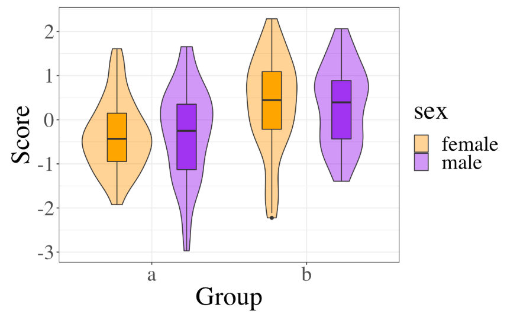

Chapitre 10 : Flux de travail reproductible

*Traduit par Mae Braud.*

10.1 Objectifs d’apprentissage

10.1.1 Niveau débutant

1. Créer un script reproductible dans R Markdown

2. Éditer le préambule pour ajouter un sommaire et autres options

3. Inclure une table

4. Inclure une figure

5. Utiliser source() pour inclure du code à partir d’un fichier externe

6. Reporter la sortie d’une analyse à l’aide de l’intégration de code R dans le texte

10.1.2 Niveau intermédiaire

7. Exporter en formats doc et PDF

8. Ajouter une bibliographie et des citations dans le texte

9. Formater des tables à l’aide de kableExtra

10.1.3 Niveau avancé

10. Créer un projet computationnel reproductible dans Code Ocean

10.2 Ressources

* [Chapitre 27: R Markdown](https://r4ds.had.co.nz/r-markdown.html) dans *R for Data Science* (EN)

* [Antisèche R Markdown](https://rstudio.com/wp-content/uploads/2016/03/rmarkdown-cheatsheet-2.0.pdf) (EN)

* [Guide de référence pour R Markdown](https://rstudio.com/wp-content/uploads/2015/03/rmarkdown-reference.pdf) (EN)

* [Tutoriel R Markdown](https://rmarkdown.rstudio.com/lesson-1.html) (EN)

* [R Markdown: ](https://bookdown.org/yihui/rmarkdown/)[Le Guide Définitif](https://bookdown.org/yihui/rmarkdown/) de Yihui Xie, J.J. Allaire, & Garrett Grolemund (EN)

* Manuscrits APA Reproductibles [papaja ](https://crsh.github.io/papaja_man/)(EN)

* [Code Ocean](https://codeocean.com/) pour la Reproductibilité Computationnelle (EN)

10.3 R Markdown

<table>
  <tr>
    <td>library(tidyverse)</td>
  </tr>
</table>


À ce point, vous devriez être relativement à l’aise avec les fichiers R Markdown à partir des exercices d’entraînement et des exercices hebdomadaires. Ici, nous allons explorer certaines des options plus avancées et créer un document R Markdown permettant de produire un manuscrit reproductible.

10.3.1 Options *knitr*

Lorsque vous créer un nouveau fichier R Markdown dans RStudio, un chunk de setup est automatiquement créé.

<table>
  <tr>
    <td>```{r setup, include=FALSE}
knitr::opts_chunk$set(echo = TRUE)
```</td>
  </tr>
</table>


Ici, vous pouvez définir davantage d’options par défaut concernant les chunks de code. Voir la [documentation des options knitr](https://yihui.org/knitr/options/) pour des explications concernant les options possibles.

<table>
  <tr>
    <td>```{r setup, include=FALSE}
knitr::opts_chunk$set(
  fig.width  = 8,
  fig.height = 5,
  fig.path   = 'images/',
  echo       = FALSE,
  warning    = TRUE,
  message    = FALSE,
  cache      = FALSE
)
```</td>
  </tr>
</table>


Le code ci-dessus définit les options suivantes :

* fig.width = 8 : la largeur des figures est de 8 pouces

* fig.height = 5 : la hauteur des figures est de 5 pouces

* fig.path = ‘image/’ : les figures sont sauvées dans le directory "images"

* echo = FALSE : ne montrez pas les bouts de code dans le document imprimé

* warning = FALSE : ne montrez aucun avertissement concernant les fonctions

* message = FALSE : ne montrez aucun message concernant les fonctions

* cache = FALSE : exécutez l’ensemble du code afin de créer toutes les images et objets à chaque fois que vous utilisez ‘knit’ (définissez comme TRUE si vous avez un code très long à exécuter en termes de temps)

10.3.2 Préambule (*YAML Header*)

Le préambule est là où vous pouvez définir un ensemble d’options.

<table>
  <tr>
    <td>---
title: "My Demo Document"
author: "Me"
output:
  html_document:
    theme: spacelab
    highlight: tango
    toc: true
    toc_float:
      collapsed: false
      smooth_scroll: false
    toc_depth: 3
    number_sections: false
---</td>
  </tr>
</table>


Les thèmes inclus de base sont : "cerulean", “cosmo”, “flatty”, “journal”, “lumen”, “paper”, “readable”, “sandstone”, simplex”, “spacelab”, “united”, et “yeti”. Vous pouvez [voir et télécharger d’autres thèmes](https://www.datadreaming.org/post/r-markdown-theme-gallery/).

10.3.3 Sommaire et Titres

Si vous ajoutez un sommaire (toc), il est créé à partir de vos titres. Dans markdown, les titres sont créés en plaçant un ou plus hashtag (#) devant le titre. Ajoutez à votre document une structure d’article comme celle ci-dessous.

<table>
  <tr>
    <td>## Abstract

My abstract here...

## Introduction

What's the question; why is it interesting?

## Methods

### Participants

How many participants and why? Do your power calculation here.

### Procedure

What will they do?

### Analysis

Describe the analysis plan...

## Results

Demo results for simulated data...

## Discussion

What does it all mean?

## References</td>
  </tr>
</table>


10.3.4 Chunks de code

Vous pouvez insérer des *chunks* de code (morceaux de code) qui créent et affichent des images, tableaux ou calculs dans votre texte.

Commençons tout d’abord par simuler des données.

Tout d’abord, créez un chunk de code dans votre document. Puisque dans ce document nous n’afficherons pas le code, vous pouvez le placer avant le résumé (abstract). Nous utiliserons une version modifiée de la fonction two_sample du cours sur le MLG (Chapitre 9) afin de créer deux groupes avec une différence de 0.75 et 100 observations par groupe.

<table>
  <tr>
    <td>two_sample <- function(diff = 0.5, n_per_group = 20) {
  tibble(Y = c(rnorm(n_per_group, -.5 * diff, sd = 1),
               rnorm(n_per_group, .5 * diff, sd = 1)),
         grp = factor(rep(c("a", "b"), each = n_per_group)),
         sex = factor(rep(c("female", "male"), times = n_per_group))
  ) %>%
    mutate(
      grp_e = recode(grp, "a" = -0.5, "b" = 0.5),
      sex_e = recode(sex, "female" = -0.5, "male" = 0.5)
    )
}</td>
  </tr>
</table>


Maintenant, nous pouvons créer un chunk de code séparé afin de simuler notre jeu de données dat.

<table>
  <tr>
    <td>dat <- two_sample(diff = 0.75, n_per_group = 100)</td>
  </tr>
</table>


**10.3.4.1 ****Tables**

Ensuite, créez un chunk de code où vous voulez afficher un tableau avec les données descriptives (e.g., la section Participants de la partie Méthode). Nous utiliserons des fonctions du *tidyverse *que vous avez apprises dans le cours sur la manipulation des données (Chapitre 5) afin de créer des statistiques résumées pour chaque groupe.

<table>
  <tr>
    <td>```{r, results='asis'}

dat %>%
  group_by(grp, sex) %>%
  summarise(n = n(),
            Mean = mean(Y),
            SD = sd(Y)) %>%
  rename(group = grp) %>%
  mutate_if(is.numeric, round, 3) %>%
  knitr::kable()

```</td>
  </tr>
</table>


<table>
  <tr>
    <td>## `mutate_if()` ignored the following grouping variables:
## Column `group`</td>
  </tr>
</table>


<table>
  <tr>
    <td>group</td>
    <td>sex</td>
    <td>n</td>
    <td>Mean</td>
    <td>SD</td>
  </tr>
  <tr>
    <td>a</td>
    <td>female</td>
    <td>50</td>
    <td>-0.361</td>
    <td>0.796</td>
  </tr>
  <tr>
    <td>a</td>
    <td>male</td>
    <td>50</td>
    <td>-0.284</td>
    <td>1.052</td>
  </tr>
  <tr>
    <td>b</td>
    <td>female</td>
    <td>50</td>
    <td>0.335</td>
    <td>1.080</td>
  </tr>
  <tr>
    <td>b</td>
    <td>male</td>
    <td>50</td>
    <td>0.313</td>
    <td>0.904
</td>
  </tr>
</table>


**10.3.4.2 Images**

Ensuite, créez un chunk de code où vous souhaitez afficher une image dans votre document. Mettons-la dans la partie Résultats. Utilisez ce que vous avez appris dans le cours sur la visualisation des données (Chapitre 3) pour créer un graphique en violon avec boîte à moustache interne pour les deux groupes.

<table>
  <tr>
    <td>```{r, fig1, fig.cap="Figure 1. Scores by group and sex."}
ggplot(dat, aes(grp, Y, fill = sex)) +
  geom_violin(alpha = 0.5) +
  geom_boxplot(width = 0.25,
               position = position_dodge(width = 0.9),
               show.legend = FALSE) +
  scale_fill_manual(values = c("orange", "purple")) +
  xlab("Group") +
  ylab("Score") +
  theme(text = element_text(size = 30, family = "Times"))

```</td>
  </tr>
</table>




Figure 10.1 : Figure 1. Scores par groupe et par âge

Vous pouvez également inclure des images que vous n’avez pas créer dans R en utilisant la syntaxe markdown classique pour les images :

<table>
  <tr>
    <td>](images/memes/x-all-the-things.png)</td>
  </tr>
</table>


All the Things de [Hyperbole and a Half](http://hyperboleandahalf.blogspot.com/)

**10.3.4.3 ****Commande R intégrée dans le texte**

Maintenant, servons-nous de ce que vous avez appris dans le cours sur le MLG (Chapitre 9) pour analyser les données que nous avons simulées. Le document devient un petit peu encombré alors déplaçons ce code dans des scripts externes.

* Créez un nouveau script R appelé "functions.R"

* Déplacez la ligne library(tidyverse) et la définition de la fonction two_sample() dans ce fichier.

* Créez un nouveau script R appelé "analysis.R"

* Déplacez dans ce fichier le code créant dat.

* Ajoutez les lignes de code suivantes à la fin du chunk de setup :

<table>
  <tr>
    <td>source("functions.R")
source("analysis.R")</td>
  </tr>
</table>


La fonction source vous permet d’inclure du code à partir d’un fichier externe. Ceci est très utile pour rendre votre document lisible. Assurez-vous simplement de bien faire appel à vos fichiers sources dans le bon ordre (e.g., inclure les définitions de fonctions avant d’utiliser ces fonctions).

Dans le fichier "analysis.R", vous allez exécuter le code d’analyse et sauvegarder tout nombre susceptible d’être réutilisé plus tard dans le script.

<table>
  <tr>
    <td>grp_lm <- lm(Y ~ grp_e * sex_e, data = dat)

stats <- grp_lm %>%
  broom::tidy() %>%
  mutate_if(is.numeric, round, 3)</td>
  </tr>
</table>


Le code ci-dessus exécute notre analyse permettant de prédire Y à partir de notre variable group recodée grp-e, notre variable sex recodée sex_e et leur interaction. La fonction tidy du package broom transforme la sortie en table tidy. La fonction mutate_if utilise la fonction is.numeric pour vérifier si chaque colonne doit être ‘mutée’, et si elle est numérique, alors la fonction round est appliquée avec l’argument ‘digits’ fixé à 3.

Si vous souhaitez rapporter les résultats de l’analyse dans un paragraphe plutôt que dans une table, il vous faut savoir comment vous référer à chaque nombre dans la table. Comme tout, il existe plusieurs méthodes pour faire cela dans R. Parmi ces méthodes, l’une consiste à spécifier le numéro de la colonne et de la ligne de la façon suivante :

<table>
  <tr>
    <td>stats$p.value[2]</td>
  </tr>
</table>


<table>
  <tr>
    <td>## [1] 0</td>
  </tr>
</table>


Une autre façon de faire est de créer une variable pour chaque ligne comme suit :

<table>
  <tr>
    <td>grp_stats <- filter(stats, term == "grp_e")
sex_stats <- filter(stats, term == "sex_e")
ixn_stats <- filter(stats, term == "grp_e:sex_e")</td>
  </tr>
</table>


Ajoutez les lignes de code ci-dessus à la fin de votre fichier analysis.R. Vous pourrez ensuite vous référer aux colonnes par leur nom comme suit :

<table>
  <tr>
    <td>grp_stats$p.value
sex_stats$statistic
ixn_stats$estimate</td>
  </tr>
</table>


<table>
  <tr>
    <td>## [1] 0
## [1] 0.197
## [1] -0.099</td>
  </tr>
</table>


Vous pouvez insérer ces nombres dans un paragraphe en y intégrant du code R qui ressemble à ceci :

<table>
  <tr>
    <td>Scores were higher in group B than group A
(B = `r grp_stats$estimate`,
t = `r grp_stats$statistic`,
p = `r grp_stats$p.value`).
There was no significant difference between men and women
(B = `r sex_statsestimate`,
t = `r sex_stats$statistic`,
p = `r sex_stats$p.value`)
and the effect of group was not qualified by an interaction with sex
(B = `r ixn_stats$estimate`,
t = `r ixn_stats$statistic`,
p = `r ixn_stats$p.value`).</td>
  </tr>
</table>


**Texte rendu :**

Les scores étaient plus haut dans le groupe B que dans le groupe A (B = 0.647, t = 4.74, p = 0). Il n’y avait pas de différence significative entre les hommes et les femmes (B = 0.027, t = 0.197, p = 0.844) et l’effet du groupe n’était pas caractérisé par une interaction avec le sexe (B = 0.099, t = -0.363, p = 0.717).

Les valeurs p ne sont pas formatées suivant les normes APA. Dans la leçon sur les fonctions (Chapitre 7), nous avons écrit une fonction pour palier à ceci. Ajoutez cette fonction au fichier "functions.R" et modifiez le texte pour utiliser la fonction report_p.

<table>
  <tr>
    <td>report_p <- function(p, digits = 3) {
  if (!is.numeric(p)) stop("p must be a number")
  if (p <= 0) warning("p-values are normally greater than 0")
  if (p >= 1) warning("p-values are normally less than 1")

  if (p < .001) {
    reported = "p < .001"
  } else {
    roundp <- round(p, digits)
    fmt <- paste0("p = %.", digits, "f")
    reported = sprintf(fmt, roundp)
  }

  reported
}</td>
  </tr>
</table>


<table>
  <tr>
    <td>Scores were higher in group B than group A
(B = `r grp_stats$estimate`,
t = `r grp_stats$statistic`,
`r report_p(grp_stats$p.value, 3)`).
There was no significant difference between men and women
(B = `r sex_stats$estimate`,
t = `r sex_stats$statistic`,
`r report_p(sex_stats$p.value, 3)`)
and the effect of group was not qualified by an interaction with sex
(B = `r ixn_stats$estimate`,
t = `r ixn_stats$statistic`,
`r report_p(ixn_stats$p.value, 3)`).</td>
  </tr>
</table>


**Texte rendu** **:**

Les scores étaient plus haut dans le groupe B que dans le groupe A (B = 0.647, t = 4.74, p < .001). Il n’y avait pas de différence significative entre les hommes et les femmes (B = 0.027, t = 0.197, p = 0.844) et l’effet du groupe n’était pas caractérisé par une interaction avec le sexe (B = 0.099, t = -0.363, p = 0.717).

Vous voudrez peut-être rapporter également les statistiques pour la régression. Puisqu’il y a beaucoup de nombres à formatter et insérer, il est plus simple de le faire dans le script d’analyse à l’aide de sprintf pour le formattage.

<table>
  <tr>
    <td>s <- summary(grp_lm)

# calculate p value from fstatistic
fstat.p <- pf(s$fstatistic[1],
              s$fstatistic[2],
              s$fstatistic[3],
              lower=FALSE)

adj_r <- sprintf(
  "The regression equation had an adjusted $R^{2}$ of %.3f ($F_{(%i, %i)}$ = %.3f, %s).",
  round(s$adj.r.squared, 3),
  s$fstatistic[2],
  s$fstatistic[3],
  round(s$fstatistic[1], 3),
  report_p(fstat.p, 3)
)</td>
  </tr>
</table>


Vous pouvez ensuite insérer le texte dans votre manuscript de la façon suivante : *adj**r* :

L’équation de régression avait un *R²* ajusté de 0.090 (*F*(3,196) = 7.546, p < .001).

10.3.5 Bibliographie

Il existe plusieurs méthodes pour citer à l’intérieur même de votre texte et de générer automatiquement une [bibliographie](https://rmarkdown.rstudio.com/authoring_bibliographies_and_citations.html#bibliographies) dans RMarkdown.

**10.3.5.1 Créer un fichier BibTeX manuellement**

Vous pouvez simplement créer un fichier BibTeX et ajouter les citations manuellement. Créez un nouveau fichier texte dans RStudio appelé "bibliography.bib".

Ensuite, ajoutez la ligne bibliography: bibliography.bib à votre préambule.

Vous pouvez ajouter des citations dans le format suivant :

<table>
  <tr>
    <td>@article{shortname,
  author = {Author One and Author Two and Author Three},
  title = {Paper Title},
  journal = {Journal Title},
  volume = {vol},
  number = {issue},
  pages = {startpage--endpage},
  year = {year},
  doi = {doi}
}</td>
  </tr>
</table>


**10.3.5.2 Citer des packages R**

Vous pouvez obtenir la citation pour un package R en utilisant la fonction citation. Vous pouvez coller l’entrée bibtex dans votre fichier bibliography.bib. Assurez-vous d’ajouter un nom court (e.g., "rmarkdown") avant la première virgule pour renvoyer à votre référence.

<table>
  <tr>
    <td>citation(package="rmarkdown”)</td>
  </tr>
</table>


<table>
  <tr>
    <td>##
## To cite the 'rmarkdown' package in publications, please use:
##
##   JJ Allaire and Yihui Xie and Jonathan McPherson and Javier
##   Luraschi and Kevin Ushey and Aron Atkins and Hadley Wickham and
##   Joe Cheng and Winston Chang and Richard Iannone (2019).
##   rmarkdown: Dynamic Documents for R. R package version 1.14. URL
##   https://rmarkdown.rstudio.com.
##
##   Yihui Xie and J.J. Allaire and Garrett Grolemund (2018). R
##   Markdown: The Definitive Guide. Chapman and Hall/CRC. ISBN
##   9781138359338. URL https://bookdown.org/yihui/rmarkdown.
##
## To see these entries in BibTeX format, use 'print(<citation>,
## bibtex=TRUE)', 'toBibtex(.)', or set
## 'options(citation.bibtex.max=999)'.</td>
  </tr>
</table>


**10.3.5.3 Télécharger des**** informations bibliographiques**

Vous pouvez obtenir la référence au format BibTeX sur la plupart des sites des maisons d’éditions. Par exemple, allez sur la page de l’éditeur pour [Equivalence Testing for Psychological Research: A Tutorial](https://journals.sagepub.com/doi/full/10.1177/2515245918770963), cliquez sur le bouton ‘Cite’ (dans la sidebar ou en bas du menu ‘Explore’), choisissez ‘BibTeX format’, et téléchargez la citation. Vous pouvez ouvrir ce fichier dans un éditeur de texte et copier le texte. Cela devrait ressembler à quelque chose comme suit :

<table>
  <tr>
    <td>@article{doi:10.1177/2515245918770963,
author = {Daniël Lakens and Anne M. Scheel and Peder M. Isager},
title ={Equivalence Testing for Psychological Research: A Tutorial},
journal = {Advances in Methods and Practices in Psychological Science},
volume = {1},
number = {2},
pages = {259-269},
year = {2018},
doi = {10.1177/2515245918770963},

URL = {
        https://doi.org/10.1177/2515245918770963

},
eprint = {
        https://doi.org/10.1177/2515245918770963

}
,
    abstract = { Psychologists must be able to test both for the presence of an effect and for the absence of an effect. In addition to testing against zero, researchers can use the two one-sided tests (TOST) procedure to test for equivalence and reject the presence of a smallest effect size of interest (SESOI). The TOST procedure can be used to determine if an observed effect is surprisingly small, given that a true effect at least as extreme as the SESOI exists. We explain a range of approaches to determine the SESOI in psychological science and provide detailed examples of how equivalence tests should be performed and reported. Equivalence tests are an important extension of the statistical tools psychologists currently use and enable researchers to falsify predictions about the presence, and declare the absence, of meaningful effects. }
}</td>
  </tr>
</table>


Copiez la référence dans votre fichier bibliography.bib. Au niveau de la première ligne de la référence, changez doi:10.1177/2515245918770963 en un nom court que vous utiliserez ensuite pour citer la référence dans votre manuscrit. Nous utiliserons TOSTtutorial.

**10.3.5.4 Convertir à partir des logiciels de gestion bibliographique**

La plupart des logiciels de gestion bibliographique comme EndNote, Zotero ou Mendeley possèdent des options d’exportation qui peuvent exporter au format BibTeX. Il vous suffit de vérifier les noms courts dans le fichier créé.

**10.3.5.5 ****Citer dans le texte**

Vous pouvez citer des références à l’intérieur même de votre texte de la façon suivante :

<table>
  <tr>
    <td>This tutorial uses several R packages [@tidyverse;@rmarkdown].</td>
  </tr>
</table>


Ce tutoriel utilise une variété de packages R (Wickham 2017; Allaire et al. 2018).

Mettez un moins devant le @ si vous ne voulez que l’année :

<table>
  <tr>
    <td>Lakens, Scheel and Isengar [-@TOSTtutorial] wrote a tutorial explaining how to test for the absence of an effect.</td>
  </tr>
</table>


Lakens, Scheel et Isengar (2018) ont écrit un tutoriel expliquant comment tester pour une absence d’effet.

**10.3.5.6 ****Styles de citation**

Vous pouvez rechercher une [liste de style de fichiers](https://www.zotero.org/styles) pour une variété de journaux et télécharger un fichier qui formatera votre bibliographie selon le style adapté au journal en question. Vous aurez besoin d’ajouter la ligne csl: filename.csl à votre préambule.

10.3.6. Formats de sortie

Du moment que vous possédez les bons packages installés sur votre ordinateur, il vous est possible de ‘knit’ votre fichier vers un format PDF ou Word.

10.3.7 Reproductibilité computationnelle

La reproductibilité computationnelle renvoie au fait de rendre reproductible tous les aspects de votre analyse, y compris les spécificités des logiciels utilisés pour exécuter le code que vous avez écrit. Les packages R sont régulièrement mis à jour et certaines de ces mises à jour sont susceptibles de rendre votre code obsolète. Passer par une plateforme de reproductibilité computationnelle permet de pallier à ce problème en exécutant votre code toujours dans le même environnement.

10.4 Références

E Références

Allaire, JJ, Yihui Xie, Jonathan McPherson, Javier Luraschi, Kevin Ushey, Aron Atkins, Hadley Wickham, Joe Cheng, and Winston Chang. 2018. *Rmarkdown: Dynamic Documents for R*. [https://CRAN.R-project.org/package=rmarkdown](https://cran.r-project.org/package=rmarkdown).

Lakens, Daniël, Anne M. Scheel, and Peder M. Isager. 2018. "Equivalence Testing for Psychological Research: A Tutorial." *Advances in Methods and Practices in Psychological Science* 1 (2): 259–69. [https://doi.org/10.1177/2515245918770963](https://doi.org/10.1177/2515245918770963).

Wickham, Hadley. 2017. *Tidyverse: Easily Install and Load the ’Tidyverse’*. [https://CRAN.R-project.org/package=tidyverse](https://cran.r-project.org/package=tidyverse).
