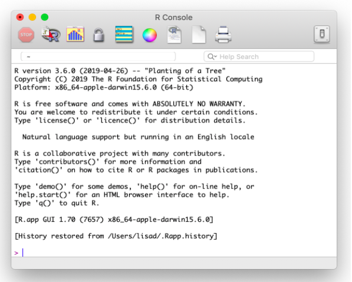
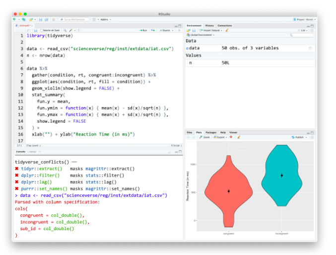
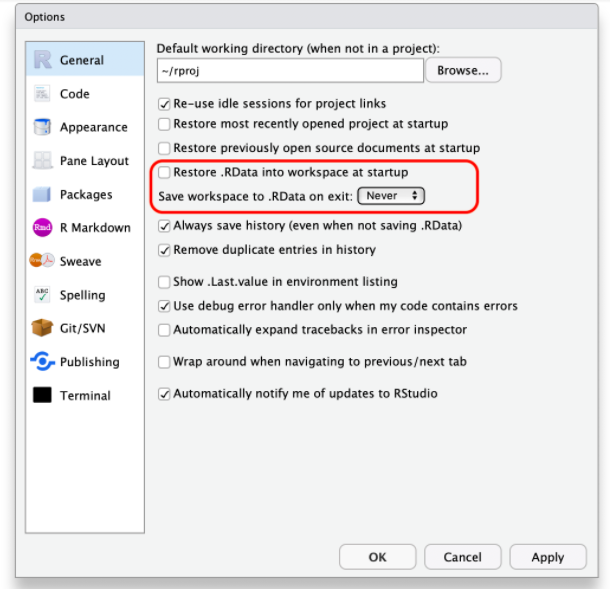
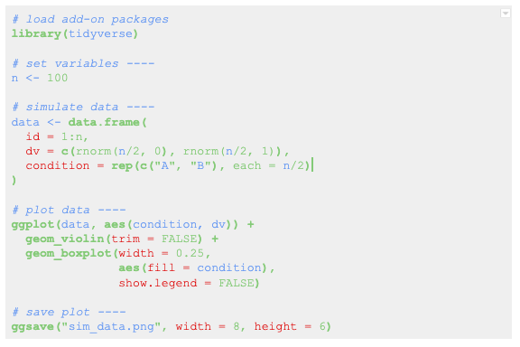

Chapitre 1 : Pour commencer

* Traduit par Fabrice Gabarrot.

1.1 Objectifs d'apprentissage

1. Comprendre les composants de l’environnement IDE *RStudio*

2. Tapez les commandes dans la *console*

3. Comprendre la *syntaxe des fonctions*

4. *Installer un ‘package’*

5. *Organiser un projet*

6. *Structurer un script R ou un fichier RMarkdown* correctement

7. Créer et compiler un document en RMarkdown

# 1.2 Ressources

*N.B. Les ressources marquées (EN) sont en anglais.*

* Le premier chapitre [Introduction](https://r4ds.had.co.nz/introduction.html) de *[R for Data Scienc*e](https://r4ds.had.co.nz)* * (EN)

* [L’Antisèche de ](https://github.com/rstudio/cheatsheets/raw/master/rstudio-ide.pdf)[RStudio](https://github.com/rstudio/cheatsheets/raw/master/rstudio-ide.pdf)  (EN)

* [Une introduction au RMarkdown](https://rmarkdown.rstudio.com/lesson-1.html) (EN)

* [Une antisèche pour RMarkdown](https://www.rstudio.com/wp-content/uploads/2016/03/rmarkdown-cheatsheet-2.0.pdf)  (EN)

* [Le guide de référence de RMarkdown](https://www.rstudio.com/wp-content/uploads/2015/03/rmarkdown-reference.pdf) (EN)

# 1.3 Qu’est-ce que R?

R est un environnement de programmation pour le traitement et l'analyse statistique de données. R est de plus en plus utilisé pour la recherche en psychologie afin de promouvoir et faciliter une science ouverte et reproductible. L’objectif est de pouvoir documenter et reproduire toutes les étapes entre les données brutes et les résultats. R vous permet d'écrire des scripts qui combinent des fichiers de données, nettoient les données et exécutent des analyses. Il y a beaucoup d'autres façons de le faire, comme écrire des fichiers de syntaxe SPSS, mais R est un outil utile dans la mesure où il est libre, open source, et couramment utilisé dans la recherche en psychologie et dans les autres sciences.

<table>
  <tr>
    <td></td>
    <td>Voir l'annexe A pour plus d'informations sur l'installation de R et des programmes associés. </td>
  </tr>
</table>

### 1.3.1 La console de base R

Si vous ouvrez l'application appelée R, vous verrez une fenêtre "R Console" qui ressemble à ceci.

<table>
  <tr>
    <td></td>
  </tr>
  <tr>
    <td>Figure 1.1 La console de R (sous MacOS)</td>
  </tr>
</table>

Vous pouvez maintenant fermer R et ne plus jamais l'ouvrir. Dans ce cours, nous travaillerons exclusivement avec RStudio.

<table>
  <tr>
    <td></td>
    <td>RAPPEL : Toujours lancer R via l’environnement IDE RStudio
Lancez  (RStudio.app), pas  (R.app).</td>
  </tr>
</table>

### 1.3.2 RStudio

<table>
  <tr>
    <td></td>
  </tr>
  <tr>
    <td>Figure 1.2: L’environnement IDE RStudio</td>
  </tr>
</table>

RStudio est un environnement de développement intégré (IDE). Il s'agit d'un programme qui sert d'éditeur de texte, de gestionnaire de fichiers et offre de nombreuses fonctions pour vous aider à lire et à écrire du code R.

RStudio est composé de quatre volets (Voir Figure 1.2). Par défaut, le volet supérieur gauche est le volet **_source_**, dans lequel vous pouvez afficher et modifier le code source des fichiers. Le volet inférieur gauche est généralement le volet de la **_console_**, où vous pouvez taper des commandes et afficher les messages de sortie. Les volets de droite ont plusieurs onglets différents qui vous montrent des informations sur votre code. Vous pouvez modifier l'emplacement des volets et les onglets affichés sous **Préférences > Disposition du volet**.

### 1.3.3 Configurer RStudio

Dans ce cours, vous apprendrez comment développer des scripts reproductibles. Il s'agit de scripts qui effectuent une analyse complète et transparente du début à la fin, d'une manière qui donne le même résultat pour différentes personnes utilisant le même logiciel sur différents ordinateurs. La transparence est une valeur clé de la science, telle qu’incarnée dans la devise "*trust but verify*" ("faire confiance mais vérifier").

Lorsque vous faites les choses de façon reproductible, les autres peuvent comprendre et vérifier votre travail. Cela profite à la science, mais il y a aussi une raison égoïste : la personne qui bénéficiera le plus d'un script reproductible est vous-même. Lorsque vous reviendrez à une analyse après deux semaines de vacances, vous remercierez votre moi antérieur d'avoir fait les choses de manière transparente et reproductible, car vous pouvez facilement reprendre là où vous vous étiez arrêté.

Il y a deux modifications que vous devriez apporter à votre installation RStudio pour maximiser la reproductibilité. Allez dans le menu **Préférences/Paramètres**, et décochez la case **Restaurer .RData** dans l'espace de travail au démarrage. Si vous gardez les choses dans votre espace de travail, les choses deviendront désordonnées et des choses inattendues se produiront. Vous devriez toujours commencer par un espace de travail vierge. Cela signifie également que vous ne voulez jamais enregistrer votre espace de travail lorsque vous quittez RStudio, alors définissez ce paramètre sur **Jamais**. La seule chose que vous voulez sauver, ce sont vos scripts.

<table>
  <tr>
    <td></td>
  </tr>
  <tr>
    <td>Figure 1.3 : Modifiez ces paramètres pour ne pas qu’RStudio enregistre systématiquement votre espace de travail.</td>
  </tr>
</table>

## 1.4 Prise en main

### 1.4.1 Commandes de la console

Nous allons d'abord apprendre comment interagir avec la console. En général, vous développerez des scripts R ou des fichiers RMarkdown, plutôt que de travailler directement dans la fenêtre de la console. Cependant, vous pouvez considérer la console comme une sorte de *bac à sable* dans lequel vous pourrez tester des lignes de code et les adapter jusqu'à obtenir ce que vous voulez. Vous pouvez ensuite les copier dans l'éditeur de script.

La plupart du temps, cependant, vous travaillerez dans la fenêtre de l'éditeur de script (soit dans un script R, soit dans un fichier de RMarkdown), puis vous executerez les commandes dans la console en plaçant le curseur sur la ligne et en maintenant la touche Ctrl (sur PC) ou Cmd (sur Mac) enfoncée pendant que vous appuyez sur Entrée. La séquence de touches **Ctrl+Entrée** (ou **Cmd+Entrée**) envoie la commande du script vers la console.

Une façon simple d'en savoir plus sur la console R est de l'utiliser comme calculatrice. Entrez les lignes de code ci-dessous et voyez si vos résultats correspondent. Soyez prêt à faire beaucoup de fautes de frappe (au début).

<table>
  <tr>
    <td>1 + 1</td>
  </tr>
</table>

<table>
  <tr>
    <td>[1] 2</td>
  </tr>
</table>

La console R enregistre l’historique des commandes que vous avez tapées par le passé. Utilisez les touches ↑ flèche vers le haut et ↓ flèche vers le bas de votre clavier pour faire défiler votre historique en avant et en arrière. C'est beaucoup plus rapide que de tout retaper.

<table>
  <tr>
    <td>1 + 1 + 3</td>
  </tr>
</table>

<table>
  <tr>
    <td>[1] 5</td>
  </tr>
</table>

Vous pouvez décomposer des expressions mathématiques sur plusieurs lignes ; R attend une expression complète avant de la traiter.

<table>
  <tr>
    <td>## here comes a long expression
## let's break it over multiple lines

1 + 2 + 3 + 4 + 5 + 6 +
    7 + 8 + 9 +
    10</td>
  </tr>
</table>

<table>
  <tr>
    <td>[1] 55</td>
  </tr>
</table>

Du texte entre guillemets s'appelle une chaîne de caractères (*string*).

<table>
  <tr>
    <td>"Good afternoon"</td>
  </tr>
</table>

<table>
  <tr>
    <td>[1] "Good afternoon"</td>
  </tr>
</table>

Vous pouvez décomposer le texte sur plusieurs lignes ; R attend des guillemets de fermeture avant de l'exécuter. Si vous voulez inclure un guillemet double à l'intérieur de cette chaîne de caractères entre guillemets, faites-la précéder d’une barre oblique inversée ( **\**" ).

<table>
  <tr>
    <td>africa <- "I hear the drums echoing tonight  
But she hears only whispers of some quiet conversation  
She's coming in, 12:30 flight  
The moonlit wings reflect the stars that guide me towards salvation  
I stopped an old man along the way  
Hoping to find some old forgotten words or ancient melodies  
He turned to me as if to say, \"Hurry boy, it's waiting there for you\"

- Toto"

cat(africa) # cat() prints the string
</td>
  </tr>
</table>

<table>
  <tr>
    <td>I hear the drums echoing tonight  
But she hears only whispers of some quiet conversation  
She's coming in, 12:30 flight  
The moonlit wings reflect the stars that guide me towards salvation  
I stopped an old man along the way  
Hoping to find some old forgotten words or ancient melodies  
He turned to me as if to say, "Hurry boy, it's waiting there for you"

- Toto</td>
  </tr>
</table>

### 1.4.2 Variables

Souvent, vous voulez stocker le résultat d'un calcul pour une utilisation ultérieure. Vous pouvez le stocker dans une **variable**. Une variable dans R :

* ne contient que des lettres, des chiffres, des points et des soulignements

* commence par une lettre ou un point et une lettre

* distingue les lettres majuscules et minuscules (rickastley n'est pas la même chose que RickAstley)

Les variables suivantes sont valides et différentes :

* songdata

* SongData

* song_data

* song.data

* .song.data

* never_gonna_give_you_up_never_gonna_let_you_down

Les variables suivantes ne sont pas valides :

* _song_data

* 1song

* .1song

* song data

* Song-data

Utiliser l'opérateur d'assignation  **<-**  pour assigner la valeur à droite à la variable nommée à gauche.

<table>
  <tr>
    <td>## use the assignment operator '<-'
## R stores the number in the variable

x <- 5
</td>
  </tr>
</table>

Maintenant que nous avons assigné une valeur à  x , nous pouvons en faire quelque chose :

<table>
  <tr>
    <td>x * 2</td>
  </tr>
</table>

<table>
  <tr>
    <td>[1] 10</td>
  </tr>
</table>

Il est même possible de stocker les résultats de calculs dans une variable

<table>
  <tr>
    <td>boring_calculation <- 2 + 2</td>
  </tr>
</table>

Notez que R n’affiche pas le résultat lorsqu'il est stocké. Pour afficher le résultat, il suffit de taper le nom de la variable sur une ligne blanche.

<table>
  <tr>
    <td>boring_calculation </td>
  </tr>
</table>

<table>
  <tr>
    <td>[1] 4</td>
  </tr>
</table>

Une fois qu'une valeur est assignée à une variable, sa valeur ne change pas à moins que vous ne la ré-assignez, même si les variables que vous avez utilisées pour la calculer changent. Prévoyez ce que fait le code ci-dessous et testez-le :

<table>
  <tr>
    <td>this_year <- 2019
my_birth_year <- 1976
my_age <- this_year - my_birth_year
this_year <- 2020</td>
  </tr>
</table>

<table>
  <tr>
    <td>this_year</td>
  </tr>
</table>

<table>
  <tr>
    <td>[1] 2020</td>
  </tr>
</table>

<table>
  <tr>
    <td>my_birth_year</td>
  </tr>
</table>

<table>
  <tr>
    <td>[1] 1976</td>
  </tr>
</table>

<table>
  <tr>
    <td>my_age</td>
  </tr>
</table>

<table>
  <tr>
    <td>[1] 43</td>
  </tr>
</table>

### 1.4.3 L'environnement

Chaque fois que vous assignez quelque chose à une nouvelle variable, R crée un nouvel objet dans l'environnement global. Les objets dans l'environnement global existent jusqu'à la fin de votre session, puis ils disparaissent à jamais (à moins de les sauvegarder).

Regardez l'onglet **Environnement** dans le volet supérieur droit. Il répertorie toutes les variables que vous avez créées.

Cliquez sur l'icône du balai  pour effacer toutes les variables et recommencer à zéro. Vous pouvez également utiliser les fonctions suivantes dans la console pour afficher toutes les variables, supprimer une variable ou supprimer toutes les variables.

<table>
  <tr>
    <td>ls()            # print the variables in the global environment
rm("x")         # remove the variable named x from the global environment
rm(list = ls()) # clear out the global environment</td>
  </tr>
</table>

<table>
  <tr>
    <td></td>
    <td>Dans le coin supérieur droit de l'onglet Environnement, changez Liste en Grille. Vous pouvez maintenant voir le type, la longueur et la taille de vos variables et réorganiser la liste selon l'un de ces attributs. </td>
  </tr>
</table>

### 1.4.4 Espacement

Quand vous voyez  **>**  au début d'une ligne, cela signifie que R attend que vous démarriez une nouvelle commande. Cependant, si vous voyez un  **+**  au lieu de  **>**  au début de la ligne, cela signifie que R attend que vous terminiez une commande que vous avez commencée sur une ligne précédente. Si vous voulez annuler une commande que vous avez lancée, appuyez simplement sur la touche Echap dans la fenêtre de la console et vous reviendrez à l'invite de commande  **>** .

<table>
  <tr>
    <td># R waits until next line for evaluation
(3 + 2) *
5</td>
  </tr>
</table>

<table>
  <tr>
    <td>[1] 25</td>
  </tr>
</table>

Il est souvent utile de décomposer de longues fonctions sur plusieurs lignes.

<table>
  <tr>
    <td>cat("3, 6, 9, the goose drank wine",
    "The monkey chewed tobacco on the streetcar line",
    "The line broke, the monkey got choked",
    "And they all went to heaven in a little rowboat",
    sep = "  \n")</td>
  </tr>
</table>

<table>
  <tr>
    <td>3, 6, 9, the goose drank wine  
The monkey chewed tobacco on the streetcar line  
The line broke, the monkey got choked  
And they all went to heaven in a little rowboat</td>
  </tr>
</table>

### 1.4.5 Syntaxe des fonctions

Une grande partie de ce que vous faites dans R implique d'appeler une fonction et de stocker les résultats. Une fonction est une section de code nommée qui peut être réutilisée.

Par exemple,  sd  est une fonction qui retourne l'écart-type du vecteur (l’ensemble) de nombres que vous fournissez comme argument d'entrée. Les fonctions sont configurées comme suit :

<table>
  <tr>
    <td>function_name(argument1, argument2 = "value")</td>
  </tr>
</table>

Les arguments entre parenthèses peuvent être nommés (comme **argument1 = 10**) ou vous pouvez ignorer les noms si vous les mettez dans le même ordre qu'ils sont définis dans la fonction. Vous pouvez vérifier cela en tapant ** ****?sd**** ** (ou n'importe quel nom de fonction que vous recherchez) dans la console et le panneau d'aide vous montrera l'ordre par défaut sous Utilisation. Vous pouvez également ignorer les arguments dont la valeur par défaut est spécifiée.

La plupart des fonctions retournent une valeur, mais peuvent aussi produire des effets secondaires comme l’affichage sur la console.

Pour illustrer, la fonction **rnorm()** génère des nombres aléatoires à partir de la distribution normale standard. La page d'aide de **rnorm()**  (accessible en tapant **?rnorm**  dans la console) montre qu'il a la syntaxe suivante

<table>
  <tr>
    <td>rnorm(n, mean = 0, sd = 1)</td>
  </tr>
</table>

où **n** est le nombre de nombres générés au hasard que vous voulez, **mean** est la moyenne de la distribution et **sd** est l'écart-type. Il n'y a pas de valeur par défaut pour **n**, ce qui signifie que vous obtiendrez une erreur si vous ne la spécifiez pas :

<table>
  <tr>
    <td>rnorm()</td>
  </tr>
</table>

<table>
  <tr>
    <td>## Error in rnorm(): argument "n" is missing, with no default</td>
  </tr>
</table>

Si vous voulez 10 nombres aléatoires d'une distribution avec une moyenne de 0 et un écart-type, vous pouvez simplement utiliser les valeurs par défaut.

<table>
  <tr>
    <td>rnorm(10)</td>
  </tr>
</table>

<table>
  <tr>
    <td>[1]  1.15186804 -0.33024283 -0.24991448 -0.50668069 -0.02495801
[6] -0.27710230  1.47781088 -0.21063169  1.67800038 -0.31944619</td>
  </tr>
</table>

Si vous voulez 10 numéros d'une distribution avec une moyenne de 100 :

<table>
  <tr>
    <td>rnorm(10,100)</td>
  </tr>
</table>

<table>
  <tr>
    <td>[1]  98.48191 100.43418  99.62359 100.29270 100.50828  98.70452
[7] 101.75982  99.46557  99.03663  99.94638</td>
  </tr>
</table>

Ci-dessous, un moyen équivalent, mais moins efficace, d'appeler la fonction :

<table>
  <tr>
    <td>rnorm(n=10,mean=100)</td>
  </tr>
</table>

<table>
  <tr>
    <td>[1]  99.61621  99.73038 100.34224  98.61603 100.85594 101.29661  [7]  98.97355  99.65776  98.99585 100.61711</td>
  </tr>
</table>

Nous n'avons pas besoin de nommer les arguments parce que R reconnaîtra que nous avions l'intention de remplir les premier et second arguments par leur position dans l'appel de fonction. Cependant, si nous voulons changer la valeur par défaut d'un argument qui arrive plus tard dans la liste, alors nous devons le nommer. Par exemple, si nous voulions garder la moyenne par défaut **mean = 0** mais changer l'écart-type à 100, nous le ferions de cette façon :

<table>
  <tr>
    <td>rnorm(10,sd=100)</td>
  </tr>
</table>

<table>
  <tr>
    <td>[1]  -81.60272   71.40418  -73.48568   28.09207  116.85255
[6] -242.48229  141.17281   16.89854   14.01350  -51.97355</td>
  </tr>
</table>

Certaines fonctions donnent une liste d'options après un argument ; cela signifie que la valeur par défaut est la première option. L'entrée d'utilisation de la fonction **power.t.test()** ressemble à ceci :

<table>
  <tr>
    <td>power.t.test(n = NULL, delta = NULL, sd = 1, sig.level = 0.05,
             power = NULL,
             type = c("two.sample", "one.sample", "paired"),
             alternative = c("two.sided", "one.sided"),
             strict = FALSE, tol = .Machine$double.eps^0.25)</td>
  </tr>
</table>

### 1.4.6 Obtenir de l'aide

Démarrer l'aide dans un navigateur en utilisant la fonction **help.start()**.

Si une fonction est dans la base R ou un *package* chargé, vous pouvez utiliser la fonction **help("function_name")** ou le raccourci **?function_name** pour accéder au fichier d'aide. Si le package n'est pas chargé, spécifiez le nom du package comme deuxième argument de la fonction d'aide.

<table>
  <tr>
    <td># these methods are all equivalent ways of getting help
help("rnorm")
?rnorm
help("rnorm", package="stats") </td>
  </tr>
</table>

Lorsque le *package* n'est pas chargé ou que vous n'êtes pas sûr du *package* dans lequel se trouve la fonction, utilisez le raccourci **??function_name**.

## 1.5 Packages d'extensions

L'un des avantages de R est qu'il est extensible par l'utilisateur : n'importe qui peut créer un nouveau progiciel complémentaire qui étend ses fonctionnalités. Il y a actuellement des milliers de modules complémentaires que les utilisateurs de R ont créés pour résoudre différents types de problèmes, ou simplement pour s'amuser. Il existe des progiciels pour la visualisation de données, l'apprentissage automatique, la neuro-imagerie, le suivi oculaire, l’aspiration de données sur le web et les jeux tels que le Sudoku.

Les modules complémentaires ne sont pas distribués avec la base R, mais doivent être téléchargés et installés à partir d'une archive, de la même manière que vous le feriez, par exemple, pour télécharger et installer une application sur votre smartphone.

Le référentiel principal où résident les *packages* s'appelle CRAN, le Comprehensive R Archive Network. Un *package* doit passer des tests stricts conçus par l'équipe de base de R pour être autorisé à faire partie de l'archive CRAN. Vous pouvez installer à partir de l'archive CRAN via R en utilisant la fonction **install.packages()**.

Il y a une distinction importante entre installer un *package* et charger un *package*.

### 1.5.1 Installer un *package*

Ceci est fait en utilisant **install.packages()**. C'est comme installer une application sur votre téléphone : vous n'avez à le faire qu'une seule fois et l'application restera installée jusqu'à ce que vous la supprimiez. Par exemple, si vous voulez utiliser PokemonGo sur votre téléphone, vous devez l'installer une fois à partir de l'App Store ou du Play Store, et vous n'avez pas à le réinstaller chaque fois que vous voulez l'utiliser. Une fois que vous lancez l'application, elle s'exécutera en arrière-plan jusqu'à ce que vous la fermiez ou redémarriez votre téléphone. De même, lorsque vous installez un paquet, le *package* sera disponible (mais non chargé) chaque fois que vous ouvrirez R.

<table>
  <tr>
    <td></td>
    <td>Il se peut que vous ne puissiez installer des packages de manière permanente que si vous utilisez R sur votre propre système ; vous ne pourrez peut-être pas le faire sur les postes de travail publics si vous ne disposez pas des privilèges appropriés.</td>
  </tr>
</table>

Installez le paquet **ggExtra** sur votre système. Ce package vous permet de créer des tracés avec des histogrammes marginaux.

<table>
  <tr>
    <td>install.packages("ggExtra")</td>
  </tr>
</table>

Si vous n'avez pas déjà installé des *packages* comme **ggplot2** et **shiny**, il installera également ces dépendances pour vous. Si vous n'obtenez pas de message d'erreur à la fin, l'installation a réussi.

### 1.5.2 Chargement d'un paquet

Ceci est fait en utilisant **library(nomdupackage)**. C'est comme lancer une application sur votre téléphone : la fonctionnalité est seulement là où l'application est lancée et reste là jusqu'à ce que vous la fermiez ou la redémarriez. De même, lorsque vous exécutez **library(nomdupackage)** au cours d'une session, les fonctionnalités du *package* auquel se réfère **nomdupackage** seront disponibles pour votre session R. La prochaine fois que vous lancerez R, vous devrez exécuter à nouveau la fonction **library()** si vous voulez accéder à sa fonctionnalité.

Vous pouvez charger les fonctions dans **ggExtra** pour votre session R actuelle comme suit :

<table>
  <tr>
    <td>library(ggExtra)</td>
  </tr>
</table>

Il se peut que vous receviez du texte rouge lorsque vous chargez un *package*, c'est normal. Il vous avertit généralement que ce *package* a des fonctions qui ont le même nom que les autres *packages* que vous avez déjà chargés.

<table>
  <tr>
    <td></td>
    <td>Vous pouvez utiliser la convention package::function() pour indiquer dans quel package d'extension se trouve une fonction. Par exemple, si vous voyez readr::read_csv(), cela fait référence à la fonction read_csv() dans le package readr.</td>
  </tr>
</table>

Vous pouvez maintenant exécuter la fonction **ggExtra::runExample()**, qui exécute un exemple interactif de tracés marginaux utilisant **shiny**.

<table>
  <tr>
    <td>ggExtra::runExample()</td>
  </tr>
</table>

### 1.5.3 Installer à partir de GitHub

Beaucoup de *packages* R ne sont pas encore sur CRAN car ils sont encore en développement. De plus en plus, les ensembles de données et le code pour les articles sont disponibles sous forme de *packages* que vous pouvez télécharger sur github. Vous aurez besoin d'installer le *package* **devtools** pour pouvoir installer des *packages* depuis github. Vérifiez si vous avez un *packages* installé en essayant de le charger (par exemple, si vous n'avez pas devtools installé, **library("devtools")** affichera un message d'erreur) ou en le recherchant dans l'onglet paquets dans le volet inférieur droit. Tous les paquets listés sont installés ; tous les paquets cochés sont actuellement chargés.

<table>
  <tr>
    <td></td>
  </tr>
  <tr>
    <td>Figure 1.4 : Vérifiez les paquets installés et chargés dans l'onglet Paquets dans le volet inférieur droit.</td>
  </tr>
</table>

<table>
  <tr>
    <td>install.packages("devtools")
devtools::install_github("adam-gruer/goodshirt")</td>
  </tr>
</table>

Après avoir installé le package **goodshirt**, chargez-le à l'aide de la fonction **library()** et affichez quelques citations en utilisant les fonctions ci-dessous.

<table>
  <tr>
    <td>library(goodshirt)
# quotes from The Good Place
chidi()
eleanor()
tahani()
jason()</td>
  </tr>
</table>

<table>
  <tr>
    <td>##  There really is an afterlife. I can't wait to have breakfast with Kant, and lunch with Michel Foucault, and then have dinner with Kant again so we can talk about what came up at breakfast!
##
##  ~ Chidi
##  Oh, so now I'm supposed to be nice and make friends and treat her with mutual respect?
##
##  ~ Eleanor
##  That was my first time as a fashion "don't," and I did not care for it.
##
##  ~ Tahani
##  I was just about to tell an awesome story about a wing-eating contest that I lost, and a barfing contest that I won, but then a hole opened up in the ground.
##
##  ~ Jason
</td>
  </tr>
</table>

## 1.6 Organiser un projet

Les projets dans RStudio sont un moyen de regrouper tous les fichiers dont vous avez besoin pour un projet. La plupart des projets comprennent des scripts, des fichiers de données et des fichiers de sortie comme la version PDF du script ou des images.

<table>
  <tr>
    <td>
</td>
    <td>Créez un nouveau répertoire dans lequel vous conserverez tout votre matériel pour ce cours. Si vous utilisez un ordinateur de laboratoire, assurez-vous de créer ce répertoire dans votre lecteur réseau pour pouvoir y accéder à partir d'autres ordinateurs.
Choisissez New Project... sous le menu File pour créer un nouveau projet appelé 01-intro dans ce répertoire.</td>
  </tr>
</table>

### 1.6.1 Structure

Voici à quoi ressemble un script R. Ne vous inquiétez pas des détails pour l'instant.

Il est préférable de suivre la structure suivante lors du développement de vos propres scripts :

* charger dans tous les modules complémentaires que vous devez utiliser

* définir des fonctions personnalisées

* charger ou simuler les données avec lesquelles vous allez travailler

* travailler avec les données

* enregistrez tout ce que vous avez besoin d'enregistrer

Souvent, lorsque vous travaillez sur un script, vous vous rendrez compte que vous avez besoin de charger un autre module complémentaire. N'enterrez pas l'appel à **library(package_I_need)** tout en bas dans le script. Mettez-le en tête de liste pour que l'utilisateur ait une vue d'ensemble des paquets nécessaires.

Vous pouvez ajouter des commentaires à un script R en utilisant le symbole dièse (** # **). L'interpréteur R ignore les caractères du hachage jusqu'à la fin de la ligne.

<table>
  <tr>
    <td>## comments: any text from '#' on is ignored until end of line
22 / 7  # approximation to pi</td>
  </tr>
</table>

<table>
  <tr>
    <td>[1] 3.142857</td>
  </tr>
</table>

### 1.6.2 Rapports reproductibles avec R Markdown

Nous produirons des rapports reproductibles en suivant les principes d'une [programmation lettrée](https://fr.wikipedia.org/wiki/Programmation_lettrée). L'idée de base est de regrouper le texte du rapport dans un seul document avec le code nécessaire pour effectuer toutes les analyses et générer les tableaux. Le rapport est ensuite "compilé" à partir du format original dans un autre format plus portable, tel que HTML ou PDF. C'est différent des approches traditionnelles de copier-coller où, par exemple, vous créez un graphique dans Microsoft Excel ou un programme de statistiques comme SPSS et vous le collez ensuite dans Microsoft Word.

Nous utiliserons [R Markdown](https://rmarkdown.rstudio.com/lesson-1.html) pour créer des rapports reproductibles, ce qui permet de mélanger le texte et le code. Un script reproductible contiendra des blocs de code. Un bloc de code commence et se termine avec des apostrophes ouvrantes (** ` **) dans une rangée, avec quelques informations sur le code entre accolades, tels que **{r nom du morceau, echo=FALSE}** (ceci exécute le code, mais n'affiche pas le texte du bloc de code dans le document compilé). Le texte à l'extérieur des blocs de code est écrit en markdown, ce qui est une façon de spécifier le formatage, comme les en-têtes, les paragraphes, les listes, les caractères gras et les liens.

<table>
  <tr>
    <td></td>
  </tr>
  <tr>
    <td>Figure 1.5 : Un code reproductible</td>
  </tr>
</table>

Si vous ouvrez un nouveau fichier RMarkdown à partir d'un modèle, vous verrez un document exemple contenant plusieurs blocs de code. Pour créer un rapport HTML ou PDF à partir d'un document R Markdown (Rmd), vous devez le compiler. La compilation d'un document s'appelle *knit* ("tricoter") sur RStudio.

Il y a un bouton qui ressemble à une pelote de laine avec des aiguilles   sur lequel vous devez cliquer pour compiler votre fichier dans un rapport.

<table>
  <tr>
    <td></td>
  </tr>
  <tr>
    <td>Figure 1.6 : Le bouton "knit" pour “tricoter” un document RMarkdown.</td>
  </tr>
</table>

<table>
  <tr>
    <td></td>
    <td>Créez un nouveau fichier R Markdown à partir du menu File > New File > R Markdown... Changez le titre et l'auteur, puis cliquez sur le bouton tricoter pour créer un fichier html.</td>
  </tr>
</table>

### 1.6.3 Répertoire de travail

Où dois-je mettre tous mes fichiers ? Lors du développement d'une analyse, vous voulez généralement avoir tous vos scripts et fichiers de données dans un sous-repertoire de la structure de répertoire de votre ordinateur. Habituellement, il n'y a qu'un seul répertoire de travail où vos données et vos scripts sont stockés.

Votre script ne devrait référencer que des fichiers à trois endroits, en utilisant le format approprié.

<table>
  <tr>
    <td>Où ?</td>
    <td>Exemple</td>
  </tr>
  <tr>
    <td>Sur le Web</td>
    <td>"https://psyteachr.github.io/msc-data-skills/data/disgust_scores.csv"</td>
  </tr>
  <tr>
    <td>Dans le répertoire de travail</td>
    <td>“disgust_scores.csv”</td>
  </tr>
  <tr>
    <td>Dans un sous-répertoire</td>
    <td>“data/disgust_scores.csv”</td>
  </tr>
</table>

<table>
  <tr>
    <td></td>
    <td>
Ne définissez ou ne modifiez jamais votre répertoire de travail dans un script.</td>
  </tr>
</table>

Si vous travaillez avec un fichier R Markdown, il utilisera automatiquement le même répertoire que le fichier ".Rmd".

Si vous travaillez avec des scripts R, stockez votre fichier de script principal dans le répertoire de niveau supérieur et définissez manuellement votre répertoire de travail à cet emplacement. Vous devrez réinitialiser le répertoire de travail chaque fois que vous ouvrez RStudio, sauf si vous créez un projet et accédez au script depuis le projet.

Par exemple, si sur une machine Windows vos données et scripts sont dans le répertoire **C:\Carla's_files\thesis2\my_thesis\new_analysis**, vous pouvez définir votre répertoire de travail de deux façons : (1) en allant dans le menu déroulant **Session** dans RStudio et en choisissant **Set Working Directory**, ou (2) en tapant **setwd("C:\Carla's_files\thesis2\my_thesis\new_analysis")** dans la fenêtre console.

<table>
  <tr>
    <td>

</td>
    <td>
Il est tentant pour vous simplifier la vie de mettre la commande setwd() dans votre script. Ne faites pas ça ! D'autres n'auront pas la même arborescence de répertoires que vous (et quand votre ordinateur portable meurt et que vous en recevez un nouveau, vous ne l’aurez pas non plus).

Lorsque vous définissez manuellement le répertoire de travail, utilisez toujours l'option Session > Set Working Directory ou tapez setwd() dans la console.
</td>
  </tr>
</table>

Si votre script a besoin d'un fichier dans un sous-répertoire de **new_analysis**, par exemple **data/questionnaire.csv**, chargez-le en utilisant un chemin relatif pour qu'il soit accessible si vous déplacez le dossier **new_analysis** vers un autre emplacement ou ordinateur :

<table>
  <tr>
    <td>dat <- read_csv("data/questionnaire.csv")  # correct</td>
  </tr>
</table>

Ne le chargez pas en utilisant un chemin absolu :

<table>
  <tr>
    <td>dat <- read_csv("C:/Carla's_files/thesis2/my_thesis/new_analysis/data/questionnaire.csv")  # wrong</td>
  </tr>
</table>

<table>
  <tr>
    <td></td>
    <td>Notez également la convention d'utiliser des barres obliques avant ( / ), contrairement à la convention spécifique à Windows d'utiliser des barres obliques arrière ( \ ). Ceci permet de rendre les références à la plate-forme de fichiers indépendantes.</td>
  </tr>
</table>

## 1.7 Exercices

Téléchargez la première série d'exercices et placez-la dans le répertoire de projet que vous avez créé précédemment. Ne regardez les réponses qu'après avoir essayé toutes les questions.
