Chapitre 3 : Visualisation des données

*Traduit par Mae Braud. **Relu et corrigé par Marie Delacre et Fabrice Gabarrot.*

Pour savoir si vous avez besoin de réviser ce chapitre, faites le **quiz** (voir 3.11).

3.1 Objectifs d’apprentissage

3.1.1. Niveau débutant

1. Comprendre quels types de graphiques sont les plus adaptés aux différents types de données

* 1 discrète

* 1 continue

* 2 discrètes

* 2 continues

* 1 discrète, 1 continue

* 3 continues

2. Créer des graphiques de base à l’aide de ggplot2

* geom_bar()

* geom_density()

* geom_freqpoly()

* geom_histogram()

* geom_violin()

* geom_boxplot()

* geom_col()

* geom_point()

* geom_smooth()

3. Définir des étiquettes et couleurs personnalisées

4. Représenter des plans factoriels avec différentes couleurs ou vignettes

5. Sauvegarder des graphiques en tant qu’image

3.1.2. Niveau intermédiaire

6. Superposer différents types de graphiques

7. Ajouter des droites aux graphiques

8. Gérer la répétition d’observations

9. Créer des types de graphiques moins communs

* geom_tile()

* geom_density2d()

* geom_bin2d()

* geom_hex()

* geom_count()

3.1.3. Niveau avancé

10. Combiner plusieurs graphiques sur une même page à l’aide de  cowplot

11. Ajuster les axes (e.g., inverser les coordonnées, définir les limites des axes)

12. Modifier le thème

13. Créer des graphiques interactifs avec plotly

3.2 Ressources

* [Look at Data](http://socviz.co/lookatdata.html#lookatdata) de [Data Visualization for Social Science](http://socviz.co/) (EN)

* [Chapitre 3 : Visualisation des données](https://r4ds.had.co.nz/data-visualisation.html) de *R* *for Data Science* (EN)

* [Chapitre 28 : Graphiques pour la communication](https://r4ds.had.co.nz/graphics-for-communication.html) de *R for Data Science* (EN)

* [Graphiques ](http://www.cookbook-r.com/Graphs/)dans *Cookbook for R* (EN)

* [Antisèche ggplot2](https://github.com/rstudio/cheatsheets/raw/master/data-visualization-2.1.pdf) (EN)

* [Documentation ggplot2](https://ggplot2.tidyverse.org/reference/) (EN)

* [La galerie des graphiques R](https://www.r-graph-gallery.com/) (ceci est très utile) (EN)

* [Top 50 des représentations graphiques ggplot2](http://r-statistics.co/Top50-Ggplot2-Visualizations-MasterList-R-Code.html) (EN)

* [Extensions ggplot](https://www.ggplot2-exts.org/) (EN)

* [plotly](https://plot.ly/ggplot2/) pour créer des graphiques interactifs (EN)

3.3 Préambule

<table>
  <tr>
    <td># libraries needed for these graphs
library(tidyverse)
library(plotly)
library(cowplot)
set.seed(30250) # make sure random numbers are reproducible</td>
  </tr>
</table>

3.4 Combinaison de variables communes

Les variables **continues** sont des caractéristiques que vous pouvez mesurer, comme la taille.

Les variables **discrètes** (ou catégorielles) sont des choses que vous pouvez compter, comme le nombre d’animaux de compagnie que vous avez. Les variables catégorielles peuvent être **nominales**, lorsque les catégories n’ont pas vraiment d’ordre, comme pour les catégories chats, chiens et furets (bien que les furets soient évidemment les meilleurs). Elles peuvent être **ordinales**, lorsque les catégories peuvent être classées dans un ordre naturel, mais que la distance entre deux catégories consécutives n’est pas tout à fait équivalente partout, comme les points sur une échelle de Likert.

<table>
  <tr>
    <td>Avant de lire la suite, réfléchissez à un exemple pour chaque type de combinaison de variables et dessinez les types de graphiques qui représenteraient le mieux ces données.
1 discrète
1 continue
2 discrètes
2 continues
1 discrète, 1 continue
3 continues</td>
  </tr>
</table>

3.4.1 Données

Le code ci-dessous permet de créer des tableaux de données avec différents types de données. Nous apprendrons comment simuler ce type de données dans le chapitre [Probabilité & Simulation](https://psyteachr.github.io/msc-data-skills/sim.html#sim), mais pour l’instant exécutez simplement le bout de code ci-dessous.

* pets contient une colonne avec le type d’animal de compagnie

* pet_happy contient les informations happiness et age pour 500 propriétaires de chiens et 500 propriétaires de chats

* x_vs_y contient deux variables continues corrélées (x et y)

* overlap contient deux variables ordinales corrélées. Dans la mesure où il y a 1000 observations, il y a beaucoup de répétition d’observations.

* overplot contient deux variables continues corrélées et 10000 observations

<table>
  <tr>
    <td>Tout d’abord, réfléchissez aux types de graphiques qui seraient les plus adaptés pour représenter ces différents types de données.</td>
  </tr>
</table>

<table>
  <tr>
    <td>pets <- tibble(
  pet = sample(
    c("dog", "cat", "ferret", "bird", "fish"),
    100,
    TRUE,
    c(0.45, 0.40, 0.05, 0.05, 0.05)
  )
)

pet_happy <- tibble(
  pet = rep(c("dog", "cat"), each = 500),
  happiness = c(rnorm(500, 55, 10), rnorm(500, 45, 10)),
  age = rpois(1000, 3) + 20
)

x_vs_y <- tibble(
  x = rnorm(100),
  y = x + rnorm(100, 0, 0.5)
)

overlap <- tibble(
  x = rbinom(1000, 10, 0.5),
  y = x + rbinom(1000, 20, 0.5)
)

overplot <- tibble(
  x = rnorm(10000),
  y = x + rnorm(10000, 0, 0.5)
)</td>
  </tr>
</table>

3.5 Graphiques de base

3.5.1 Diagramme à barres

Les diagrammes à barres conviennent à une variable catégorielle pour laquelle vous souhaitez représenter l’effectif.

<table>
  <tr>
    <td>ggplot(pets, aes(pet)) +
  geom_bar()</td>
  </tr>
</table>

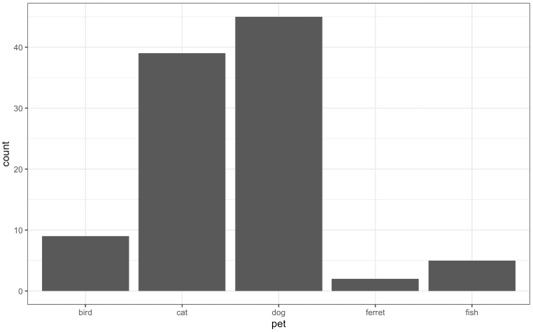

Figure 3.1 : Diagramme à barres

3.5.2. Courbe de densité

Les courbes de densité (ou de distribution) conviennent à une variable continue, mais seulement lorsque vous possédez un grand nombre d’observations.

<table>
  <tr>
    <td>ggplot(pet_happy, aes(happiness)) +
  geom_density()</td>
  </tr>
</table>

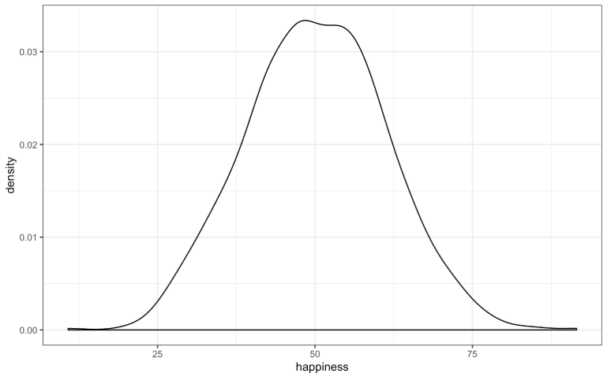

Figure 3.2 : Courbe de densité

Vous pouvez diviser une variable en sous-ensembles et les représenter en assignant la variable catégorielle aux arguments group, fill, ou couleur.

<table>
  <tr>
    <td>ggplot(pet_happy, aes(happiness, fill = pet)) +
  geom_density(alpha = 0.5)</td>
  </tr>
</table>

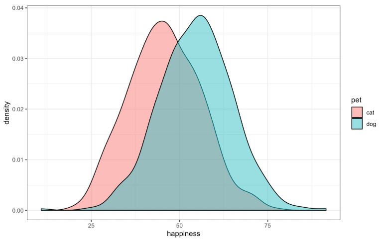

Figure 3.3 : Courbe de densité avec plusieurs groupes

<table>
  <tr>
    <td>Essayez de modifier l’argument alpha pour voir ce que cela change.</td>
  </tr>
</table>

3.5.3. Polygone des effectifs

Si vous ne souhaitez pas une distribution lissée, essayez geom_freqpoly().

<table>
  <tr>
    <td>ggplot(pet_happy, aes(happiness, color = pet)) +
  geom_freqpoly(binwidth = 1)</td>
  </tr>
</table>

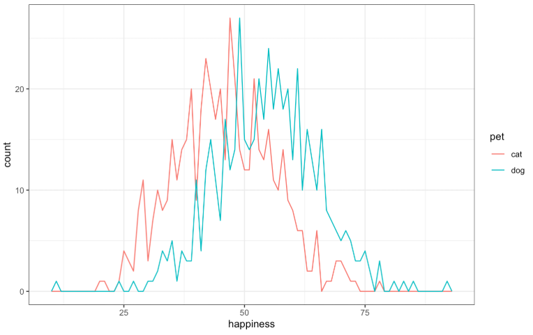

Figure 3.4 : Polygone des effectifs

<table>
  <tr>
    <td>Essayez de remplacer la valeur de l’argument binwidth par 5 puis par 0.1. Comment déterminez-vous la bonne valeur ?</td>
  </tr>
</table>

3.5.4. Histogramme

Les histogrammes conviennent également pour représenter une variable continue, et notamment lorsque vous n’avez pas beaucoup d’observations. Spécifiez l’argument binwidth pour contrôler la largeur de chaque barre.

<table>
  <tr>
    <td>ggplot(pet_happy, aes(happiness)) +
  geom_histogram(binwidth = 1, fill = "white", color = "black")</td>
  </tr>
</table>

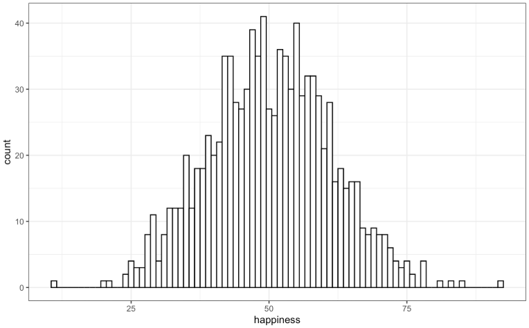

Figure 3.5 : Histogramme

<table>
  <tr>
    <td>Dans ggplot les histogrammes ne sont pas très esthétiques, à moins de définir les arguments fill et color.</td>
  </tr>
</table>

Si vous affichez des histogrammes avec plusieurs groupes, vous voudrez probablement aussi changer la valeur par défaut de l’argument position.

<table>
  <tr>
    <td>ggplot(pet_happy, aes(happiness, fill=pet)) +
  geom_histogram(binwidth = 1, alpha = 0.5, position = "dodge")</td>
  </tr>
</table>

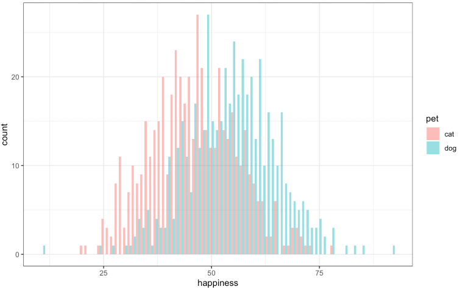

Figure 3.6 : Histogramme avec plusieurs groupes

<table>
  <tr>
    <td>Essayez de modifier la valeur de l’argument position avec "identity", “fill”, “dodge”, ou “stack”.</td>
  </tr>
</table>

3.5.5. Diagramme en colonnes

Les diagrammes en colonnes sont la pire façon de représenter des données continues divisées en plusieurs groupes, mais font aussi partie des plus communément utilisés.

Pour faire des diagrammes en colonnes avec barres d’erreur, vous devez d’abord calculer les moyennes, la limite supérieure (ymax) et la limite inférieure (ymin) des barres pour chaque catégorie. Vous en apprendrez plus sur la manière d’utiliser le code ci-dessous dans les deux prochaines leçons.

<table>
  <tr>
    <td># calculate mean and SD for each pet
avg_pet_happy <- pet_happy %>%
  group_by(pet) %>%
  summarise(
    mean = mean(happiness),
    sd = sd(happiness)
  )

ggplot(avg_pet_happy, aes(pet, mean, fill=pet)) +
  geom_col(alpha = 0.5) +
  geom_errorbar(aes(ymin = mean - sd, ymax = mean + sd), width = 0.25) +
  geom_hline(yintercept = 40)</td>
  </tr>
</table>

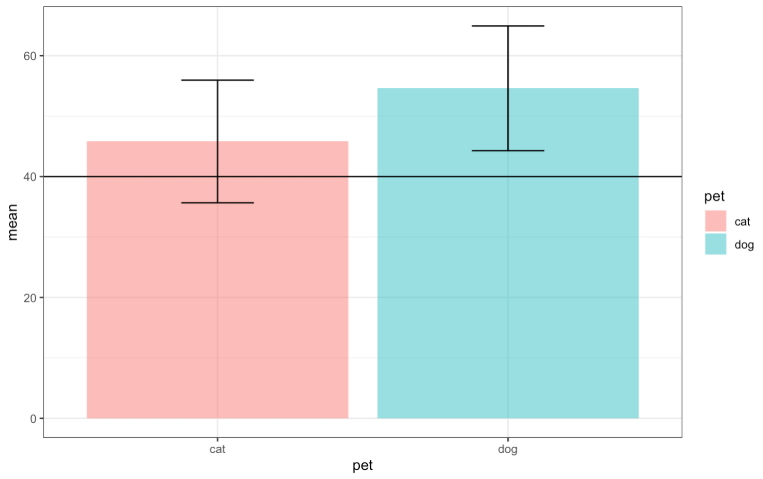

Figure 3.7 : Diagramme en colonnes

<table>
  <tr>
    <td>À votre avis, que fait geom_hline() ?</td>
  </tr>
</table>

3.5.6. Boîte à moustaches

Les boîtes à moustaches sont très bien pour représenter la distribution de variables continues divisées en plusieurs groupes. Elles résolvent la plupart des problèmes liés à l’utilisation des diagrammes en colonnes pour la représentation de données continues.

<table>
  <tr>
    <td>ggplot(pet_happy, aes(pet, happiness, fill=pet)) +
  geom_boxplot(alpha = 0.5)</td>
  </tr>
</table>

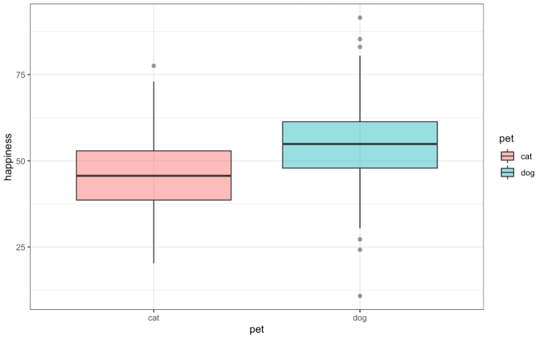

Figure 3.8 : Boîte à moustache

3.5.7. Diagramme en violon

Les diagrammes en violon ressemblent en quelque sorte à deux courbes de densité symétriques accolées verticalement. Ils donnent davantage d’informations sur la distribution que les boîtes à moustaches et sont particulièrement utiles lorsque vous avez des distributions ne suivant pas une loi normale.

<table>
  <tr>
    <td>ggplot(pet_happy, aes(pet, happiness, fill=pet)) +
  geom_violin(
    trim = FALSE,
    draw_quantiles = c(0.25, 0.5, 0.75),
    alpha = 0.5
  )</td>
  </tr>
</table>

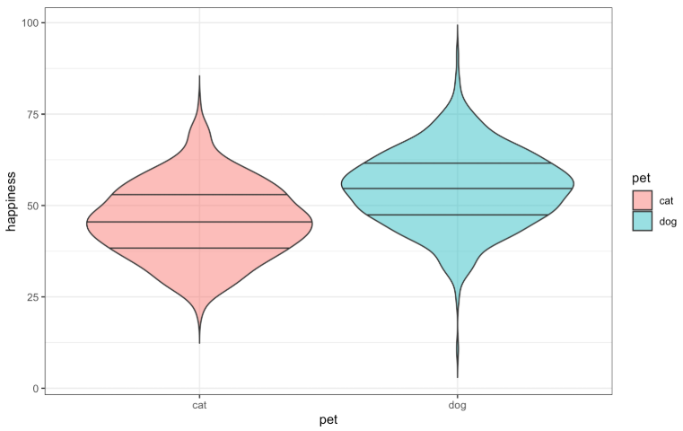

Figure 3.9 : Diagramme en violon

<table>
  <tr>
    <td>Essayez de changer les chiffres de l’argument draw_quantiles.</td>
  </tr>
</table>

3.5.8. Nuage de points

Les nuages de points sont une bonne manière de représenter la relation entre deux variables continues.

<table>
  <tr>
    <td>ggplot(x_vs_y, aes(x, y)) +
  geom_point()</td>
  </tr>
</table>

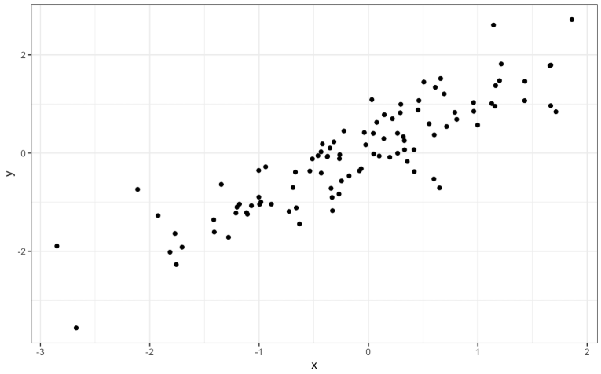

Figure 3.10 : Nuage de points à l’aide de geom_point()

3.5.9. Droite de régression linéaire

Nous cherchons souvent à représenter cette relation en une seule droite.

<table>
  <tr>
    <td>ggplot(x_vs_y, aes(x, y)) +
  geom_smooth(method="lm")</td>
  </tr>
</table>

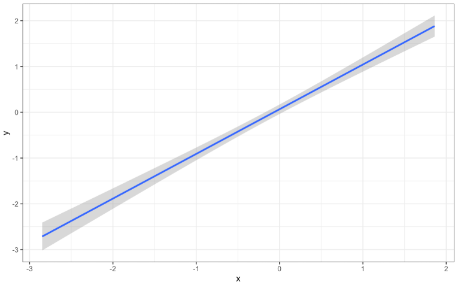

Figure 3.11 : Droite de régression linéaire à l’aide de geom_smooth()

3.6 Personnalisation

3.6.1. Étiquettes

Il y a différentes façons de définir des titres et des étiquettes d’axes personnalisés.

<table>
  <tr>
    <td>ggplot(x_vs_y, aes(x, y)) +
  geom_smooth(method="lm") +
  ggtitle("My Plot Title") +
  xlab("The X Variable") +
  ylab("The Y Variable")</td>
  </tr>
</table>

Figure 3.12 : Définir des étiquettes personnalisées à l’aide de ggtitle(), xlab() et ylab()

<table>
  <tr>
    <td>ggplot(x_vs_y, aes(x, y)) +
  geom_smooth(method="lm") +
  labs(title = "My Plot Title",
       x = "The X Variable",
       y = "The Y Variable")</td>
  </tr>
</table>

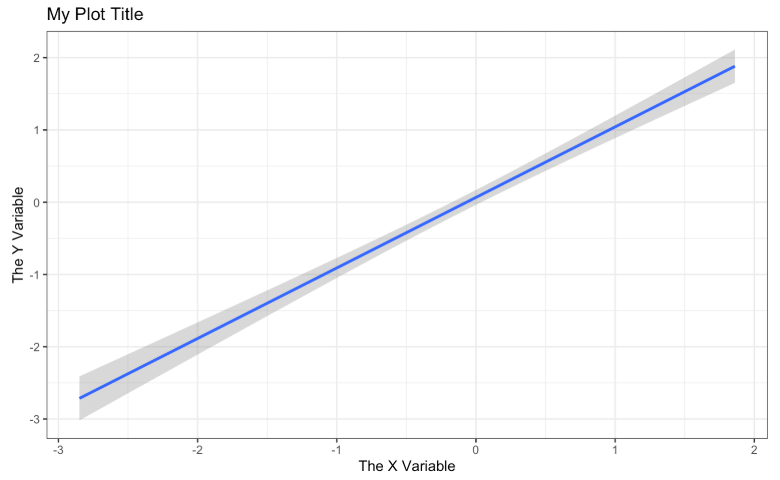

Figure 3.13 : Définir des étiquettes personnalisées à l’aide de labs()

3.6.2. Couleurs

Vous pouvez définir des valeurs personnalisées pour les bordures et le remplissage en utilisant les fonctions comme scale_colour_manual() et scale_fill_manual(). Le [chapitre Couleurs ](http://www.cookbook-r.com/Graphs/Colors_(ggplot2)/)dans[ Cookbook for R](http://www.cookbook-r.com/Graphs/Colors_(ggplot2)/) présente d’autres nombreuses manières de personnaliser les couleurs.

<table>
  <tr>
    <td>ggplot(pet_happy, aes(pet, happiness, colour = pet, fill = pet)) +
  geom_violin() +
  scale_color_manual(values = c("darkgreen", "dodgerblue")) +
  scale_fill_manual(values = c("#CCFFCC", "#BBDDFF"))</td>
  </tr>
</table>

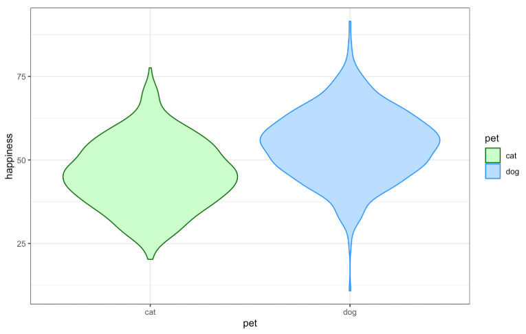

Figure 3.14 : Définir des couleurs personnalisées

3.6.3. Sauvegarder en tant que fichier

Vous pouvez sauvegarder un ggplot avec ggsave(). Par défaut, cette fonction sauvegarde le dernier ggplot ayant été créé, mais vous pouvez spécifier quel graphique vous voulez sauvegarder à condition qu’il ait été assigné à une variable.

Vous pouvez spécifier les dimensions de votre graphique avec les arguments width (largeur) et height (hauteur). Les valeurs par défaut sont en pouces, mais vous pouvez changer l’unité en modifiant la valeur de l’argument units par "in", “cm” ou “mm”.

<table>
  <tr>
    <td>box <- ggplot(pet_happy, aes(pet, happiness, fill=pet)) +
  geom_boxplot(alpha = 0.5)

violin <- ggplot(pet_happy, aes(pet, happiness, fill=pet)) +
  geom_violin(alpha = 0.5)

ggsave("demog_violin_plot.png", width = 5, height = 7)

ggsave("demog_box_plot.jpg", plot = box, width = 5, height = 7)</td>
  </tr>
</table>

3.7 Graphiques combinés

3.7.1 Diagramme en violon avec boîte à moustache interne

Pour démontrer l’utilisation de facet_grid() pour les plans factoriels, nous créons une nouvelle colonne appelée agegroup de sorte à diviser les participants suivant qu’ils soient plus âgés ou plus jeunes que l’âge médian. Par défaut, les modalités du facteur seront représentées par ordre alphabétique, mais il est possible de modifier cet ordre via la fonction factor().

<table>
  <tr>
    <td>pet_happy %>%
  mutate(agegroup = ifelse(age<median(age), "Younger", "Older"),
         agegroup = factor(agegroup, levels = c("Younger", "Older"))) %>%
  ggplot(aes(pet, happiness, fill=pet)) +
    geom_violin(trim = FALSE, alpha=0.5, show.legend = FALSE) +
    geom_boxplot(width = 0.25, fill="white") +
    facet_grid(.~agegroup) +
    scale_fill_manual(values = c("orange", "green"))</td>
  </tr>
</table>

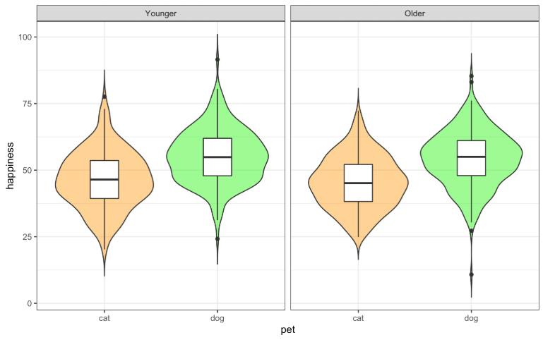

Figure 3.15 : Diagramme en violon avec boîte à moustache interne

<table>
  <tr>
    <td>Pour cacher la légende, spécifiez la valeur de l’argument show.legend avec FALSE. Ici, nous le faisons car le type d’animal de compagnie est déjà affiché sur l’axe des x.</td>
  </tr>
</table>

3.7.2 Diagramme en violon avec barres d’erreurs

Vous pouvez utiliser la fonction stat_summary() pour superposer un point-range plot affichant la moyenne ± 1 ET.

Vous apprendrez comment écrire vos propres fonctions dans la leçon [Itération et Fonctions](https://psyteachr.github.io/msc-data-skills/func.html#func).

<table>
  <tr>
    <td>ggplot(pet_happy, aes(pet, happiness, fill=pet)) +
  geom_violin(
    trim = FALSE,
    alpha = 0.5
  ) +
  stat_summary(
    fun.y = mean,
    fun.ymax = function(x) {mean(x) + sd(x)},
    fun.ymin = function(x) {mean(x) - sd(x)},
    geom="pointrange"
  )</td>
  </tr>
</table>

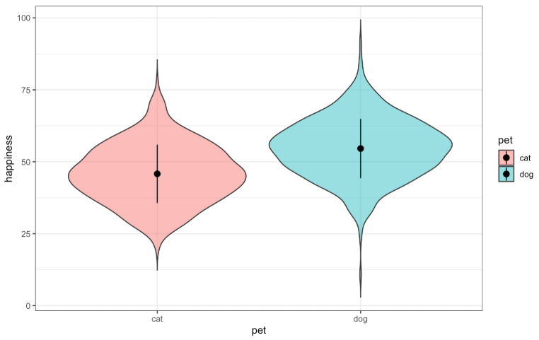

Figure 3.16 : Point-range plot à l’aide de stat_summary()

3.7.3 *Violin-jitter plot*

Si vous n’avez pas beaucoup de points de données, il est bien de les représenter individuellement. Pour faire cela, vous pouvez utiliser geom_jitter.

<table>
  <tr>
    <td>pet_happy %>%
  sample_n(50) %>%  # choose 50 random observations from the dataset
  ggplot(aes(pet, happiness, fill=pet)) +
  geom_violin(
    trim = FALSE,
    draw_quantiles = c(0.25, 0.5, 0.75),
    alpha = 0.5
  ) +
  geom_jitter(
    width = 0.15, # points spread out over 15% of available width
    height = 0, # do not move position on the y-axis
    alpha = 0.5,
    size = 3
  )</td>
  </tr>
</table>

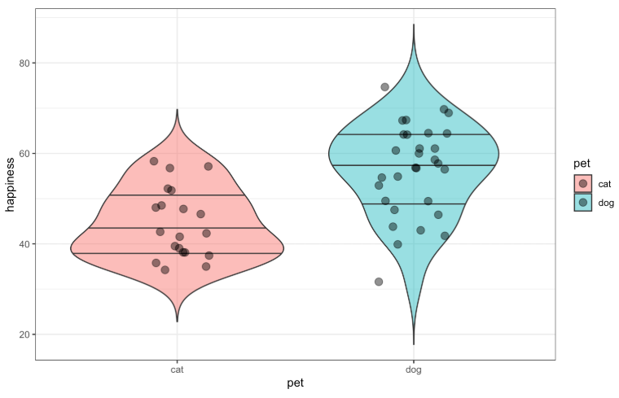

Figure 3.17 : Violin-jitter plot

3.7.4 Nuage de points avec droite de régression linéaire

Si votre graphique n’est pas trop complexe, il est aussi bien de montrer les données individuelles en arrière-plan de la droite de régression.

<table>
  <tr>
    <td>ggplot(x_vs_y, aes(x, y)) +
  geom_point(alpha = 0.25) +
  geom_smooth(method="lm")</td>
  </tr>
</table>

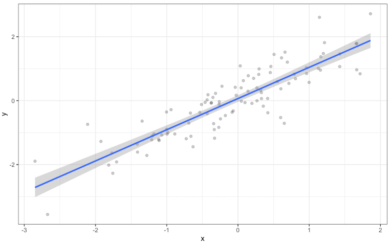

Figure 3.18 : Nuage de points avec droite de régression

3.7.5 Combinaison de graphiques

Pour facilement créer une grille avec différents graphiques, vous pouvez utiliser le package [cowplot](https://cran.r-project.org/package=cowplot/vignettes/introduction.html). Tout d’abord, vous devez assigner un nom à chaque graphique. Ensuite, vous listez tous les graphiques en tant que premiers arguments de la fonction plot_grid() puis vous définissez une liste d’étiquettes.

<table>
  <tr>
    <td>my_hist <- ggplot(pet_happy, aes(happiness, fill=pet)) +
  geom_histogram(
    binwidth = 1,
    alpha = 0.5,
    position = "dodge",
    show.legend = FALSE
  )

my_violin <- ggplot(pet_happy, aes(pet, happiness, fill=pet)) +
  geom_violin(
    trim = FALSE,
    draw_quantiles = c(0.5),
    alpha = 0.5,
    show.legend = FALSE
  )

my_box <- ggplot(pet_happy, aes(pet, happiness, fill=pet)) +
  geom_boxplot(alpha=0.5, show.legend = FALSE)

my_density <- ggplot(pet_happy, aes(happiness, fill=pet)) +
  geom_density(alpha=0.5, show.legend = FALSE)

my_bar <- pet_happy %>%
  group_by(pet) %>%
  summarise(
    mean = mean(happiness),
    sd = sd(happiness)
  ) %>%
  ggplot(aes(pet, mean, fill=pet)) +
    geom_bar(stat="identity", alpha = 0.5,
             color = "black", show.legend = FALSE) +
    geom_errorbar(aes(ymin = mean - sd, ymax = mean + sd), width = 0.25)

plot_grid(
  my_violin,
  my_box,
  my_density,
  my_bar,
  labels = c("A", "B", "C", "D")
)</td>
  </tr>
</table>

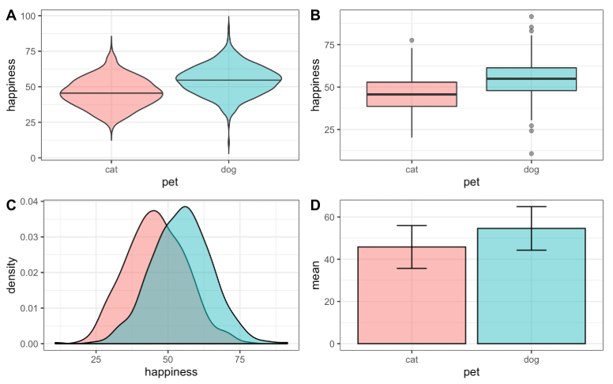

Figure 3.19 : Grille de graphiques à l’aide de cowplot

3.8 Répétition de données discrètes

3.8.1 Réduire l’opacité

Vous pouvez gérer la superposition d’observations (cas très commun lorsque vous utilisez des échelles de Likert) en réduisant l’opacité des points (représentants chacun une observation). Pour trouver le niveau d’opacité qui convient le mieux, vous devez procéder par essais et erreurs.

<table>
  <tr>
    <td>ggplot(overlap, aes(x, y)) +
  geom_point(size = 5, alpha = .05) +
  geom_smooth(method="lm")</td>
  </tr>
</table>

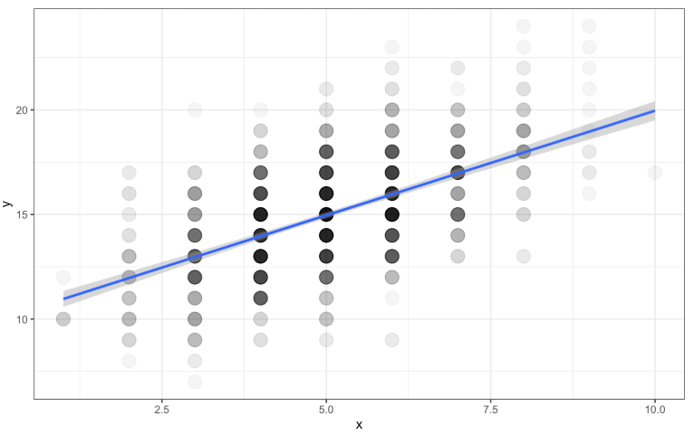

Figure 3.20 : Gérer la superposition d’observations à l’aide de la transparence

3.8.2 *Proportional dot plot*

Ou bien alors, vous pouvez également définir la taille des points comme étant proportionnelle au nombre d’observations qui se chevauchent en utilisant geom_count().

<table>
  <tr>
    <td>overlap %>%
  ggplot(aes(x, y)) +
  geom_count(color = "#663399")</td>
  </tr>
</table>

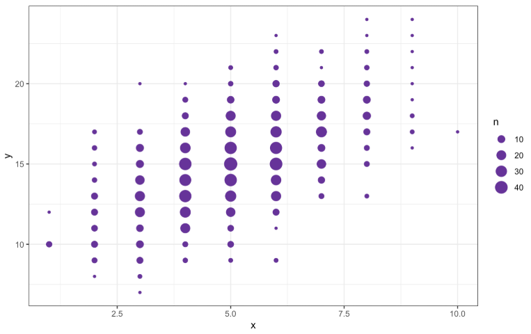

Figure 3.21 : Gérer la répétition d’observations à l’aide de geom_count()

Alternativement, vous pouvez transformer vos données en créant une colonne d’effectifs et utiliser l’effectif pour définir la couleur des points.

<table>
  <tr>
    <td>overlap %>%
  group_by(x, y) %>%
  summarise(count = n()) %>%
  ggplot(aes(x, y, color=count)) +
  geom_point(size = 5) +
  scale_color_viridis_c()</td>
  </tr>
</table>

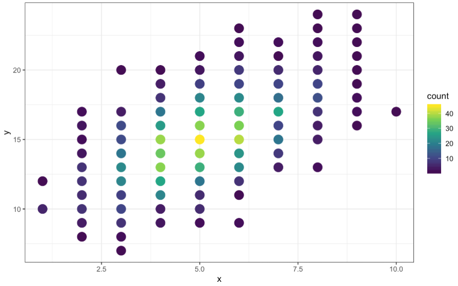

Figure 3.22 : Gérer la répétition d’observations à l’aide de la couleur

<table>
  <tr>
    <td>Le package viridis change le thème des couleurs pour les rendre plus lisibles par les personnes daltoniennes et rendre le contraste plus lisible lorsqu’il est imprimé en noir et blanc. Depuis la version 3.0.0., Viridis est intégré dans ggplot2. Il utilise scale_colour_viridis_c() et scale_fill_viridis_c() pour les variables continues et scale_colour_viridis_d() et scale_fill_viridis_d() pour les variables discrètes.</td>
  </tr>
</table>

3.9 Répétition de données continues

Même si les variables sont continues, si vous avez beaucoup de données alors la superposition des points risquerait de masquer quelconque relation.

<table>
  <tr>
    <td>overplot %>%
  ggplot(aes(x, y)) +
  geom_point()</td>
  </tr>
</table>

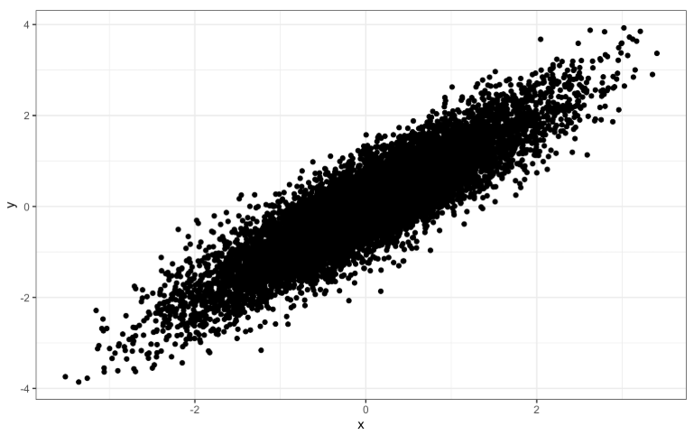

Figure 3.23 : Sur-représentation de données

3.9.1 *2D Density plot*

Utilisez geom_density2d() pour créer une *contour map*.

<table>
  <tr>
    <td>overplot %>%
  ggplot(aes(x, y)) +
  geom_density2d()</td>
  </tr>
</table>

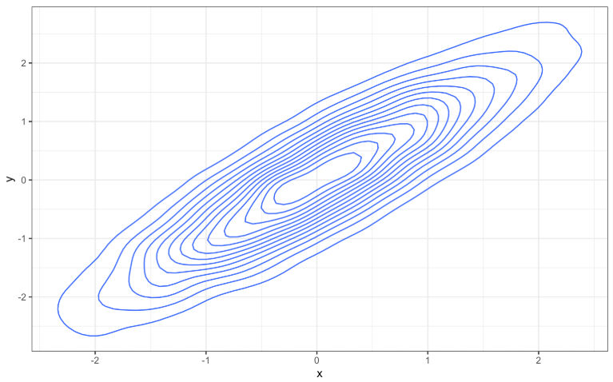

Figure 3.24 : *Contour map* à l’aide de geom_density2d()

Pour créer une carte de densité thermique vous pouvez utiliser stat_density_2d(aes(fill = ..level..), geom = "polygon").

<table>
  <tr>
    <td>overplot %>%
  ggplot(aes(x, y)) +
  stat_density_2d(aes(fill = ..level..), geom = "polygon") +
  scale_fill_viridis_c()</td>
  </tr>
</table>

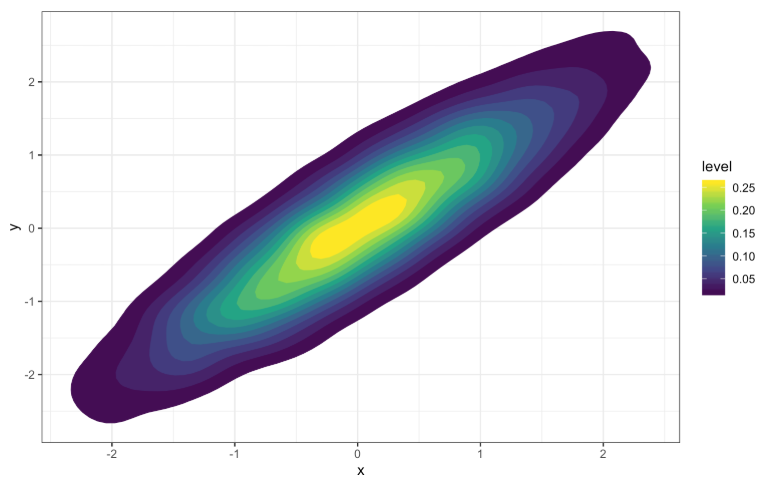

Figure 3.25 : Carte de densité thermique

3.9.2 Histogramme 2D

Utilisez geom_bin2d() pour créer une heatmap rectangulaire basée sur le nombre de bin. Spécifiez la binwidth avec les dimensions x et y définissant la taille de chaque bin.

<table>
  <tr>
    <td>overplot %>%
  ggplot(aes(x, y)) +
  geom_bin2d(binwidth = c(1,1))</td>
  </tr>
</table>

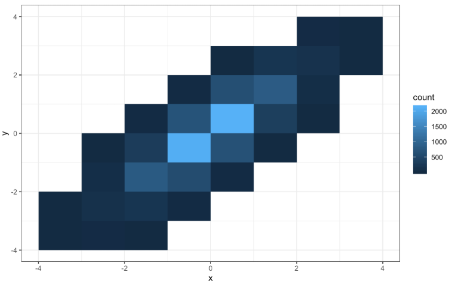

Figure 3.26 : Heatmap basée sur le nombre de bin

3.9.3 Heatmap hexagonale

Utilisez geomhex() pour créer une heatmap hexagonale basée sur le nombre de bin. Ajustez la binwidth, xlim(), ylim() et/ou les dimensions de la figure pour créer des hexagones plus ou moins allongés.

<table>
  <tr>
    <td>overplot %>%
  ggplot(aes(x, y)) +
  geom_hex(binwidth = c(0.25, 0.25))</td>
  </tr>
</table>

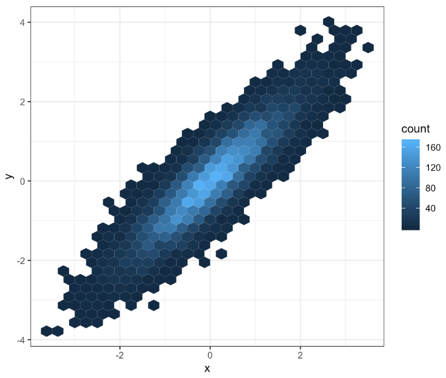

Figure 3.27 : Heatmap hexagonale basée sur le nombre de bin

3.9.4 Heatmap d’une matrice de corrélation

J’ai inclus le code pour créer une matrice de corrélation à partir d’un tableau de variables, mais vous n’avez pas à comprendre comment cela a été fait pour l’instant. Nous couvrirons les fonctions mutate() et gather() dans les leçons sur [dplyr (EN)](https://psyteachr.github.io/msc-data-skills/dplyr.html#dplyr) et [tidyr (EN)](https://psyteachr.github.io/msc-data-skills/tidyr.html#tidyr).

<table>
  <tr>
    <td># generate two sets of correlated variables (a and b)
heatmap <- tibble(
    a1 = rnorm(100),
    b1 = rnorm(100)
  ) %>%
  mutate(
    a2 = a1 + rnorm(100),
    a3 = a1 + rnorm(100),
    a4 = a1 + rnorm(100),
    b2 = b1 + rnorm(100),
    b3 = b1 + rnorm(100),
    b4 = b1 + rnorm(100)
  ) %>%
  cor() %>% # create the correlation matrix
  as.data.frame() %>% # make it a data frame
  rownames_to_column(var = "V1") %>% # set rownames as V1
  gather("V2", "r", a1:b4) # wide to long (V2)</td>
  </tr>
</table>

Une fois que vous avez une matrice de corrélation dans le bon format (format ‘long’), il est facile de créer une heatmap à l’aide de geom_tile().

<table>
  <tr>
    <td>ggplot(heatmap, aes(V1, V2, fill=r)) +
  geom_tile() +
  scale_fill_viridis_c()</td>
  </tr>
</table>

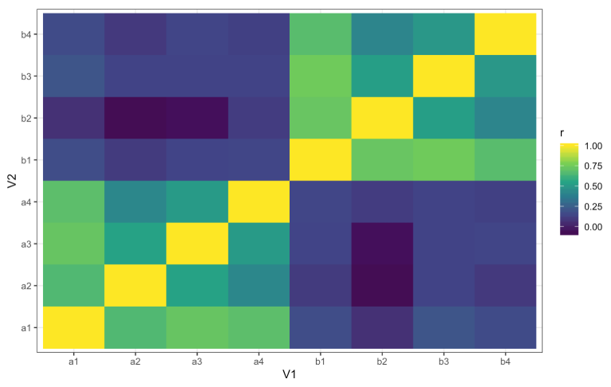

Figure 3.28 : Heatmap à l’aide de geom_tile()

<table>
  <tr>
    <td>Le type de fichier est déterminé par l’extension du fichier, ou bien en spécifiant l’argument device, qui peut prendre les valeurs suivants : "eps", “ps”, “tex”, “pdf”, “jpeg”, “tiff”, “png”, “bmp”, “svg” ou “wmf”.</td>
  </tr>
</table>

3.10 Graphiques interactifs

Pour créer des graphiques interactifs, vous pouvez utiliser le package plotly. Il vous suffit d’assigner votre ggplot à une variable et d’utiliser la fonction ggplotly().

<table>
  <tr>
    <td>demog_plot <- ggplot(pet_happy, aes(pet, happiness, fill=pet)) +
  geom_point(position = position_jitter(width= 0.2, height = 0), size = 2)

ggplotly(demog_plot)</td>
  </tr>
</table>

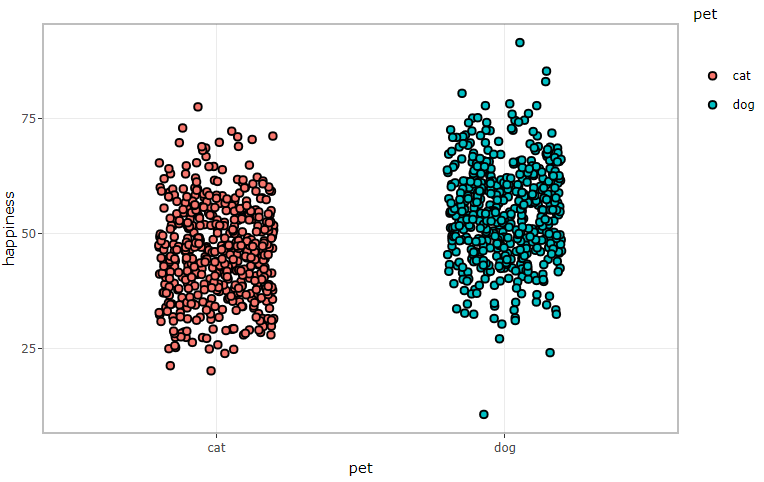

Figure 3.29 : Graphique interactif avec plotly

<table>
  <tr>
    <td>Passez votre souris sur les points de données et cliquez sur les différentes étiquettes du graphique.</td>
  </tr>
</table>

3.11 Quizz

*N.B. : Pour afficher les solutions, surlignez la zone grisée à l’aide de votre curseur.*

1. Générez un graphique comme celui ci-dessous à partir du jeu de données iris. Veillez à bien inclure des étiquettes d’axes personnalisés.

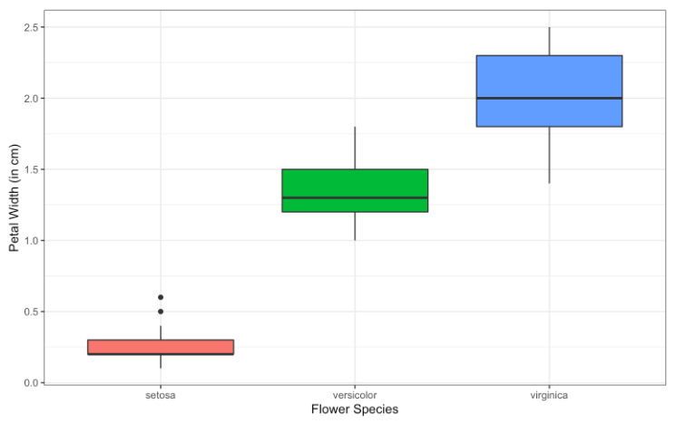

[Solution]

<table>
  <tr>
    <td>ggplot(iris, aes(Species, Petal.Width, fill = Species)) +
  geom_boxplot(show.legend = FALSE) +
  xlab("Flower Species") +
  ylab("Petal Width (in cm)")

# there are many ways to do things, the code below is also correct
ggplot(iris) +
  geom_boxplot(aes(Species, Petal.Width, fill = Species), show.legend = FALSE) +
  labs(x = "Flower Species",
       y = "Petal Width (in cm)")</td>
  </tr>
</table>

2. Vous venez juste de créer un graphique avec le code suivant. Comment le sauvegarder ?

<table>
  <tr>
    <td>ggplot(cars, aes(speed, dist)) +
  geom_point() +
  geom_smooth(method = lm)</td>
  </tr>
</table>

[Solution]

<table>
  <tr>
    <td># Les quatre possibilités fonctionnent

ggsave()
ggsave("figname")
ggsave(“figname.png”)
ggsave(“figname.png”, plot = cars)</td>
  </tr>
</table>

3. Déboguez le code suivant.

<table>
  <tr>
    <td>ggplot(iris) +
  geom_point(aes(Petal.Width, Petal.Length, colour = Species)) +
  geom_smooth(method = lm) +
  facet_grid(Species)</td>
  </tr>
</table>

[Solution]

<table>
  <tr>
    <td>ggplot(iris, aes(Petal.Width, Petal.Length, colour = Species)) +
  geom_point() +
  geom_smooth(method = lm) +
  facet_grid(~Species)</td>
  </tr>
</table>

4. Générez un graphique comme celui ci-dessous à l’aide du jeu de données ChickWeight.

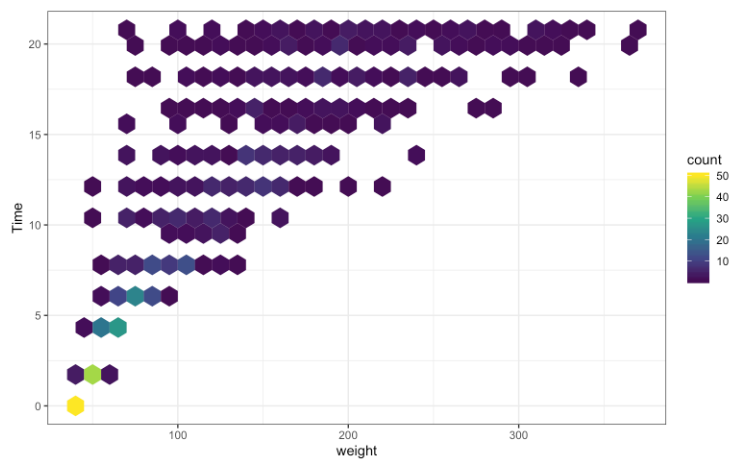

[Solution]

<table>
  <tr>
    <td>ggplot(ChickWeight, aes(weight, Time)) +
  geom_hex(binwidth = c(10, 1)) +
  scale_fill_viridis_c()</td>
  </tr>
</table>

5. Générez un graphique comme celui ci-dessous à l’aide du jeu de données iris.

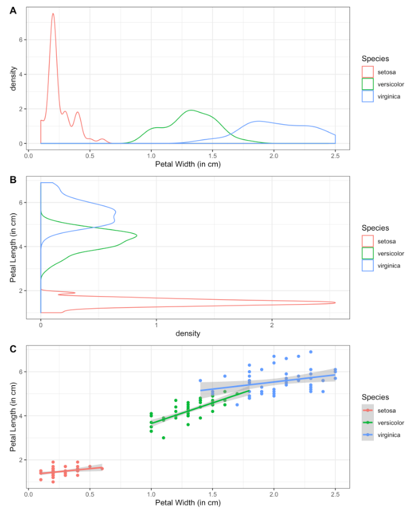

[Solution]

<table>
  <tr>
    <td>pw <- ggplot(iris, aes(Petal.Width, color = Species)) +
  geom_density() +
  xlab("Petal Width (in cm)")

pl <- ggplot(iris, aes(Petal.Length, color = Species)) +
  geom_density() +
  xlab("Petal Length (in cm)") +
  coord_flip()

pw_pl <- ggplot(iris, aes(Petal.Width, Petal.Length, color = Species)) +
  geom_point() +
  geom_smooth(method = lm) +
  xlab("Petal Width (in cm)") +
  ylab("Petal Length (in cm)")

cowplot::plot_grid(
  pw, pl, pw_pl,
  labels = c("A", "B", "C"),
  nrow = 3
)</td>
  </tr>
</table>

3.12 Exercices

Téléchargez les [exercices (EN)](https://psyteachr.github.io/msc-data-skills/exercises/03_ggplot_exercise.Rmd). Référez-vous aux [graphiques (EN)](https://psyteachr.github.io/msc-data-skills/exercises/03_ggplot_answers.html) pour voir à quoi vos graphiques devraient ressembler (cette page ne contient pas le code de réponse). Ne regardez les [réponses (EN)](https://psyteachr.github.io/msc-data-skills/exercises/03_ggplot_answers.Rmd) qu’après avoir tenté de répondre à toutes les questions.
