# Chapitre 6: les liaisons de données

*Traduit par Marie Delacre. **Relu et corrigé par Mae Braud.*

## 6.1   Objectifs d’apprentissage

### 6.1.1 Niveau débutant

1. Être capable d’utiliser les 4 fonctions de jointure :

o  [left_join()](#heading=h.3d5qvurzv9g0)

o  [right_join()](#heading=h.fu1zqm3zf7cb)

o  [inner_join()](#heading=h.6z108k48ch4u)

o  [full_join()](#heading=h.cvh73peyoox7)

2.  Utiliser l’argument *by* pour définir les colonnes servant à joindre les tables

### 6.1.2 Niveau intermédiaire

3.  Utiliser l’argument *suffix* pour discriminer plusieurs colonnes qui portent le même nom

4.  Être capable d’utiliser les 2 fonctions de jointures filtrantes :

o [semi_join()](#heading=h.o33eiy9fp36e)

o [anti_join()](#heading=h.7rnmi1syxjnb)

5.  Être capable d’utiliser les 2 fonctions de concaténation de tableaux :

o [bind_rows()](#heading=h.hkbx9p1fli39)

o [bind_cols](#heading=h.jk6048hw6zto)[()](#heading=h.7rnmi1syxjnb)

6.  Être capable d’utiliser les 3 opérations ensemblistes :

o [intersect()](#heading=h.xojdz33klwpd)

o [union()](#heading=h.has8rrhjtd58)

o [setdiff()](#heading=h.i2dwoqig8cxo)

## 6.2   Resources

·Le chapitre 13[ Relational Data](https://r4ds.had.co.nz/relational-data.html) de[ R for Data Science](https://r4ds.had.co.nz/)* * (EN)

·[L’antisèche pour les fonctions de jointure de deux tables, du package dplyr](https://stat545.com/join-cheatsheet.html) (EN)

·[Slides du cours sur les fonctions de jointures de deux tables, du package dplyr](https://psyteachr.github.io/msc-data-skills/slides/05_joins_slides.pdf) (EN)

## 6.3 Les données

Nous allons commencer par créer deux petites tables de données.

Dans la table subject, on trouve l’identifiant (id), le sexe (les hommes sont codés « m » et les femmes sont codées « f ») et l’âge de 5 sujets, à l’exception de l’âge et du sexe du sujet 3 pour lequel ces données sont manquantes.

<table>
  <tr>
    <td>subject <- tibble(
  id = seq(1,5),
  sex = c("m", "m", NA, "f", "f"),
  age = c(19,22,NA,19,18)
) </td>
  </tr>
</table>

Dans la table exp, on trouve l’identifiant (id) de sujets ainsi que le score qu’ils ont obtenu à une expérience. Certains sujets de la table subject sont manquants, d’autres ont réalisé deux fois l’expérience et enfin, certains sujets répertoriés dans la table exp ne sont pas mentionnés dans la table subject.

<table>
  <tr>
    <td>exp <- tibble(
  id = c(2, 3, 4, 4, 5, 5, 6, 6, 7),
  score = c(10, 18, 21, 23, 9, 11, 11, 12, 3)
)</td>
  </tr>
</table>

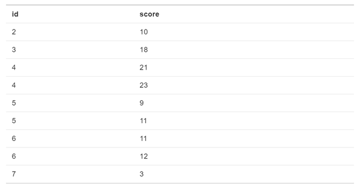

## 6.4 Les jointures

Toutes les fonctions de jointures ont la syntaxe de base suivante :

****_join(x, y, by = NULL, suffix = c(".x", ".y")

·   	x = la première table (table de gauche)

·   	y = la deuxième table (table de droite)

·   	{#join-by} by = quelles sont les colonnes qui permettent de joindre les deux tables? Si vous laissez ce champ vide, la jointure sera faite sur base de toutes les colonnes qui ont le même nom dans les deux tables.

·   	{#join-suffix} suffix = si des colonnes ont le même nom dans les deux tables mais que vous ne les utilisez pas pour la jointure, un suffixe sera ajouté à leur nom dans la table finale, de sorte à les rendre non ambigües. Par défaut, les suffixes ajoutés sont ".x" et “.y”, mais vous pouvez les remplacer par quelque chose de plus pertinent.

<table>
  <tr>
    <td>Bien que l’argument "by" puisse être omis si vous faites la jointure sur base de toutes les colonnes ayant le même nom dans les deux tables, il est recommandé de systématiquement spécifier cet argument, de sorte que votre code soit robuste
              aux modifications dans les données chargées.     </td>
  </tr>
</table>

### 6.4.1 Jointure à gauche: left_join()

**Figure 6.1: Jointure à gauche**

La fonction *left_join* conserve toutes les données de la première table (à gauche) auxquelles elle adjoint les données provenant de la deuxième table (à droite). S’il y a plusieurs lignes de la table de droite en correspondance avec une ligne de la table de gauche, cette dernière sera dupliquée dans la table jointe (voir les sujets 4 et 5).

<table>
  <tr>
    <td>left_join(subject, exp,by = "id")</td>
  </tr>
</table>

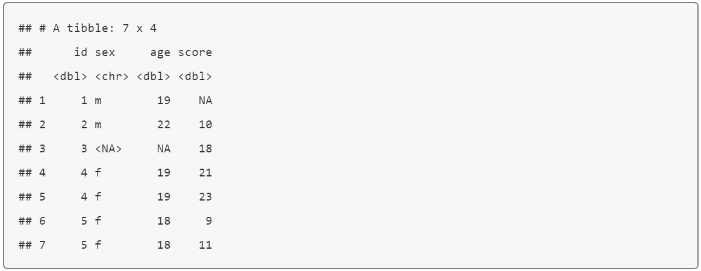

Dans le code ci-dessous, nous avons inversé l’ordre des tables dans la fonction, de sorte que la table jointe résultante soit l’ensemble des lignes de la table exp auxquelles sont adjointes les informations provenant de la table subject.

<table>
  <tr>
    <td>left_join(exp, subject,by = "id")</td>
  </tr>
</table>

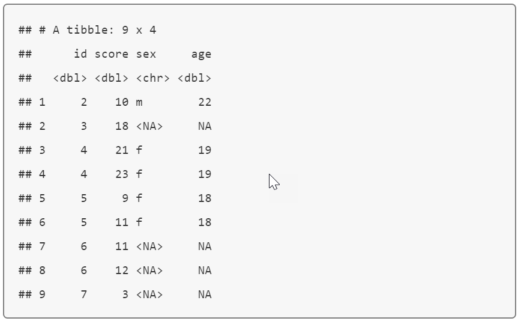

### 6.4.2 Jointure à droite: right_join()

La fonction *right_join* conserve toutes les données de la deuxième table (à droite) auxquelles elle adjoint les données provenant de la première table (à gauche).

<table>
  <tr>
    <td>right_join(subject, exp,by = "id")</td>
  </tr>
</table>

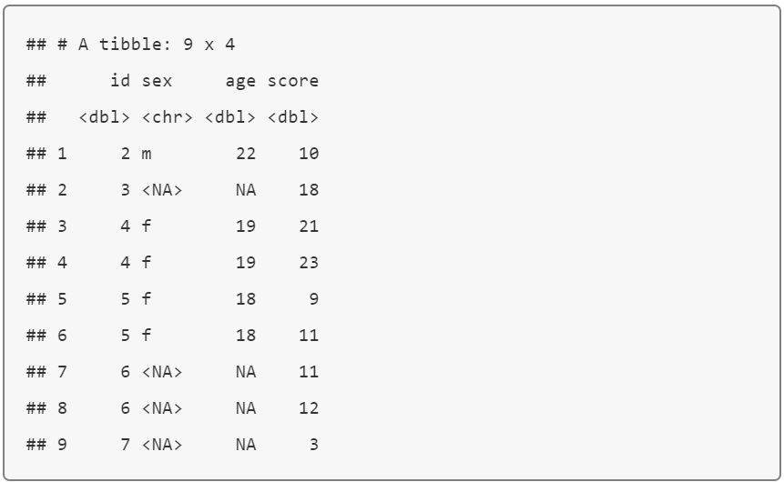

<table>
  <tr>
    <td>Cette table contient la même information que celle obtenue via la fonction left_join(exp, subject, by = ="id”), mais les colonnes sont présentées dans un ordre différent (les colonnes de la table de gauche précèdent celles de la table de
              droite)</td>
  </tr>
</table>

### 6.4.3 Jointure restreinte: inner_join()

La fonction *inner_join* produira une table jointe constituée de toutes les lignes qui sont présentes dans les deux tables simultanément.** **

<table>
  <tr>
    <td>inner_join(subject, exp,by = "id")</td>
  </tr>
</table>

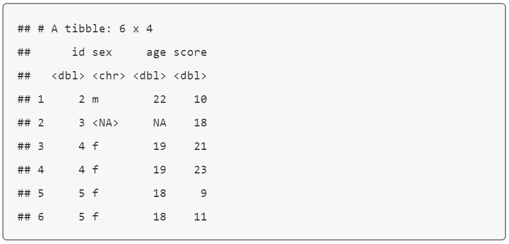

### 6.4.4 Jointure complète: full_join()

La fonction *full_join* vous permet de rejoindre les lignes des deux tables tout en conservant l’ensemble de l’information des deux tables. Si une ligne n’est pas présente dans les deux tables simultanément, les valeurs « NA » seront introduites dans les colonnes correspondant à la table dans laquelle la ligne n’est pas présente.** **

<table>
  <tr>
    <td>full_join(subject, exp,by = "id")</td>
  </tr>
</table>

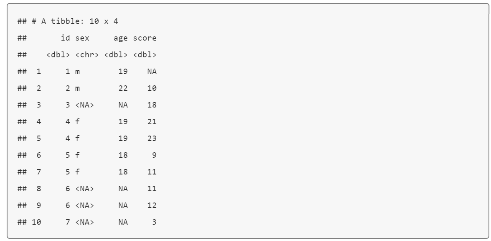

## 6.5 Jointures filtrantes

### 6.5.1 Semi-jointure : semi_join()

**Figure 6.6: semi jointure**

La fonction *semi_join* sélectionne toutes les lignes de la table de gauche qui ont une correspondance dans la table de droite, sans ajouter les colonnes de la table de droite.

<table>
  <tr>
    <td>semi_join(subject, exp, by = "id")</td>
  </tr>
</table>

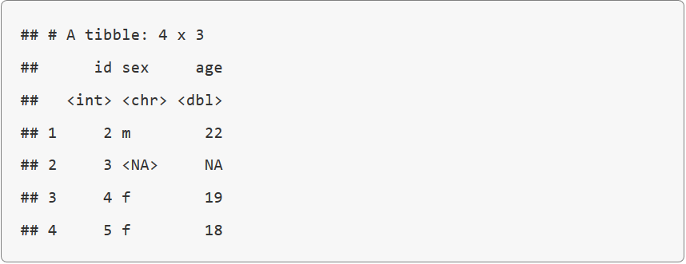

<table>
  <tr>
    <td>Contrairement à la fonction inner_join, semi_join ne dupliquera jamais les lignes de la table de gauche s’il y a plusieurs lignes qui lui correspondent dans la table de droite.</td>
  </tr>
</table>

L’ordre dans lequel on introduit les tables dans la fonction *semi_join* importe.

<table>
  <tr>
    <td>semi_join(exp, subject, by = "id")</td>
  </tr>
</table>

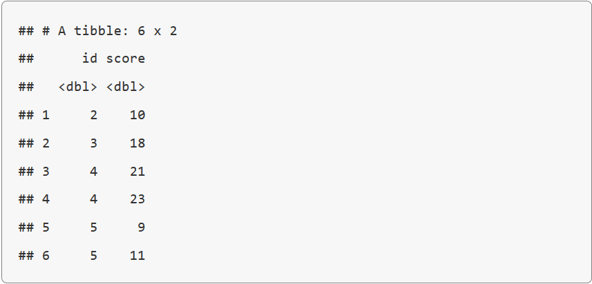

### 6.5.2 Anti-jointure : anti_join()

La fonction *anti_join* sélectionne toutes les lignes de la table de gauche qui *n’*ont pas de correspondance dans la table de droite, sans ajouter les colonnes de la table de droite.

<table>
  <tr>
    <td>anti_join(subject, exp, by = "id")</td>
  </tr>
</table>

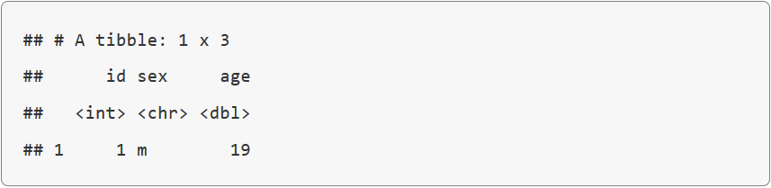

L’ordre dans lequel on introduit les tables dans la fonction *anti_join* importe.

<table>
  <tr>
    <td>anti_join(exp, subject, by = "id")</td>
  </tr>
</table>

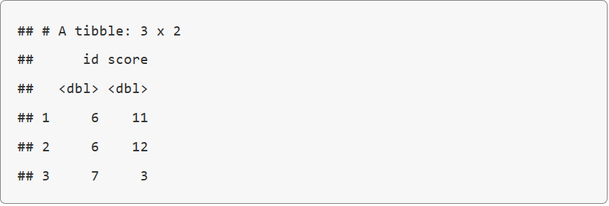

## 6.6 Les fonctions de concaténations

### 6.6.1 Concaténation de lignes: bind_rows()

Vous pouvez combiner les lignes de deux tables avec la fonction *bind_rows*.

Dans l’exemple ci-dessous, nous allons créer la table « new_subjects » contenant l’identifiant (id), le sexe et l’âge des sujets 6 à 9, et concaténer cette table et la table d’origine « subject ».

<table>
  <tr>
    <td>new_subjects <- tibble(
  id = seq(6, 9),
  sex = c("m", "m", "f", "f"),
  age = c(19, 16, 20, 19)
)
bind_rows(subject, new_subjects)</td>
  </tr>
</table>

Les colonnes qui correspondent à une variable doivent avoir le même nom d’une table à l’autre pour pouvoir être associées, mais il n’est pas nécessaire qu’elles soient présentées dans le même ordre d’une table à l’autre.

Si certaines colonnes sont manquantes dans une des deux tables, des NA seront automatiquement insérés.

Si une ligne est présente dans les deux tables (comme la ligne qui se rapporte à l’id 5, présente à la fois dans les tables **subjects** et **new_subjects** ci-dessous), alors, elle sera dupliquée dans la table finale.

<table>
  <tr>
    <td>new_subjects <- tibble(
  id = seq(5, 9),
  age = c(18, 19, 16, 20, 19),
  sex = c("f", "m", "m", "f", "f"),
  new = c(1,2,3,4,5)
)
bind_rows(subject, new_subjects)</td>
  </tr>
</table>

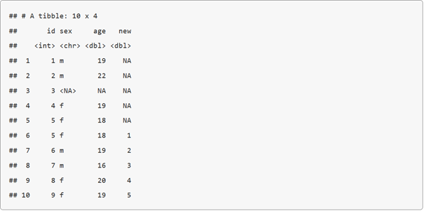

Si vos tables contiennent exactement les mêmes colonnes, vous pouvez utiliser la fonction *union()* (voir ci-dessous) pour éviter les duplications de lignes.

### 6.6.2 Concaténation de colonnes: bind_cols()

Vous pouvez fusionner deux tables ayant le même nombre de lignes en utilisant la fonction *bind_cols*. Ce n’est utile que si les lignes sont présentées exactement dans le même ordre dans les deux tables. Le seul avantage de cette fonction, par rapport à la jointure à gauche, survient lorsque les tables n’ont pas de colonne « id » permettant de joindre l’information des deux tables, nous obligeant à nous fier uniquement à leur ordre.

<table>
  <tr>
    <td>new_info <- tibble(
  colour = c("red", "orange", "yellow", "green", "blue")
)

bind_cols(subject, new_info)</td>
  </tr>
</table>

## 6.7 les opérations ensemblistes

### 6.7.1 la fonction *intersect()*

La fonction *intersect()* sélectionne toutes les lignes qui sont en parfaite correspondance (c’est-à-dire, les lignes qui contiennent exactement les mêmes donnés, relatives aux mêmes variables) dans les deux tables, peu importe si les lignes sont présentées dans le même ordre ou non.

<table>
  <tr>
    <td>new_subjects <- tibble(
  id = seq(4, 9),
  age = c(19, 18, 19, 16, 20, 19),
  sex = c("f", "f", "m", "m", "f", "f")
)

dplyr::intersect(subject, new_subjects)</td>
  </tr>
</table>

### 6.7.2 la fonction *union()*

La fonction *union()* fusionne toutes les lignes des deux tables, en supprimant les doublons (à condition que les deux tables contiennent exactement les mêmes colonnes, comme il a été mentionné précédemment).

<table>
  <tr>
    <td>dplyr::union(subject, new_subjects)</td>
  </tr>
</table>

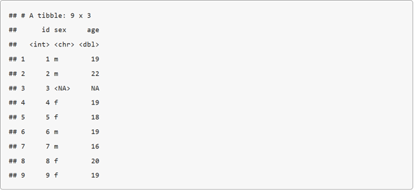

### 6.7.3 la fonction *setdiff()*

La fonction *setdiff* sélectionne les lignes qui ne sont présentes que dans la première table (et qui sont donc absentes de la seconde table).

<table>
  <tr>
    <td> setdiff(subject, new_subjects)</td>
  </tr>
</table>

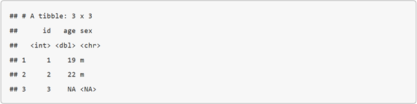

** **L’ordre dans lequel on introduit les tables dans la fonction *setdiff* importe.

<table>
  <tr>
    <td> setdiff(new_subjects, subject)</td>
  </tr>
</table>

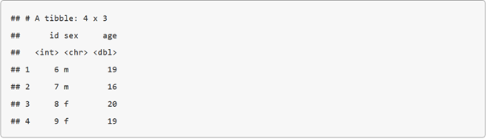

##  6.8 Exercices

Téléchargez les[ exercices](https://psyteachr.github.io/msc-data-skills/exercises/06_joins_exercise.Rmd). Ne regardez les[ réponses](https://psyteachr.github.io/msc-data-skills/exercises/06_joins_answers.Rmd)qu’après avoir tenté de répondre à toutes les questions
