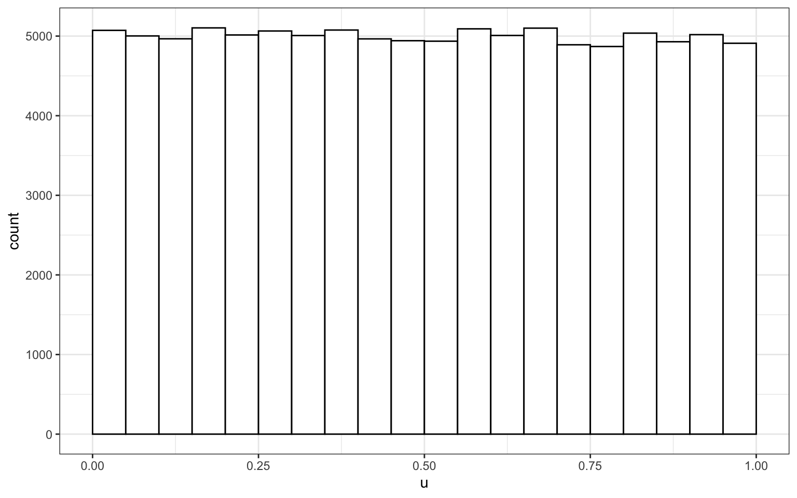
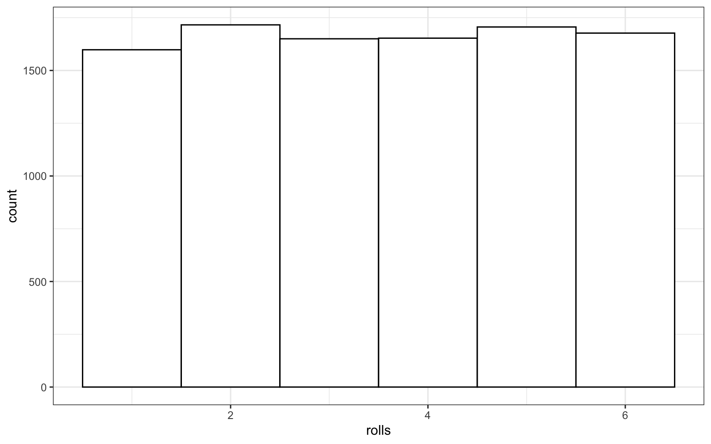
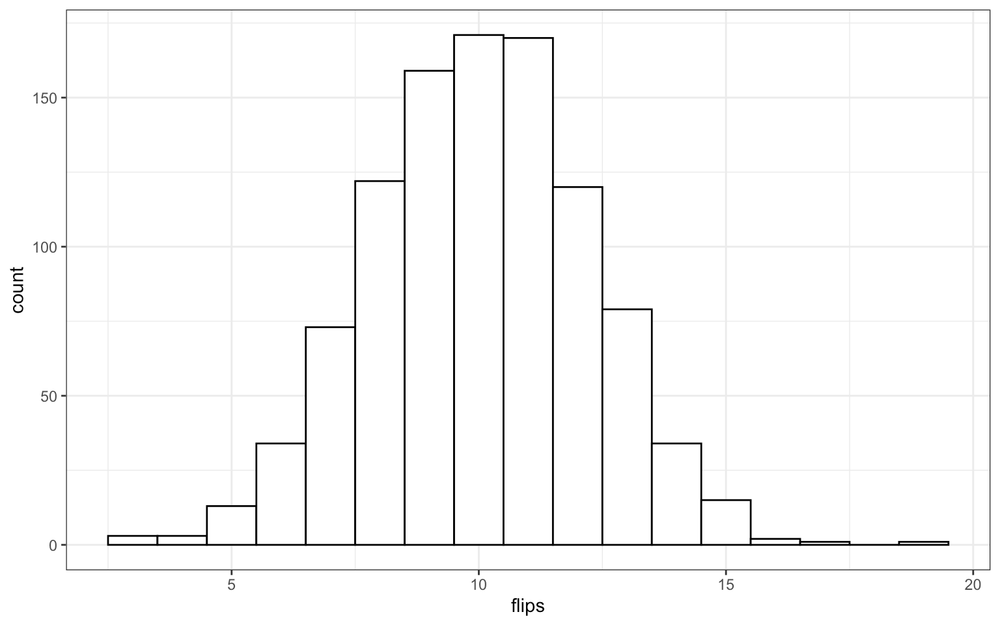
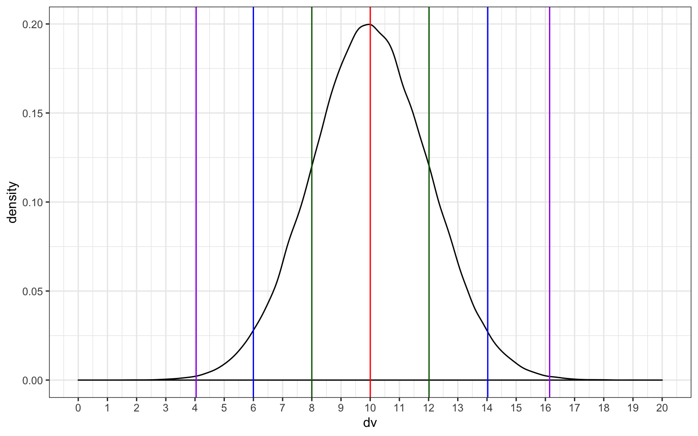
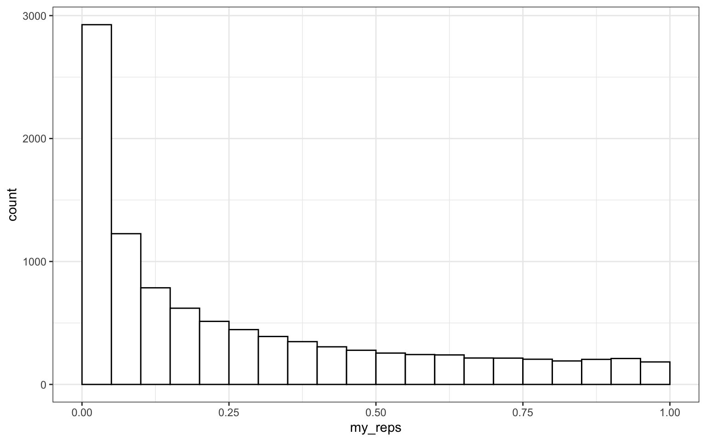
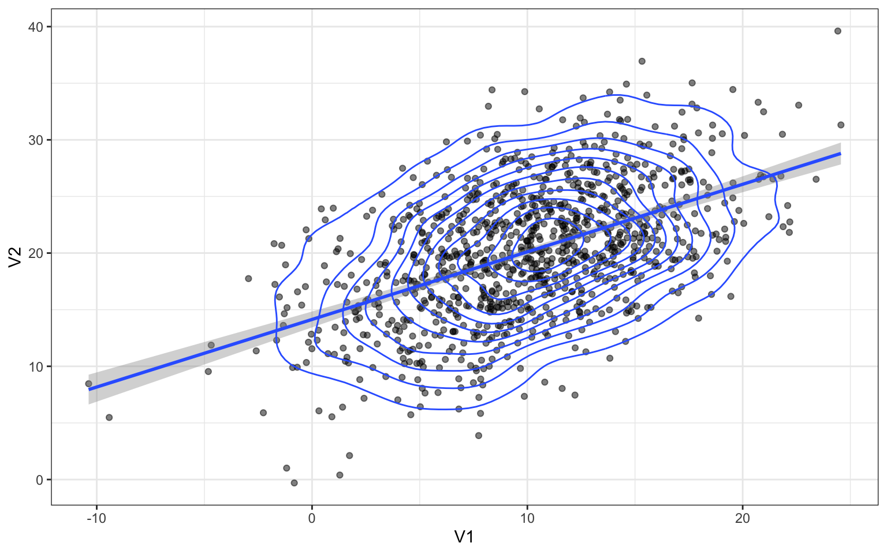
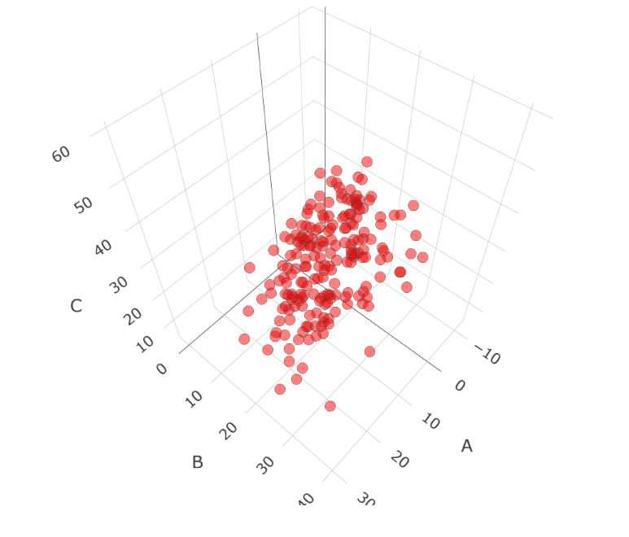
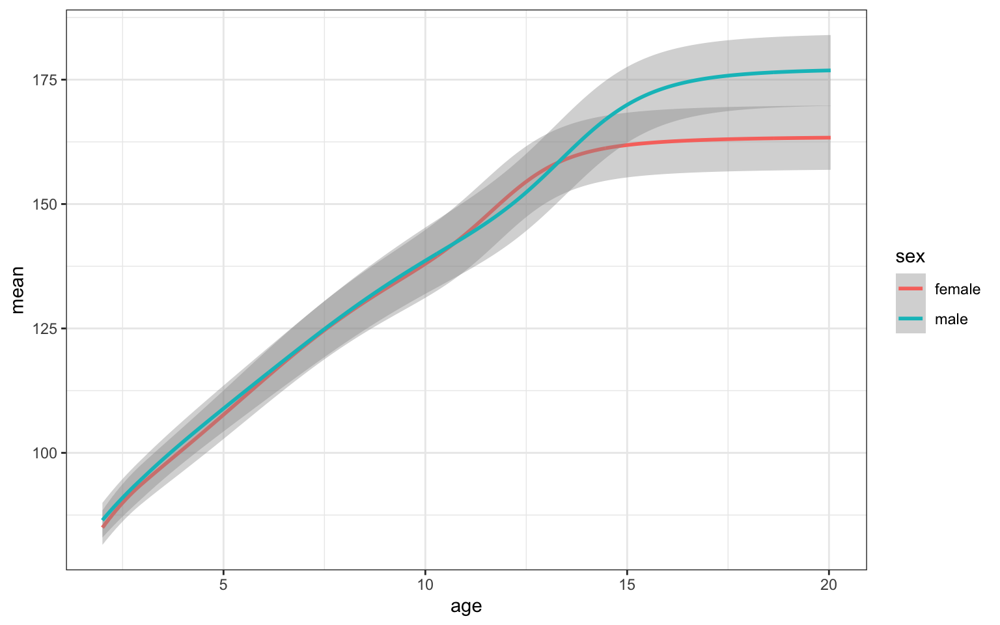
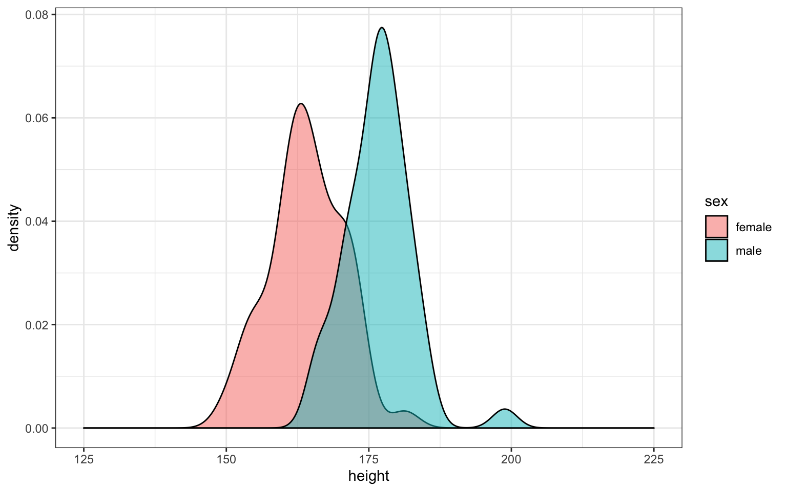
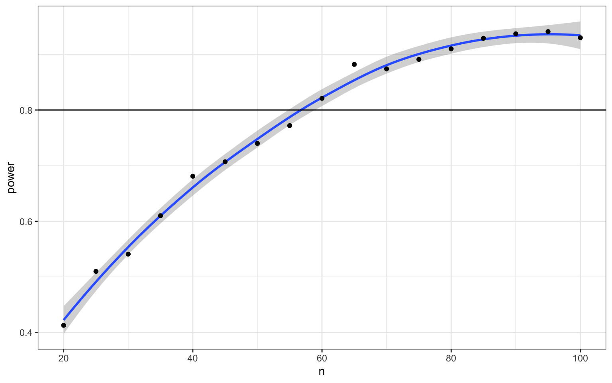

Chapitre 8 : Probabilités et simulations

*Traduit par Marie Delacre. **Relu et corrigé par **Mae Braud**.*

# 8.1 Objectifs d’apprentissage

8.1.1 Niveau débutant

1. Comprendre quels types de données sont les mieux modélisés par différentes distributions

    * [uniform](#heading=h.w38p53ieoo9d)e

    * [binomial](#heading=h.qn7dmjo1w7ae)e

    * [normale](#heading=h.8syomcnhy2qw)

    * de poisson

2. Générer et représenter graphiquement des données d’échantillons aléatoires extraits au départ des distributions précitées.

3. Tester les distributions des échantillons par rapport à une hypothèse nulle

    * [test binomial exact](#heading=h.ur6g11w7omox)

    * [test ](#heading=h.xcgr9fu2szo9)*[*t](#heading=h.xcgr9fu2szo9) (pour échantillon unique, 2 échantillons indépendants ou 2 échantillons appariés)

    * [test de corrélation](#heading=h.el0do983b2fi) (de pearson, kendall et spearman)

4. Définir les [termes statistiques](#heading=h.iqz5wqt90c06) suivants:

    * p-valeur

    * alpha

    * puissance

    * plus petite taille d’effet d’intérêt (SESOI)

    * faux positif (erreur de type I)

    * faux négatif (erreur de type II)

    * intervalle de confiance (IC)

5. [Calculer la puissance](#heading=h.7b0xl4hfox1) en utilisant des itérations et des fonctions d’échantillonnage

8.1.2 Niveau intermédiaire

1. Générer 3 variables ou plus extraites d’une distribution normale multivariée et les représenter graphiquement.

8.1.3 Niveau avancé

1. Calculer la taille d’échantillon minimale pour un design et un niveau de puissance spécifique.

## 8.2 Ressources

* [App](http://shiny.psy.gla.ac.uk/debruine/simulate/)lication Shiny pour simuler des distributions

* [Tutoriels de simulation](https://debruine.github.io/tutorials/sim-data.html)

* Le chapitre 21[ Itération](http://r4ds.had.co.nz/iteration.html) de[ R for Data Science](https://r4ds.had.co.nz/)* * (EN)

* [Improving your statistical inferences](https://www.coursera.org/learn/statistical-inferences/) sur Coursera (semaine 1)

* Le package [Faux](https://debruine.github.io/faux/) pour la simulation de données

* [Simulation-Based Power-Analysis for Factorial ANOVA Designs](https://psyarxiv.com/baxsf) (Lakens and Caldwell[ 2019](https://psyteachr.github.io/msc-data-skills/sim.html#ref-lakens_caldwell_2019))

* [Understanding mixed effects models through data simulation](https://psyarxiv.com/xp5cy/) (DeBruine and Barr[ 2019](https://psyteachr.github.io/msc-data-skills/sim.html#ref-debruine_barr_2019))

## 8.3 Les distributions

Simuler des données est un moyen très puissant de tester votre compréhension des concepts statistiques. Nous allons utiliser les simulations pour apprendre les bases de la probabilité.

<table>
  <tr>
    <td># packages nécessaires pour ces exemples
library(tidyverse)
library(MASS)

set.seed(8675309) # assurer la reproductibilité des nombres aléatoires générés</td>
  </tr>
</table>

### 8.3.1 Distribution uniforme

La distribution uniforme est la distribution la plus simple. Il s’agit d’une distribution pour laquelle toutes les valeurs dans un intervalle de valeur ont exactement la même probabilité d’être sélectionnées.

<table>
  <tr>
    <td>Prenez une minute pour penser à des éléments dans votre propre recherche qui sont distribués uniformément.</td>
  </tr>
</table>

#### **8.3.1.1 Échantillon d’une distribution continue**

runif(n, min=0, max=1)

Utilisez la fonction "runif()" pour extraire un échantillon d’une distribution uniforme continue.

<table>
  <tr>
    <td>u <- runif(100000, min = 0, max = 1)

# représenter visuellement les résultats
ggplot() +
  geom_histogram(aes(u), binwidth = 0.05, boundary = 0,
                 fill = "white", colour = "black")</td>
  </tr>
</table>

#### **8.3.1.2 Échantillon d’une distribution discrète**

sample(x, size, replace = FALSE, prob = NULL)

Utilisez la fonction *sample()* pour extraire un échantillon d’une distribution discrète.

Vous pouvez utiliser la fonction *sample()* pour simuler des événements tels que lancer des dés ou tirer une carte dans un jeu de cartes. Le code ci-dessous simule le fait de lancer 10000 fois un dé à 6 faces. Nous utilisons l’argument *replace=TRUE* pour que chaque événement soit indépendant. Voyez ce qui se passe si vous utilisez *replace=FALSE*.

<table>
  <tr>
    <td>rolls <- sample(1:6, 10000, replace = TRUE)

# représenter visuellement les résultats
ggplot() +
  geom_histogram(aes(rolls), binwidth = 1,
                 fill = "white", color = "black")</td>
  </tr>
</table>

Figure 8.1: Distribution de lancers de dé

Vous pouvez aussi utiliser la fonction *sample()* pour extraire un échantillon à partir d’une liste de résultats nommés.

<table>
  <tr>
    <td>pet_types <- c("cat", "dog", "ferret", "bird", "fish")
sample(pet_types, 10, replace = TRUE)</td>
  </tr>
</table>

Dans la mesure où les furets sont des animaux beaucoup moins répandus que les chats et les chiens, notre échantillon n’est pas très réaliste. Pour le rendre plus réaliste, vous pouvez définir les probabilités de chaque élément de la liste avec l'argument *prob*.

<table>
  <tr>
    <td>pet_types <- c("cat", "dog", "ferret", "bird", "fish")
pet_prob <- c(0.3, 0.4, 0.1, 0.1, 0.1)
sample(pet_types, 10, replace = TRUE, prob = pet_prob)</td>
  </tr>
</table>

### 8.3.2 Distribution binomiale

La distribution binomiale est utile pour modéliser des données binaires, pour lesquelles chaque observation peut aboutir à un résultat parmi deux possibles, tel que succès/échec, oui/non, face/pile.

####  **8.3.2.1 Distribution de l’échantillon**

rbinom(n, size, prob)

la fonction *rbinom* génèrera une distribution binomiale aléatoire.

* n = nombre d’observations

* size = nombre d’essais (par observation)

* prob = probabilité de succès de chaque essais

Les lancers de pièces de monnaies sont un exemple typique de distribution binomiale, où l’on peut assigner la valeur 1 aux faces, et la valeur 0 aux piles.

<table>
  <tr>
    <td># 20 lancers indépendants d’une pièce de monnaie équilibrée
rbinom(20, 1, 0.5)</td>
  </tr>
</table>

<table>
  <tr>
    <td>##  [1] 1 1 1 0 1 1 0 1 0 0 1 1 1 0 0 0 1 0 0 0</td>
  </tr>
</table>

<table>
  <tr>
    <td># 20 lancers d’une pièce de monnaie truquée (avec une probabilité de 0.75 d’obtenir "face")
rbinom(20, 1, 0.75)</td>
  </tr>
</table>

<table>
  <tr>
    <td>##  [1] 1 1 1 0 1 0 1 1 1 0 1 1 1 0 0 1 1 1 1 1</td>
  </tr>
</table>

Vous pouvez générer le nombre total de pièces qui tombent face visible lorsque vous lancez 20 pièces de monnaie, en définissant l’argument *size *à* 20* (i.e. le nombre de pièces lancées par jet) et *n à 1* (i.e. nombre de jets).

<table>
  <tr>
    <td>rbinom(1, 20, 0.75)</td>
  </tr>
</table>

<table>
  <tr>
    <td>## [1] 13</td>
  </tr>
</table>

Vous pouvez augmenter le nombre de jets en augmentant la valeur de  *n*.

<table>
  <tr>
    <td>rbinom(10, 20, 0.5)</td>
  </tr>
</table>

<table>
  <tr>
    <td>##  [1] 10 14 11  7 11 13  6 10  9  9</td>
  </tr>
</table>

Vous devriez toujours vérifier vos données générées aléatoirement, de sorte à vous assurer qu’elles fassent sens. Pour des échantillons de grande taille, le plus simple est de le faire graphiquement. Un histogramme est généralement le meilleur choix pour représenter graphiquement des données binomiales.

<table>
  <tr>
    <td>flips <- rbinom(1000, 20, 0.5)

ggplot() +
  geom_histogram(
    aes(flips),
    binwidth = 1,
    fill = "white",
    color = "black"
  )</td>
  </tr>
</table>

<table>
  <tr>
    <td>Exécutez plusieurs fois la simulation ci-dessus, en notant les modifications dans l’histogramme. Essayez de changer les valeurs des arguments n,
             size et prob.</td>
  </tr>
</table>

#### **8.3.2.2 Test binomial exact**

binom.test(x, n, p)

Vous pouvez tester si la probabilité d’une distribution binomiale est égale à une probabilité spécifique, en utilisant le test binomial exact.

* x = nombre de succès

* n = nombre d’essais

* p = probabilité théorique de succès

Nous pouvons tester l’hypothèse selon laquelle les probabilités d’obtenir pile ou face sont égales (probabilité théorique de 0,5) lorsqu’on lance une pièce de monnaie équilibrée et lorsqu’on lance une pièce de monnaie truquée, chaque pièce étant testée sur base d’une série de 10 lancers.

<table>
  <tr>
    <td>n <- 10
fair_coin <- rbinom(1, n, 0.5)
biased_coin <- rbinom(1, n, 0.6)

binom.test(fair_coin, n, p = 0.5)
binom.test(biased_coin, n, p = 0.5)</td>
  </tr>
</table>

*L’output ci-dessous informe, pour chaque test, du nombre de succès obtenu (number of successes), du nombre d’essais (number of trials) et de la p-valeur associée au test binomial exact (p-value), et rappelle l’hypothèse du chercheur (alternative hypothesis). Enfin, il fournit une estimation de la probabilité de succès, calculée au départ de l’échantillon ainsi qu’un intervalle de confiance autour de cette proportion. Lors de la série de 10 lancers de la pièce équilibrée, on a obtenu 4 faces (et donc 6 piles). Si l’on considère un risque alpha à 5%, on ne peut conclure au rejet de l’hypothèse d’après laquelle les chances d’obtenir pile ou face seraient égales. En effet, la p-valeur est supérieure à alpha = .05 (p-valeur = 0.7539), et la probabilité de succès théorique de .5 est inclue dans l’intervalle de confiance (IC = [.122; .738]). Lors de la série de 10 lancers de la pièce truquée, on a obtenu 7 faces (et donc 3 piles). Si l’on considère un risque alpha à 5%, on ne peut conclure au rejet de l’hypothèse d’après laquelle les chances d’obtenir pile ou face seraient égales. En effet, la p-valeur est supérieur à alpha = .05 (p-valeur = 0.3438), et la probabilité de succès théorique de .5 est inclue dans l’intervalle de confiance (IC = [.348; .933]). *

<table>
  <tr>
    <td>##
##  Exact binomial test
##
## data:  fair_coin and n
## number of successes = 5, number of trials = 10, p-value = 1
## alternative hypothesis: true probability of success is not equal to 0.5
## 95 percent confidence interval:
##  0.187086 0.812914
## sample estimates:
## probability of success
##                    0.5
##
##
##  Exact binomial test
##
## data:  biased_coin and n
## number of successes = 4, number of trials = 10, p-value = 0.7539
## alternative hypothesis: true probability of success is not equal to 0.5
## 95 percent confidence interval:
##  0.1215523 0.7376219
## sample estimates:
## probability of success
##                    0.4</td>
  </tr>
</table>

<table>
  <tr>
    <td>Exécutez le code ci-dessus plusieurs fois, en notant les p-valeurs pour la pièce équilibrée et la pièce truquée. Alternativement, vous pouvez simuler des lancers de pièces en ligne et construire un graphique des résultats et des    
             p-valeurs:
Comment la p-valeur varie-t-elle pour la pièce équilibrée, et pour la pièce truquée?
Qu’advient-il des intervalles de confiance si vous augmentez les tailles d’échantillon (n) de 10 à 100?
Quel critère utiliseriez-vous pour déterminer si les données observées indiquent une pièce de monnaie équilibrée ou truquée?
A quelle fréquence concluez-vous que la pièce équilibrée est truquée (faux positifs)?
A quelle fréquence concluez-vous que la pièce truquée est équilibrée (faux négatifs)?</td>
  </tr>
</table>

#### **8.3.2.3 Termes statistiques**

L'**effet** est une mesure de vos données. Il dépendra du type de données que vous avez et du type de test statistique que vous utilisez. Par exemple, si vous lancez une pièce de monnaie 100 fois d’affilée et qu’elle tombe 66 fois face visible, l'effet serait de 66/100. Vous pouvez ensuite utiliser le test binomial exact pour comparer cet effet à l'effet nul que vous vous attendriez à observer si la pièce était parfaitement équilibrée (50/100) ou à n’importe quel autre effet de votre choix.

La **taille d'effet** fait référence à la différence entre l'effet dans vos données et l'effet nul (généralement, la valeur obtenue par effet du hasard).

{#p-value} La **_p_****-valeur** d’un test est la probabilité d’observer un effet au moins aussi extrême que celui que vous obtenez avec vos données, si le vrai effet correspond à l’hypothèse que l’on teste (càd, l’effet nul). Dès lors, si vous avez utilisé un test binomial pour tester une probabilité de 1/6 dû au hasard (par exemple, la probabilité d’obtenir 1 en lançant un dé à 6 faces), une p-valeur de 0.17 signifie que vous pourriez vous attendre à observer un effet au moins aussi extrême que celui observé dans vos données dans 17% des cas, par pur effet du hasard.

{#alpha} Si vous utilisez un test de signification d’une hypothèse nulle (**NHST**), alors il est nécessaire de décider d’une valeur seuil (**alpha**) pour prendre la décision de rejeter l’hypothèse nulle. Nous dirons des p-valeurs en dessous de la valeur seuil alpha qu’elles sont **significatives**. En psychologie, on utilise généralement un risque alpha de 0.05, mais il existe des bons arguments pour imposer un critère différent dans certaines circonstances.

{#false-pos}{#false-neg} La probabilité qu’un test amène à conclure à la présence d’un effet alors qu’en réalité, il n’y a pas d’effet  (par exemple, conclure au fait qu’une pièce équilibrée est truquée) est appelée **taux de faux positifs** (ou *taux d’erreur de type I*). L’alpha est le taux de faux positifs que l’on accepte pour un test. La probabilité qu’un test amène à conclure à l’absence d’effet alors qu’en réalité, il y a un effet (par exemple, conclure au fait qu’une pièce truquée est équilibrée) est appelée le **taux de faux négatifs** (ou *taux d’erreur de type II*). Le **beta** est le taux de faux négatifs que l’on accepte pour un test.

<table>
  <tr>
    <td>Le taux de faux positifs n’est pas la probabilité globale d’avoir un faux positif, mais la probabilité d’un faux positif lorsque l’hypothèse nulle est vraie. De la même manière, le taux de faux négatifs est la probabilité d’obtenir un faux négatif lorsque l’hypothèse alternative est vraie. A  moins que nous ne connaissions la probabilité que nous sommes en train de tester un effet nul, nous ne pouvons rien dire à propos de la probabilité globale des faux positifs et des faux négatifs. Si 100% des hypothèses que nous testons sont fausses, alors tous les effets significatifs sont des faux positifs mais si toutes les hypothèses que nous testons sont vraies, alors tous les positifs obtenus sont des vrais positifs et la taux global de faux positif est de 0.</td>
  </tr>
</table>

{#power}{#sesoi} La **puissance** est égale à 1 moins beta (càd., le **taux de vrais positifs**), et dépend de la taille d’effet, du nombre d’échantillons que nous prenons (n) et de la valeur à laquelle nous fixons alpha. Pour chaque test, si vous spécifiez toutes ces valeurs sauf une, vous pouvez déduire cette dernière. La taille d’effet que vous utilisez dans les calculs de puissance devrait être la plus petite taille d’effet d’intérêt (**SESOI**). Voir Lakens, Scheel, and Isager[ (](https://psyteachr.github.io/msc-data-skills/sim.html#ref-TOSTtutorial)[2018](https://psyteachr.github.io/msc-data-skills/sim.html#ref-TOSTtutorial))([https://doi.org/10.1177/2515245918770963](https://doi.org/10.1177/2515245918770963)) pour un tutoriel sur les méthodes pour choisir une SESOI.

<table>
  <tr>
    <td>Supposons que vous souhaitez être capable de détecter un écart d’au moins 15% par rapport au pur hasard (50%) dans l’équilibre d’une pièce, et que vous vouliez que votre test ait une probabilité de faux positifs de 5%, et une probabilité de faux négatifs de 10%. Quelles sont les valeurs suivantes?
alpha =
beta =
taux de faux positifs =
taux de faux négatifs =
puissance =
SESOI = </td>
  </tr>
</table>

[Solution] *N.B. : Pour afficher les solutions, surlignez la zone grisée à l’aide de votre curseur.*

<table>
  <tr>
    <td>alpha = 0.05
beta = 0.10
taux de faux positifs = 0.05
taux de faux négatifs = 0.10
puissance = .90
SESOI = .15</td>
  </tr>
</table>

{#conf-int} L’intervalle de confiance (IC) est une fourchette de valeurs autour de l’estimation d’un paramètre (telle que la moyenne) qui a une certaine probabilité (généralement 95%, mais vous pouvez calculer des intervalles de confiance pour n’importe quel pourcentage) de contenir la valeur du paramètre, si vous répétez le processus plusieurs fois.

<table>
  <tr>
    <td>Un intervalle de confiance à 95% ne signifie pas qu’il y a une probabilité de 95% que la vraie moyenne se situe dans cette plage, mais que si vous répétiez l’étude plusieurs fois et calculiez l’IC de la même manière à chaque fois, vous vous attendriez à ce que la vraie moyenne soit à l’intérieur de l’Intervalle de confiance dans 95% des études. La distinction semble subtile, mais cela peut conduire à des malentendus. Voir Morey et al. (2016; https://link.springer.com/article/10.3758/s13423-015-0947-8) pour une discussion plus détaillée.</td>
  </tr>
</table>

#### **8.3.2.4 Fonction d’échantillonnage**

Pour estimer ces taux, nous avons besoin de répéter plusieurs fois l’échantillonnage ci-dessus. Une fonction est idéale pour répéter exactement la même procédure encore et encore. Spécifiez les arguments de la fonction comme étant des variables que vous voudriez pouvoir modifier. Ici, nous voudrons estimer la puissance pour:

* différentes tailles d’échantillon (*n*)

* différents effets (*bias*)

* différentes probabilités théoriques (*p*, avec 0.5 comme valeur par défaut)

<table>
  <tr>
    <td>sim_binom_test <- function(n, bias, p = 0.5) {
  coin <- rbinom(1, n, bias)
  btest <- binom.test(coin, n, p)

  btest$p.value
}</td>
  </tr>
</table>

Une fois que vous avez créé votre fonction, testez là quelques fois en changeant les valeurs.

<table>
  <tr>
    <td>sim_binom_test(100, 0.6)</td>
  </tr>
</table>

<table>
  <tr>
    <td>## [1] 0.9204108</td>
  </tr>
</table>

#### **8.3.2.5 Calculer la puisance**

Vous pouvez utiliser la fonction *r**eplicate()* pour exécuter plusieurs fois la fonction "sim_binom_test" créée ci dessus, et sauver toutes les valeurs d’output. Vous pouvez calculer la *puissance* de votre analyse en vérifiant la proportion de vos analyses simulées qui ont une p-valeur inférieur à votre *alpha* (càd, la probabilité de rejeter l’hypothèse nulle lorsqu’elle est vraie).

<table>
  <tr>
    <td>my_reps <- replicate(1e4, sim_binom_test(100, 0.6))

alpha <- 0.05 # this does not always have to be 0.05

mean(my_reps < alpha)</td>
  </tr>
</table>

<table>
  <tr>
    <td>## [1] 0.4663</td>
  </tr>
</table>

<table>
  <tr>
    <td>1e4 est juste une notation scientifique pour 1 suivi de 4 zéros (10000). Quand vous exécutez des simulations, vous voulez généralement en exécuter beaucoup. Sans la notation scientifique, Il est difficile de savoir si vous avez saisi 5 ou 6 zéros (100000 vs 1000000), or, cela modifiera votre temps d’exécution d’un ordre de grandeur.</td>
  </tr>
</table>

### 8.3.3 Distribution normale

#### **8.3.3.1 Distribution de l’échantillon**

rnorm(n, mean, sd)

Nous pouvons simuler un échantillon de taille n issu d’une distribution normale, si nous connaissons la moyenne et l’écart-type (sd) de cette distribution. Une courbe de densité est généralement le meilleur moyen de visualiser ce type de données si *n* est grand.

<table>
  <tr>
    <td>dv <- rnorm(1e5, 10, 2)

# proportions de données normalement distribuées
# situées à maximum 1, 2 ou 3 écart-types de la moyenne
sd1 <- .6827
sd2 <- .9545
sd3 <- .9973

ggplot() +
  geom_density(aes(dv), fill = "white") +
  geom_vline(xintercept = mean(dv), color = "red") +
  geom_vline(xintercept = quantile(dv, .5 - sd1/2), color = "darkgreen") +
  geom_vline(xintercept = quantile(dv, .5 + sd1/2), color = "darkgreen") +
  geom_vline(xintercept = quantile(dv, .5 - sd2/2), color = "blue") +
  geom_vline(xintercept = quantile(dv, .5 + sd2/2), color = "blue") +
  geom_vline(xintercept = quantile(dv, .5 - sd3/2), color = "purple") +
  geom_vline(xintercept = quantile(dv, .5 + sd3/2), color = "purple") +
  scale_x_continuous(
    limits = c(0,20),
    breaks = seq(0,20)
  )</td>
  </tr>
</table>

<table>
  <tr>
    <td>Exécutez plusieurs fois la simulation ci-dessus, en notant la manière dont la courbe de densité change. Que représente les lignes verticales? Essayez de modifier les valeurs des arguments n, mean et sd. </td>
  </tr>
</table>

#### **8.3.3.2 Test-****_t_**

t.test(x, y, alternative, mu, paired)

Utilisez le test-*t* pour comparer la moyenne d’une distribution à l’hypothèse nulle (test-*t* pour échantillon unique), pour comparer les moyennes de deux échantillons (test-*t* pour échantillons indépendants), ou pour comparer des paires de valeurs (test-*t* pour échantillons appariés).

Vous pouvez exécuter un test-*t* pour échantillons uniques en comparant la moyenne de vos données à mu. Voici une échantillon simulé, extrait d’une population avec une moyenne de 0.5 et un écart-type de 1 (la vraie taille d’effet valant donc 0.5 écart-type lorsqu’on pose l’hypothèse que la moyenne de la population mu vaut 0). Exécutez la simulation un certain nombre de fois, pour voir à quelle fréquence le test-*t* retourne une p-valeur significative (ou exécutez-le avec l’[application shiny](http://shiny.psy.gla.ac.uk/debruine/normsim/)).

<table>
  <tr>
    <td>sim_norm <- rnorm(100, 0.5, 1)
t.test(sim_norm, mu = 0)</td>
  </tr>
</table>

<table>
  <tr>
    <td>##
##  One Sample t-test
##
## data:  sim_norm
## t = 4.988, df = 99, p-value = 2.608e-06
## alternative hypothesis: true mean is not equal to 0
## 95 percent confidence interval:
##  0.3087384 0.7166283
## sample estimates:
## mean of x
## 0.5126833</td>
  </tr>
</table>

*L’output ci-dessus informe, de la valeur de statistique (t), des degrés de libertés qui lui sont associés (df) et de la p-valeur associée au test t (p-value). Si l’on considère un risque alpha à 5%, on peut conclure au rejet de l’hypothèse nulle (la moyenne de l’échantillon est donc significativement différente de 0). En effet, la p-valeur est inférieure à alpha = .05 (p-valeur = 2.61e-06). L’output rappelle également l’hypothèse du chercheur (alternative hypothesis): on cherche à démontrer à travers ce est que la moyenne de la population est différente de 0 (mu=0). Enfin, il fournit non seulement la moyenne de l’échantillon (sample estimates: mean of x) mais également les limites de l’intervalle de confiance, à 95%, autour de cette moyenne. Notez que l’intervalle de confiance contient la moyenne de la population (à savoir 0.5). Si vous exécutez la simulation un très grand nombre de fois, cela devrait être le cas environ 95% du temps. *

Exécutez un test-*t* pour échantillons indépendants en comparant deux ensembles de valeurs.

<table>
  <tr>
    <td>a <- rnorm(100, 0.5, 1)
b <- rnorm(100, 0.7, 1)
t_ind <- t.test(a, b, paired = FALSE)
t_ind</td>
  </tr>
</table>

<table>
  <tr>
    <td>##
##  Welch Two Sample t-test
##
## data:  a and b
## t = -2.9732, df = 193.23, p-value = 0.003323
## alternative hypothesis: true difference in means is not equal to 0
## 95 percent confidence interval:
##  -0.6300477 -0.1275070
## sample estimates:
## mean of x mean of y
## 0.3850962 0.7638735</td>
  </tr>
</table>

<table>
  <tr>
    <td>Par défaut, l’argument "paired" est défini à “FALSE”, cependant, cela constitue une bonne pratique de toujours le mentionner explicitement de sorte à éviter toute confusion relative au type de test réalisé.</td>
  </tr>
</table>

#### **8.3.3.3 Fonction d’échantillonnage**

Nous pouvons utiliser la fonction *names()* pour découvrir les noms de tous les paramètres du test-*t* et utiliser cette information pour n’extraire qu’un seul paramètre, tel que la statistique de test (càd, la valeur *t*).

<table>
  <tr>
    <td>names(t_ind)
t_ind$statistic</td>
  </tr>
</table>

<table>
  <tr>
    <td>## [1] "statistic"   "parameter"   "p.value"     "conf.int"    "estimate"   
## [6] "null.value"  "alternative" "method"      "data.name"  
##         t
## -2.973168</td>
  </tr>
</table>

Alternativement, utilisez « broom::tidy() » pour convertir les résultats du test en une table rangée.

<table>
  <tr>
    <td>broom::tidy(t_ind)</td>
  </tr>
</table>

<table>
  <tr>
    <td>## # A tibble: 1 x 10
##   estimate estimate1 estimate2 statistic p.value parameter conf.low
##      <dbl>     <dbl>     <dbl>     <dbl>   <dbl>     <dbl>    <dbl>
## 1  0.00636     0.512     0.506    0.0436   0.965      197.   -0.281
## # … with 3 more variables: conf.high <dbl>, method <chr>,
## #   alternative <chr></td>
  </tr>
</table>

Si vous voulez faire tourner plusieurs fois une simulation et enregistrer l’information à chaque fois, vous devez d’abord transformer votre simulation en fonction.

<table>
  <tr>
    <td>sim_t_ind <- function(n, m1, sd1, m2, sd2) {
  v1 <- rnorm(n, m1, sd1)
  v2 <- rnorm(n, m2, sd2)
  t_ind <- t.test(v1, v2, paired = FALSE)

  return(t_ind$p.value)
}</td>
  </tr>
</table>

Exécutez la fonction un certain nombre de fois pour vérifier cela vous donne des valeurs sensibles.

<table>
  <tr>
    <td>sim_t_ind(100, 0.7, 1, 0.5, 1)</td>
  </tr>
</table>

<table>
  <tr>
    <td>## [1] 0.08335778</td>
  </tr>
</table>

À présent, répliquez la simulation 1000 fois.

<table>
  <tr>
    <td>my_reps <- replicate(1e4, sim_t_ind(100, 0.7, 1, 0.5, 1))

alpha <- 0.05
power <- mean(my_reps < alpha)
power</td>
  </tr>
</table>

<table>
  <tr>
    <td>## [1] 0.2959</td>
  </tr>
</table>

<table>
  <tr>
    <td>Exécutez plusieurs fois le code ci-dessus. À quel point la valeur de la puissance fluctue-t-elle ? Combien de réplications avez-vous besoin d’exécuter pour obtenir une estimation fiable de la puissance ?</td>
  </tr>
</table>

Comparez votre estimation de puissance, obtenue au départ de simulation, au calcul de puissance en utilisant la fonction *power.t.test()*. Dans le morceau de code ci-dessous, delta représente la différence entre m1 et m2.

<table>
  <tr>
    <td>power.t.test(n = 100, delta = 0.2, sd = 1, sig.level = alpha, type = "two.sample")</td>
  </tr>
</table>

<table>
  <tr>
    <td>##
##      Two-sample t test power calculation
##
##               n = 100
##           delta = 0.2
##              sd = 1
##       sig.level = 0.05
##           power = 0.2902664
##     alternative = two.sided
##
## NOTE: n is number in *each* group</td>
  </tr>
</table>

Vous pouvez représenter graphiquement la distribution des p-valeurs.

<table>
  <tr>
    <td>ggplot() +
  geom_histogram(
    aes(my_reps),
    binwidth = 0.05,
    boundary = 0,
    fill = "white",
    color = "black"
  )</td>
  </tr>
</table>

<table>
  <tr>
    <td>À quoi pensez-vous que la distribution des p-valeurs correspondra s’il n’y a pas d’effet ? (càd, si les moyennes sont identiques)? Vérifiez-le par vous-même.</td>
  </tr>
</table>

<table>
  <tr>
    <td>Assurez-vous que l’argument « boundary » est spécifié à la valeur 0 pour les histogrammes de p-valeur. Observez ce qui se passe avec un effet nul, si l’argument « boundary » n’est pas spécifié.</td>
  </tr>
</table>

### 8.3.4 Normale bivariée

#### **8.3.4.1 Correlation**

Vous pouvez tester si deux variables continues sont reliées l’une à l’autre en utilisant la fonction cor().

Ci-dessous, vous trouverez une manière de générer deux variables corrélées : les valeurs de « a » sont extraites d’une distribution normale, alors que x et y sont les sommes des valeurs de a et d’autres valeurs extraites de la distribution normale. Nous apprendrons plus tard comment générer des corrélations spécifiques dans des données simulées.

<table>
  <tr>
    <td>n <- 100 # number of random samples

a <- rnorm(n, 0, 1)
x <- a + rnorm(n, 0, 1)
y <- a + rnorm(n, 0, 1)

cor(x, y)</td>
  </tr>
</table>

<table>
  <tr>
    <td>## [1] 0.3525645</td>
  </tr>
</table>

<table>
  <tr>
    <td>Définissez une large valeur de n, comme 1e6, de sorte que les corrélations soient moins affectées par le hasard. Changez la valeur de la moyenne de a, x ou y. Est-ce que cela change la corrélation entre x et y? Que se passe-t-il lorsque vous augmentez ou diminuez l’écart-type de a? Pouvez-vous établir des règles à partir de ceci?</td>
  </tr>
</table>

La corrélation réalisée par défaut par la fonction « cor() » est celle de Pearson. Spécifiez l’argument « method » pour utiliser les corrélations de Kendall ou Spearman.

<table>
  <tr>
    <td>cor(x, y, method = "spearman")</td>
  </tr>
</table>

<table>
  <tr>
    <td>## [1] 0.529553</td>
  </tr>
</table>

#### **8.3.4.2 Distribution de l’échantillon**

Qu’advient-il si nous souhaitons un échantillon extrait d’une population dans laquelle il y a des relations spécifiques entre les variables ? Nous pouvons extraire un échantillon **d’une distribution normale bivariée** en utilisant la fonction « mvrnorm() » du package MASS.

<table>
  <tr>
    <td>n   <- 1000 # nombre d’échantillons aléatoires
rho <- 0.5  # corrélation entre deux variables au sein de la population

mu     <- c(10, 20) # les moyennes des populations dont sont extraits les échantillons
stdevs <- c(5, 6)   # les écart-types des populations dont sont extraits les échantillons

# matrice de corrélation
cor_mat <- matrix(c(  1, rho,
                    rho,   1), 2)

# créer la matrice de covariance
sigma <- (stdevs %*% t(stdevs)) * cor_mat

# échantillons extraits au départ de la distribution normale bivaréen
bvn <- MASS::mvrnorm(n, mu, sigma)

cor(bvn) # vérifier la matrice de corrélation</td>
  </tr>
</table>

<table>
  <tr>
    <td>##          [,1]     [,2]
## [1,] 1.000000 0.539311
## [2,] 0.539311 1.000000</td>
  </tr>
</table>

Représentez graphiquement vos variables extraites pour vérifier si tout a fonctionné comme vous le souhaitiez. Le plus simple est de convertir l’output obtenu via la fonction *mvnorm* en tibble, de sorte à pouvoir l’utiliser dans ggplot.

<table>
  <tr>
    <td>bvn %>%
  as_tibble() %>%
  ggplot(aes(V1, V2)) +
    geom_point(alpha = 0.5) +
    geom_smooth(method = "lm") +
    geom_density2d()</td>
  </tr>
</table>

<table>
  <tr>
    <td>## Warning: `as_tibble.matrix()` requires a matrix with column names or a `.name_repair` argument. Using compatibility `.name_repair`.
## This warning is displayed once per session.</td>
  </tr>
</table>

### 8.3.5 Normale multivariée

Vous pouvez générer plus de deux variables corrélées, mais il devient un peu plus délicat de créer la matrice de corrélation.

#### **8.3.5.1 Distribution de l’échantillon**

<table>
  <tr>
    <td>n      <- 200 # nombre d’échantillons aléatoires
rho1_2 <- 0.5 # corrélation entre v1 et v2
rho1_3 <- 0   # corrélation entre v1 et v3
rho2_3 <- 0.7 # corrélation entre v2 et v3

mu     <- c(10, 20, 30) # les moyennes des échantillons
stdevs <- c(8, 9, 10)   # les moyennes des écart-types

# matrice de corrélation
cor_mat <- matrix(c(     1, rho1_2, rho1_3,
                    rho1_2,      1, rho2_3,
                    rho1_3, rho2_3,      1), 3)

sigma <- (stdevs %*% t(stdevs)) * cor_mat
bvn3 <- MASS::mvrnorm(n, mu, sigma)

cor(bvn3) # vérifier la matrice de corrélation</td>
  </tr>
</table>

<table>
  <tr>
    <td>##            [,1]     [,2]       [,3]
## [1,] 1.00000000 0.526778 0.04238033
## [2,] 0.52677804 1.000000 0.73857497
## [3,] 0.04238033 0.738575 1.00000000</td>
  </tr>
</table>

Alternativement, vous pouvez utiliser le package "faux" (en cours de développement), pour générer n’importe quel nombre de variables corrélées. Cela autorise également à facilement nommer les variables et contient une fonction qui permet de vérifier les paramètres de vos données nouvellement simulées (check_sim_stats()).

<table>
  <tr>
    <td>#devtools::install_github("debruine/faux")
library(faux)</td>
  </tr>
</table>

<table>
  <tr>
    <td>##
## ************
## Welcome to faux. For support and examples visit:
## http://debruine.github.io/faux/
## - Get and set global package options with: faux_options()
## ************</td>
  </tr>
</table>

<table>
  <tr>
    <td>bvn3 <- faux::rnorm_multi(
  n = n,
  vars = 3,
  mu = mu,
  sd = stdevs,
  r = c(rho1_2, rho1_3, rho2_3),
  varnames = c("A", "B", "C")
)

faux::check_sim_stats(bvn3)</td>
  </tr>
</table>

<table>
  <tr>
    <td>## # A tibble: 3 x 7
##       n var       A     B     C  mean    sd
##   <dbl> <chr> <dbl> <dbl> <dbl> <dbl> <dbl>
## 1   200 A      1     0.54  0.1   10.5  7.27
## 2   200 B      0.54  1     0.73  20.6  9.46
## 3   200 C      0.1   0.73  1     30.7  9.64</td>
  </tr>
</table>

#### **8.3.5.2 3D Graphiques**

Vous pouvez utiliser la librairie "plotly" pour faire un graphique en 3D..

<table>
  <tr>
    <td>library(plotly)</td>
  </tr>
</table>

<table>
  <tr>
    <td>##
## Attaching package: 'plotly'</td>
  </tr>
</table>

<table>
  <tr>
    <td>## The following object is masked from 'package:MASS':
##
##     select</td>
  </tr>
</table>

<table>
  <tr>
    <td>## The following object is masked from 'package:ggplot2':
##
##     last_plot</td>
  </tr>
</table>

<table>
  <tr>
    <td>## The following object is masked from 'package:stats':
##
##     filter</td>
  </tr>
</table>

<table>
  <tr>
    <td>## The following object is masked from 'package:graphics':
##
##     layout</td>
  </tr>
</table>

<table>
  <tr>
    <td>marker_style = list(
    color = "#ff0000",
    line = list(
      color = "#444",
      width = 1
    ),
    opacity = 0.5,
    size = 5
  )

bvn3 %>%
  as_tibble() %>%
  plot_ly(x = ~A, y = ~B, z = ~C, marker = marker_style) %>%
  add_markers()</td>
  </tr>
</table>

Note: this is a  print screen of an interactive 3d plot, available in the original resource: [https://psyteachr.github.io/msc-data-skills/sim.html](https://psyteachr.github.io/msc-data-skills/sim.html)

## 8.4 Exemple

Cet exemple utilise la table de la [Courbe de croissance](https://www.cdc.gov/growthcharts/data/zscore/zstatage.csv) du [CDC](https://www.cdc.gov/growthcharts/zscore.htm)[ US](https://www.cdc.gov/growthcharts/zscore.htm).

### **8.4.1 Chargement et mise en forme**

Avant toute chose, nous devons un peu mettre les données en forme. Jetez un oeil aux données après les avoir importées et renommez les modalités de la variable sexe, en remplaçant 1 et 2 par respectivement "male" et “female”. Convertissez également la variable “Agemos” (pour “age in months”: âge exprimé en mois) de sorte à l’exprimer en années. Renommez la colonne 0 en l’appelant “mean” et calculez une nouvelle colonne appelée “sd” dont les scores seront égaux à la différence entre les colonnes 1 et 0.

<table>
  <tr>
    <td>orig_height_age <- read_csv("https://www.cdc.gov/growthcharts/data/zscore/zstatage.csv")</td>
  </tr>
</table>

<table>
  <tr>
    <td>## Parsed with column specification:
## cols(
##   Sex = col_character(),
##   Agemos = col_character(),
##   `-2` = col_double(),
##   `-1.5` = col_double(),
##   `-1` = col_double(),
##   `-0.5` = col_double(),
##   `0` = col_double(),
##   `0.5` = col_double(),
##   `1` = col_double(),
##   `1.5` = col_double(),
##   `2` = col_double()
## )</td>
  </tr>
</table>

<table>
  <tr>
    <td>height_age <- orig_height_age %>%
  filter(Sex %in% c(1,2)) %>%
  mutate(
    sex = recode(Sex, "1" = "male", "2" = "female"),
    age = as.numeric(Agemos)/12,
    sd = `1` - `0`
  ) %>%
  dplyr::select(sex, age, mean = `0`, sd)</td>
  </tr>
</table>

<table>
  <tr>
    <td>Si vous exécutez le code ci-dessus, sans écrire "dplyr::" avant select(), vous risquez de voir apparaître un message d’erreur. Cela est dû au fait que le package MASS contient également une fonction appelée “select()” et comme nous avons chargé le package MASS après le package tidyverse, la fonction du package MASS devient la fonction par défaut. Lorsque vous avez chargé le package MASS, vous avez dû voir apparaître un message d’avertissement tel que “The following object is masked from ‘package:dplyr’: select”. Vous pouvez utiliser les fonctions portant le même nom dans différents packages en spécifiant le nom du package avant le nom de la fonction, séparés par “::”.</td>
  </tr>
</table>

### **8.4.2 Graphique**

Représentez graphiquement votre nouvelle base de données, de sorte à voir de quelle manière la taille moyenne varie en fonction de l’âge, séparément pour les garçons et pour les filles.

<table>
  <tr>
    <td>ggplot(height_age, aes(age, mean, color = sex)) +
  geom_smooth(aes(ymin = mean - sd, ymax = mean + sd), stat="identity")</td>
  </tr>
</table>

### **8.4.3 Obtenir les moyennes et écart-types**

Créez des nouvelles variables pour les moyennes et les écart-types des hommes et femmes de 20 ans.

<table>
  <tr>
    <td>height_sub <- height_age %>% filter(age == 20)

m_mean <- height_sub %>% filter(sex == "male") %>% pull(mean)
m_sd   <- height_sub %>% filter(sex == "male") %>% pull(sd)
f_mean <- height_sub %>% filter(sex == "female") %>% pull(mean)
f_sd   <- height_sub %>% filter(sex == "female") %>% pull(sd)

height_sub</td>
  </tr>
</table>

<table>
  <tr>
    <td>## # A tibble: 2 x 4
##   sex      age  mean    sd
##   <chr>  <dbl> <dbl> <dbl>
## 1 male      20  177.  7.12
## 2 female    20  163.  6.46</td>
  </tr>
</table>

### **8.4.4 simuler une population**

Simulez les tailles d’un échantillon aléatoire de 50 hommes et de 50 femmes, en utilisant la fonction "rnorm" et les moyennes et écart-type ci-dessus. Représentez graphiquement les données.

<table>
  <tr>
    <td>sim_height <- tibble(
  male = rnorm(50, m_mean, m_sd),
  female = rnorm(50, f_mean, f_sd)
) %>%
  gather("sex", "height", male:female)

ggplot(sim_height) +
  geom_density(aes(height, fill = sex), alpha = 0.5) +
  xlim(125, 225)</td>
  </tr>
</table>

<table>
  <tr>
    <td>Exécutez la simulation ci-dessus à plusieurs reprises, en notant la manière dont la courbe de densité change. Essayez de changer l’âge que vous avez simulé.</td>
  </tr>
</table>

### **8.4.5 Analyser les données simulées**

Utilisez la fonction *sim_t_ind(n, m1, sd1, m2, sd2)* que nous avons créé précédemment, pour générer une simulation avec un échantillon de 50 observations dans chaque groupe, en utilisant les moyennes et écart-types des filles et garçons de 14 ans.

<table>
  <tr>
    <td>height_sub <- height_age %>% filter(age == 14)
m_mean <- height_sub %>% filter(sex == "male") %>% pull(mean)
m_sd   <- height_sub %>% filter(sex == "male") %>% pull(sd)
f_mean <- height_sub %>% filter(sex == "female") %>% pull(mean)
f_sd   <- height_sub %>% filter(sex == "female") %>% pull(sd)

sim_t_ind(50, m_mean, m_sd, f_mean, f_sd)</td>
  </tr>
</table>

<table>
  <tr>
    <td>## [1] 0.002962042</td>
  </tr>
</table>

### **8.4.6 Répliquez la simulation**

# À présent, répliquez 1e4 fois la simulation, en utilisant la fonction "replicate()". Cette fonction enregistrera les p-valeurs obtenues dans une liste (my_reps). Nous pouvons alors vérifier la proportion de p-valeurs qui sont inférieures à la valeur alpha. Ceci constitue la puissance de notre test.

<table>
  <tr>
    <td>height_sub <- height_age %>% filter(age == 14)
m_mean <- height_sub %>% filter(sex == "male") %>% pull(mean)
m_sd   <- height_sub %>% filter(sex == "male") %>% pull(sd)
f_mean <- height_sub %>% filter(sex == "female") %>% pull(mean)
f_sd   <- height_sub %>% filter(sex == "female") %>% pull(sd)

sim_t_ind(50, m_mean, m_sd, f_mean, f_sd)</td>
  </tr>
</table>

<table>
  <tr>
    <td>## [1] 0.6428</td>
  </tr>
</table>

### **8.4.7 Hypothèse unilatérale**

Ce design a une puissance d’environ 65% pour détecter la différence de taille entre les deux sexes, si l’on pose des hypothèses de type bilatéral. Modifiez la fonction sim_t_ind de sorte à définir une hypothèse de type unilatéral.

Vous pouvez simplement choisir l’alternative "greater" dans la fonction *t.test*, mais il serait préférable d’ajouter l’argument “alternative” dans votre fonction *sim_t_ind *(en donnant à l’argument la même valeur par défaut que celle données dans la fonction “t.test”) et de remplacer la valeur de l’alternative dans la fonction par “alternative”.

<table>
  <tr>
    <td>sim_t_ind <- function(n, m1, sd1, m2, sd2, alternative = "two.sided") {
  v1 <- rnorm(n, m1, sd1)
  v2 <- rnorm(n, m2, sd2)
  t_ind <- t.test(v1, v2, paired = FALSE, alternative = alternative)

  return(t_ind$p.value)
}

alpha <- 0.05
my_reps <- replicate(1e4, sim_t_ind(50, m_mean, m_sd, f_mean, f_sd, "greater"))
mean(my_reps < alpha)</td>
  </tr>
</table>

<table>
  <tr>
    <td>## [1] 0.761</td>
  </tr>
</table>

### **8.4.8 Gamme de tailles d’échantillons**

Que faire si nous souhaitons découvrir quelle taille d’échantillon nous donnera une puissance de 80%? Nous pouvons procéder par essais erreur. Nous savons que le nombre devrait être légèrement plus grand que 50. Mais vous pouvez aussi procéder à des recherches plus systématiques en répétant votre calcul de puissance pour une gamme de tailles d’échantillons.

<table>
  <tr>
    <td>Cela peut sembler excessif de faire ceci pour un test-t, pour lequel vous pouvez facilement consulter des calculateurs en ligne, mais c’est une compétence précieuse à acquérir quand vos analyses deviennent plus compliquées.</td>
  </tr>
</table>

Commencez avec un nombre relativement faible de réplications et / ou une grande plage de tailles d'échantillons pour vous faire une idée d’où vous devriez chercher plus précisément. Ensuite, vous pouvez répéter le calcul avec une plage plus étroite/plus dense de tailles d'échantillons et avec un nombre d’itérations plus important.

<table>
  <tr>
    <td>alpha <- 0.05
power_table <- tibble(
  n = seq(20, 100, by = 5)
) %>%
  mutate(power = map_dbl(n, function(n) {
    ps <- replicate(1e3, sim_t_ind(n, m_mean, m_sd, f_mean, f_sd, "greater"))
    mean(ps < alpha)
  }))

ggplot(power_table, aes(n, power)) +
  geom_smooth() +
  geom_point() +
  geom_hline(yintercept = 0.8)</td>
  </tr>
</table>

<table>
  <tr>
    <td>## `geom_smooth()` using method = 'loess' and formula 'y ~ x'</td>
  </tr>
</table>

À présent, nous pouvons limiter notre recherche à environ 55 (plus ou moins 5) et augmenter le nombre de réplications de 1e3 à 1e4.

<table>
  <tr>
    <td>power_table <- tibble(
  n = seq(50, 60)
) %>%
  mutate(power = map_dbl(n, function(n) {
    ps <- replicate(1e3, sim_t_ind(n, m_mean, m_sd, f_mean, f_sd, "greater"))
    mean(ps < alpha)
  }))

##ggplot(power_table, aes(n, power)) +
##  geom_smooth() +
##  geom_point() +
##  geom_hline(yintercept = 0.8) +
##  scale_x_continuous(breaks = sample_size)</td>
  </tr>
</table>

## 8.5 Exercices

Téléchargez les [exercices](https://psyteachr.github.io/msc-data-skills/exercises/08_sim_exercise.Rmd) (en anglais). Ne regardez les [réponses](https://psyteachr.github.io/msc-data-skills/exercises/08_sim_answers.Rmd) qu’après avoir tenté de répondre à toutes les questions.

### **D References**

DeBruine, Lisa M, and Dale J Barr. 2019. "Understanding Mixed Effects Models Through Data Simulation," June. PsyArXiv.[ https://doi.org/10.31234/osf.io/xp5cy](https://doi.org/10.31234/osf.io/xp5cy).

Lakens, Daniël, and Aaron R Caldwell. 2019. "Simulation-Based Power-Analysis for Factorial Anova Designs," May. PsyArXiv.[ https://doi.org/10.31234/osf.io/baxsf](https://doi.org/10.31234/osf.io/baxsf).

Lakens, Daniël, Anne M. Scheel, and Peder M. Isager. 2018. "Equivalence Testing for Psychological Research: A Tutorial." *Advances in Methods and Practices in Psychological Science* 1 (2): 259–69.[ https://doi.org/10.1177/2515245918770963](https://doi.org/10.1177/2515245918770963).

Morey, Richard D., Rink Hoekstra, Jeffrey N. Rouder, Michael D. Lee, and Eric-Jan Wagenmakers. 2016. "The Fallacy of Placing Confidence in Confidence Intervals." *Psychonomic Bulletin & Review* 23 (1): 103–23.[ https://doi.org/10.3758/s13423-015-0947-8](https://doi.org/10.3758/s13423-015-0947-8).
