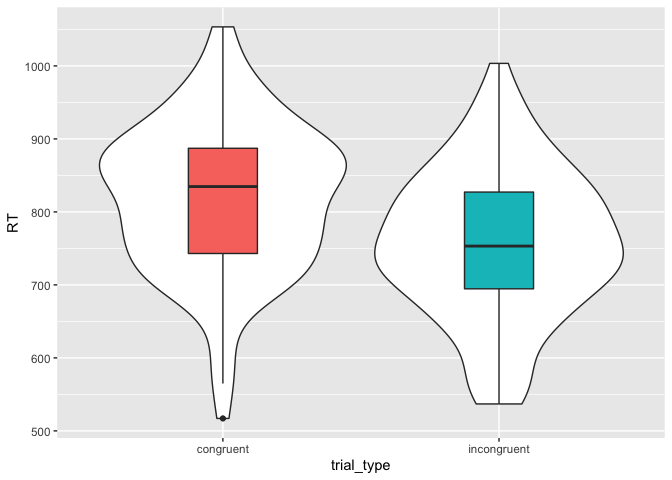

Chapitre 9 : Introduction aux GLM
================

*Chapitre traduit par Cédric Batailler et relu par Nicolas
Verger.*


## Objectifs du cours

### Débutant

1.  Définir les [paramètres](#glm-components) d’un GLM 2 [Simuler des
    données](#sim-glm) en utilisant les équations d’un GLM
2.  Identifier les paramètres d’un modèle correspondant aux paramètres
    sous-tendant la génération de données
3.  Comprendre et faire un graphique de [résidus](#residuals)
4.  [Prédire de nouvelles observations](#predict) à partir du modèle GLM
5.  Expliquer les différences dues au [codage des
    variables](#coding-schemes)

### Intermédiaire

7.  Démontrer les [relations](#test-rels) entre test *t* pour
    échantillons indépendant, ANOVA, et régression linéaire
8.  A partir de données et d’un modèle GLM, [générer la matrice de
    décomposition](decomp) et calculer la somme des carrés, les carrés
    moyens et les rapports de F pour une ANOVA à un facteur contrôlé

## Ressources

  - [Fichier source original pour cette
    leçon](https://github.com/PsyTeachR/msc-data-skills/blob/master/stubs/9_glm.Rmd)
  - [Statistical Analysis with the Linear Model de Jeff Miller et
    Patricia Haden (manuel en ligne
    gratuit)](http://www.otago.ac.nz/psychology/otago039309.pdf)
  - [Diapositives du cours sur le modèle linéaire
    général](https://github.com/PsyTeachR/msc-data-skills/blob/master/slides/08_glm_slides.pdf)
  - [shiny app GLM](http://rstudio2.psy.gla.ac.uk/Dale/GLM)
  - [distribution du F](http://rstudio2.psy.gla.ac.uk/Dale/fdist)

## Configuration

Vous aurez besoin des packages suivants.

``` r
# packages nécessaires pour les exemples
library(tidyverse)
library(broom)

set.seed(30250) # afin que les données aléatoires générées soient reproductibles
```

## GLM

Le Modèle Linéaire Généralisé (General Linear Model ; GLM) est un outil
mathématique dans lequel il est possible d’exprimer des relations entre
variables. Ces relations permettent de tester les relations linéaires
existantes entre une **variable dépendante** continue et une combinaison
de **variables dépendantes** (qu’elles soient continues ou
catégorielles).

### Paramètres

Certaines conventions mathématiques permettent de mieux comprendre les
équations représentant les modèles linéaires. Une fois ces conventions
assimilées, il sera plus facile d’apprendre le
GLM.

| Paramètres du GLM        | Paramètres \[EN\]       | Notation                         |
| ------------------------ | ----------------------- | -------------------------------- |
| Variable dépendante (VD) | Dependent Variable (DV) | \(Y\)                            |
| Moyenne générale         | Grand Average           | \(\mu\) (la lettre grecque “mu”) |
| Effets principaux        | Main Effects            | \(A, B, C, \ldots\)              |
| Interactions             | Interactions            | \(AB, AC, BC, ABC, \ldots\)      |
| Erreur aléatoire         | Random Error            | \(S(Group)\)                     |


L’équation linéaire permet de prédire la variable dépendante (\(Y\)) à
partir de la somme de la moyenne générale, des effets principaux de
chacune des variables (\(A, B, C, \ldots\)), de l’interaction entre
chacune des variables (\(AB, AC, BC, ABC, \ldots\)) et de l’erreur
résiduelle (\(S(Group)\)). Pour un modèle utilisant deux prédicteurs et
l’interaction entre les deux, l’équation linéaire s’écrira ainsi :

\(Y\) ~ \(\mu+A+B+AB+S(Group)\)

Ne vous inquiétez pas si tout n’est pas parfaitement clair pour
l’instant. Nou vous guiderons à travers un exemple plus concret.

### Simuler les données d’un GLM

Les simulations de données sont une bonne manière pour apprendre les
modèles linéaire. L’idée est de générer des données où nous choisirons
nous même comment nos différentes variables seront liées les unes aux
autres. Ensuite, nous analyserons des données générées (simulées) afin
de comprendre comment les paramètres de la simulations se retranscrivent
dans notre analyse.

Nous commencerons avec un modèle linéaire dans lequel nous avons un
facteur à deux modalités. Imaginons que nous cherchions à prédire les
temps de réponses pour des essais congruents et des essais congruents à
une tâche de Stroop, et ce pour une seule participante. Le temps de
réponse moyen (`mu`) sera de 800ms, notre participante sera plus rapide
de 50ms pour les essais congruents plutôt que les essais incongruents
(`effect`).

-----

**Attention**, un facteur (dans R, un `factor`) est une variable
catégorielle utilisée pour répartir les participant·es dans différents
groupe, le plus souvent dans le but de comparer ces groupes. Les
facteurs sont composés de différentes modalités (dans R, un `level`).
Attention à ne pas confondre les facteurs et les modalités \!

Dans notre exemple, l’essai sera **un facteur ou une modalité ?**, un
essai congruent sera **un facteur ou une modalité ?** et un essais
congruent sera **un facteur ou une modalité ?**.

-----

Pour représenter une variable catégorielle, ils nous faudra utiliser des
nombres. Ces nombres, également appelé **codage**, auront une influence
sur les résultats de l’analyse, et comment interpréter ces résultats.
Pour notre exemple, nous choisirons d’utiliser un codage “effet” pour
représenter les différents type d’essais. Avec un tel codage, les essais
congruents seront représentés par le code +0.5 et les essais
incongruents seront représentés par le code -0.5.

A la tâche de Stroop, les participant·es ne répondent pas toujours
exactement de la même manière. Parfois, ils seront plus rapide et
parfois, plus lent, et ce à cause de fluctuation de leur attention, à
cause d’un apprentissage de la tâche ou même à cause de la fatigue. Pour
cette raison, dans notre simulation, nous allons ajouter un **terme
d’erreur**. Nous ne pouvons pas prévoir de combien précisément chacun
des essais différera des autres, mais nous pouvons décrire la
distribution représentant les différences entre un essai en particulier
et la moyenne des essais.

Nous ferons ici l’hypothèse que ce terme d’erreur est tiré d’une
distribution normale avec un écart type de 100ms. A noter que la moyenne
de la distribution des termes d’erreur vaut toujours 0. Nous
échantillonerons 100 essais de chacun des types (congruents et
incongruents) afin de pouvoir observer les fluctuations.

A présent, créons chacune des variables qui nous permettront de décrire
nos données.

``` r
n_per_grp <- 100
mu     <- 800 # Temps de réponse (RT) moyen
effect <-  50 # Différence moyenne entre les essais congruents et les essais incongruents
error_sd <- 100 # Ecart-type du terme d’erreur
trial_types <- c("congruent" = 0.5, "incongruent" = -0.5) # codage “effet”
```

Ensuite, simulons les donnons en créant un jeu de données avec une ligne
par essai, et des colonnes indiquant le type d’essai ainsi que le terme
d’erreur (`error`, un nombre tiré d’une distribution normale ayant un
écart type spécifié via la variable `error_sd`). Pour notre variable
catégorielle, incluons à la fois les colonnes contenant la modalité de
la variable sous son format texte (`trial_type`) et le codage “effet”
qui y est associé (`trial_type.e`). Cela nous permettra de repérer plus
facilement le codage utilisé lorsque nous réaliserons des graphiques.
Calculons les valeurs de notre VD (`RT`) comme la somme de la moyenne
générale (`mu`), du produit du coefficient (`effet`) et du codage
“effet” associé à notre variable (`trial_type.e`) et du terme d’erreur
(`error`).

``` r
dat <- data.frame(
  trial_type = rep(names(trial_types), each = n_per_grp)
) %>%
  mutate(
    trial_type.e = recode(trial_type, !!!trial_types),
    error = rnorm(nrow(.), 0, error_sd),
    RT = mu + (effect * trial_type.e) + error
  )
```

-----

Le `!!!` (triple bang) dans le code `recode(trial_type, !!!trial_types)`
sera évalué comme `trial_types <- c("congruent" = 0.5, "incongruent" =
-0.5)`. Ce code est équivalent au code `recode(trial_type, "congruent"
= 0.5, "incongruent" = -0.5)`. Cependant, le `!!!`nous permet d’éviter
de faire des erreurs de recodage en ne définissant quel catégorie est
associée à quel code qu’une seule fois (dans le vecteur `trial_types`).

-----

Enfin, dernière chose, mais non des moindre, nous devons toujours penser
toujours à faire un graphique des données simulées. Ainsi, nous pourrons
vérifier que nos données ressemble bien à ce à quoi elles sont censées
ressembler.

``` r
ggplot(dat, aes(trial_type, RT)) + 
  geom_violin() +
  geom_boxplot(aes(fill = trial_type), 
               width = 0.25, show.legend = FALSE)
```



### La régression linéaire

Maintenant, nous allons pouvoir analyser les données que nous venons de
simuler grâce à la fonction `lm()`. Cette fonction prend une formule
comme premier argument et cette formule est équivalente à comment nous
nous y somme pris pour générer nos données (si ce n’est que nous n’y
spécifierons pas le terme d’erreur). Nous utiliserons notre jeu de
données comme second argument. Afin d’obtenir un résumé des
informations pertinentes concernant notre modèle, nous utiliserons la
fonction `summary()`.

``` r
my_lm <- lm(RT ~ trial_type.e, data = dat)

summary(my_lm)
```

    ## 
    ## Call:
    ## lm(formula = RT ~ trial_type.e, data = dat)
    ## 
    ## Residuals:
    ##      Min       1Q   Median       3Q      Max 
    ## -302.110  -70.052    0.948   68.262  246.220 
    ## 
    ## Coefficients:
    ##              Estimate Std. Error t value Pr(>|t|)    
    ## (Intercept)   788.192      7.206 109.376  < 2e-16 ***
    ## trial_type.e   61.938     14.413   4.297 2.71e-05 ***
    ## ---
    ## Signif. codes:  0 '***' 0.001 '**' 0.01 '*' 0.05 '.' 0.1 ' ' 1
    ## 
    ## Residual standard error: 101.9 on 198 degrees of freedom
    ## Multiple R-squared:  0.08532,    Adjusted R-squared:  0.0807 
    ## F-statistic: 18.47 on 1 and 198 DF,  p-value: 2.707e-05

Nous pouvons remarquer à quel point la valeur **estimate** (i.e., la
valeure estimée par la régression) pour l’`(Intercept)` est proche de la
valeur que nous avions défini pour `mu`. Concernant la valeur estimée
pour `trial_type.e`, nous pouvons remarquer qu’elle est très proche de
notre variable `effect`.

-----

Changez les valeurs pour `mu` et `effet`, simulez à nouveau les données
et relancez la régression linéaire. Qu’advient-il des valeurs estimées ?

-----

### Les résidus

Afin d’extraire le terme d’erreur de chacune des observations dont nous
nous sommes servis (i.e., les résidus), nous pouvons utiliser la
fonction `residuals()`. Cette fonction calcule les résidus en
soustrayant à notre VD les valeurs estimées pour l’intercept et le
produit entre le type d’essai et le code de contraste. Générons un
graphique de densité afin de comparer cette distribution de résidus à la
distribution que nous avons utilisée pour définir notre terme d’erreur.

``` r
res <- residuals(my_lm)

ggplot(dat) + 
  stat_function(aes(0), color = "grey60",
                fun = dnorm, n = 101,
                args = list(mean = 0, sd = error_sd)) +
  geom_density(aes(res, color = trial_type))
```

    ## Warning: `mapping` is not used by stat_function()


Il est également possible de comparer les résidus de notre modèle à
l’erreur que nous avons simulé. Si notre modèle fonctionne
correctement, les deux devraient être quasi-identique. Si jamais la
valeur estimée de l’`(Intercept) est légèrement différente de celle
définie, alors chacun des points de notre graphique devrait se situer
au dessus ou en dessous de la droite en noir. Si jamais la valeur
estimée au coefficient lié au type d’essai`trial\_type.e\`est
légèrement différente de celle définie, nous devrions retrouver des
différences systématiques entre les essais congruents et les essais
incongruents.

``` r
ggplot(dat) +
  geom_abline(slope = 1) +
  geom_point(aes(error, res, color = trial_type)) +
  ylab("Résidus du modèle") +
  xlab("Erreur simulée")
```


-----

Que se passerait-il au niveau des résidus si nous décidions d’utiliser
un modèle ne rendant pas compte du type d’essai (i.e., `lm(Y ~ 1, data =
dat)`) ?

-----

### Prédire de nouvelles valeurs

Il est possible d’utiliser les valeurs estimées par notre modèle pour
prédire notre VD pour de nouvelles observations. Pour notre exemple,
nous avons simplement besoin à quel type d’essai correspond notre
observation pour faire une prédiction.

Pour les essais congruents, nous pourrions prédire qu’une nouvelle
observation correspondrait à la valeur estimée pour l’intercept auquel
nous ajoutons la valeur estimée pour le coefficient lié au type d’essai
multiplié par 0.5 (le codage “effet” pour les essais congruents).

``` r
int_est <- my_lm$coefficients[["(Intercept)"]]
tt_est  <- my_lm$coefficients[["trial_type.e"]]
tt_code <- trial_types[["congruent"]]

new_congruent_RT <- int_est + tt_est * tt_code

new_congruent_RT
```

    ## [1] 819.1605

Il est également possible d’utiliser la fonction `predict()` afin
d’obtenir au même résultat plus facilement. Le premier argument de
cette fonction est notre régression linéaire et le second un jeu de
données dont les colonnes sont les prédicteurs utilisés dans notre
modèle. Les lignes doivent correspondre aux valeurs pour lesquels nous
souhaitons faire de nouvelles prédictions.

``` r
predict(my_lm, newdata = tibble(trial_type.e = 0.5))
```

    ##        1 
    ## 819.1605

-----

En cherchant de l’aide sur cette fonction en utilisant `?predict`, il
est possible que cette fonction “invokes particular methods which depend
on the class of the first argument”, c’est à dire qu’elle invoque une
*méthode* particulière en fonction de la classe du premier argument.

Cela signifie que la fonction `predict()` fonctionnera différemment en
fonction de si l’on cherche à faire une prédiction à partir d’une
régression linéaire `lm()`ou d’un autre type d’analyse. Pour obtenir de
l’aide concernant la version liée à la classe `lm`, il faudrait utiliser
`?predict.lm`.

-----

### Le codage des variable catégorielles

Dans l’exemple ci-dessus, nous avons utilisé un **codage “effet”** pour
coder le type d’essai. Nous aurions également pu utiliser un **codage
“somme”** qui attribuent des valeurs de +1 et -1 aux modalités de la
variable, plutôt que des valeurs de +0.5 et -0.5. Il aurait également
été possible d’utiliser un codage “traitement” qui assigne une valeur
de 0 à l’un des facteurs (le plus souvent, à la condition contrôle) et
une valeur de 1 à l’autre facteur (le plus souvent, à la condition
expérimentale).

Ajoutons les codes de type somme et traitement pour notre variable
`trial_type`dans notre jeu de données avec la fonction `recode()`.

``` r
dat <- dat %>% mutate(
  trial_type.sum = recode(trial_type, "congruent" = +1, "incongruent" = -1),
  trial_type.tr = recode(trial_type, "congruent" = 1, "incongruent" = 0)
)
```

En utilisant un vecteur nommé contenant les modalités et le code
associé, nous aurions pu utiliser la fonction `recode()` en combinaison
du `!!!`.

``` r
tt_sum <- c("congruent"   = +1, 
            "incongruent" = -1)
tt_tr <- c("congruent"   = 1, 
           "incongruent" = 0)

dat <- dat %>% mutate(
  trial_type.sum = recode(trial_type, !!!tt_sum),
  trial_type.tr = recode(trial_type, !!!tt_tr)
)
```

Voici les coefficients de notre version de l’analyse utilisant le codage
“effet”. Ils devraient être identiques à ceux obtenus lors de notre
dernière analyse.

``` r
lm(RT ~ trial_type.e, data = dat)$coefficients
```

    ##  (Intercept) trial_type.e 
    ##    788.19166     61.93773

A présent, voici les coefficients pour la version utilisant un codage
“somme”. Cette fois, les résultats sont identiques à ceux du codage
“effet”, à l’exception de la valeur estimée pour le coefficient
associé à notre facteur catégoriel. Celui-ci est deux fois plus petit.
En effet, plutôt que la différence de temps de réponses entre les deux
types d’essais, il représente désormais la différence entre la moyenne
des temps de réponses pour un type d’essai et la condition virtuelle
codée 0 (notre moyenne générale des temps de réponses).

``` r
lm(RT ~ trial_type.sum, data = dat)$coefficients
```

    ##    (Intercept) trial_type.sum 
    ##      788.19166       30.96887

Enfin, voici les coefficients pour la version utilisant un codage
“traitement”. La valeur estimée pour le coefficient associé à notre
variable catégorielle sera la même que pour la version de notre analyse
utilisant un codage “effet”. En revanche, la valeur estimée pour
l’intercept diminuera. Celle-ci sera égale à la valeur de l’intercept
auquel nous soustrayons la valeurs estimée du coefficient associé au
type d’essais provenant de notre analyse utilisant le codage “somme”.

``` r
lm(RT ~ trial_type.tr, data = dat)$coefficients
```

    ##   (Intercept) trial_type.tr 
    ##     757.22279      61.93773

## Relations entre les tests statistiques

### Test *t*

Le test *t* est un cas particulier du modèle linéaire.

``` r
t.test(RT ~ trial_type.e, data = dat, var.equal = TRUE)
```

    ## 
    ##  Two Sample t-test
    ## 
    ## data:  RT by trial_type.e
    ## t = -4.2975, df = 198, p-value = 2.707e-05
    ## alternative hypothesis: true difference in means is not equal to 0
    ## 95 percent confidence interval:
    ##  -90.35945 -33.51601
    ## sample estimates:
    ## mean in group -0.5  mean in group 0.5 
    ##           757.2228           819.1605

-----

Que se passe-t-il si nous utilisons un autre codage pour le type d’essai
dans le test t ci-dessus ? Lequel des codages correspond au mieux à un
test t ?

-----

### L’ANOVA

L’ANOVA est également un cas particulier du modèle linéaire

``` r
my_aov <- aov(RT ~ trial_type.e, data = dat)

summary(my_aov, intercept = TRUE)
```

    ##               Df    Sum Sq   Mean Sq  F value   Pr(>F)    
    ## (Intercept)    1 124249219 124249219 11963.12  < 2e-16 ***
    ## trial_type.e   1    191814    191814    18.47 2.71e-05 ***
    ## Residuals    198   2056432     10386                      
    ## ---
    ## Signif. codes:  0 '***' 0.001 '**' 0.01 '*' 0.05 '.' 0.1 ' ' 1

La manière la plus simple d’extraire les paramètres d’une analyse est
d’utiliser la fonction `broom::tidy()`. Celle-ci renvoie un jeu de
données ordonnée il est possible d’extraire les valeurs d’intérêt. Ici,
essayons d’extraire la valeur du F de Fisher correspondant à l’effet du
type d’essais. Comparons la racine de cette valeur à celle du test t
ci-dessus.

``` r
f <- broom::tidy(my_aov)$statistic[1]
sqrt(f)
```

    ## [1] 4.297498

## Comprendre l’ANOVA

Décrivons étape par étape l’exemple d’une ANOVA à un facteur contrôlé en
commençant par cette équation :

\(Y_{ij} = \mu + A_i + S(A)_{ij}\)

Cette équation indique que chaque observation (\(Y_{ij}\)) peut être
décomposée en une moyenne générale, plus l’effet d’un facteur A
(\(A_i\)) et enfin de l’erreur résiduelle (\(S(A)_{ij}\)).

### Moyennes, variabilité, et scores de déviation

Pour commencer, créons une simple fonction qui nous permettra de simuler
un jeu de données comprenant deux échantillons avec des N, moyennes et
écart types spécifiques.

``` r
two_sample <- function(n = 10, m1 = 0, m2 = 0, sd1 = 1, sd2 = 1) {
  s1 <- rnorm(n, m1, sd1)
  s2 <- rnorm(n, m2, sd2)
  
  data.frame(
    Y = c(s1, s2),
    grp = rep(c("A", "B"), each = n)
  )
}
```

A présent, utilisons cette fonction `two_sample()` pour générer un jeu
de données avec un nombre de participants par groupe de N = 5, des
moyennes de -2 et +2 et des écart types de 1 et 1 (yup, cela nous donne
une modeste taille d’effet de d = 4).

``` r
dat <- two_sample(5, -2, +2, 1, 1)
```

Il est possible de calculer à quel point chaque observation (`Y`) dévie
de la moyenne générale (\(\hat{\mu}\)). Cette moyenne générale est
représentée par la ligne grise horizontale ci-dessous, et les
déviations sont représentée par les lignes grises verticale. Il est
également possible de calculer de combien chaque observation diffère de
la moyenne de son groupe (\(\hat{A_i}\)). La moyenne des groupes est
représentée par les lignes horizontales colorées et les déviations par
les lignes verticales colorées.


A présent, il est possible d’utiliser ces déviations pour calculer les
variabilités inter- et intra-groupes. L’ANOVA teste si la variabilité
inter-groupe est importante comparativement à la variabilité
intra-groupe, et ce en rendant compte du nombre de groupes et du nombre
d’observations.

### Matrices de décompositions

Il est possible d’utiliser les équations d’estimation pour l’ANOVA à un
facteur contrôlé afin de déterminer les paramètres de notre modèle.

  - `mu` désigne la moyenne générale
  - `a` désigne à quel point chaque groupe dévie de la moyenne générale
  - `err` désigne l’erreur résiduelle obtenu en soustrayant `mu`et
    `a`d’une observation `Y`

Il est maintenant possible de réaliser une matrice de décomposition, un
tableau ayant pour colonnes `Y`, `mu`, `a` et`err`.

``` r
decomp <- dat %>% 
  select(Y, grp) %>%
  mutate(mu = mean(Y)) %>%     # calcul du mu_hat
  group_by(grp) %>%
  mutate(a = mean(Y) - mu) %>% # calcul du a_hat pour chacun des groupes
  ungroup() %>%
  mutate(err = Y - mu - a)     # calcul de l’erreur résiduelles
```

|           Y | grp |        mu |          a |         err |
| ----------: | :-- | --------: | ---------: | ----------: |
| \-1.4770938 | A   | 0.1207513 | \-1.533501 | \-0.0643443 |
| \-2.9508741 | A   | 0.1207513 | \-1.533501 | \-1.5381246 |
| \-0.6376736 | A   | 0.1207513 | \-1.533501 |   0.7750759 |
| \-1.7579084 | A   | 0.1207513 | \-1.533501 | \-0.3451589 |
| \-0.2401977 | A   | 0.1207513 | \-1.533501 |   1.1725518 |
|   0.1968155 | B   | 0.1207513 |   1.533501 | \-1.4574367 |
|   2.6308008 | B   | 0.1207513 |   1.533501 |   0.9765486 |
|   2.0293297 | B   | 0.1207513 |   1.533501 |   0.3750775 |
|   2.1629037 | B   | 0.1207513 |   1.533501 |   0.5086516 |
|   1.2514112 | B   | 0.1207513 |   1.533501 | \-0.4028410 |

Calculons la somme des carrés pour `mu`, `a` et `err`.

``` r
SS <- decomp %>%
  summarise(mu  = sum(mu * mu),
            a   = sum(a * a),
            err = sum(err * err))
```

|        mu |        a |      err |
| --------: | -------: | -------: |
| 0.1458088 | 23.51625 | 8.104182 |

Si chacune des étapes a été suivies correctement, `SS$mu + SS$a +
SS$err` devrait être égale à la somme des carré de Y.

``` r
SS_Y <- sum(decomp$Y^2)
all.equal(SS_Y, SS$mu + SS$a + SS$err)
```

    ## [1] TRUE

Divisons chaque somme des carrées par leur degré de liberté (df) afin de
calculer les carrés moyens. Le degré de liberté pour `mu` est de 1, pour
notre facteur `a`, il est de `K - 1` (avec `K` le nombre de groupes) et
pour `err`, il est de `N - K`(avec `N`le nombre total d’observation).

``` r
K <- n_distinct(dat$grp)
N <- nrow(dat)
df <- c(mu = 1, a = K - 1, err = N - K)
MS <- SS / df
```

|        mu |        a |      err |
| --------: | -------: | -------: |
| 0.1458088 | 23.51625 | 1.013023 |

Nous pouvons à présent calculer un F-ratio pour `mu` et `a` en divisant
leurs carrés moyens par le carré de l’erreur. Il nous suffit de calculer
les valeurs de *p* correspondant à ces valeurs de *F* en utilisant la
fonction `pf()`.

``` r
F_mu <- MS$mu / MS$err
F_a  <- MS$a  / MS$err
p_mu <- pf(F_mu, df1 = df['mu'], df2 = df['err'], lower.tail = FALSE)
p_a  <- pf(F_a,  df1 = df['a'],  df2 = df['err'], lower.tail = FALSE)
```

Créons à présent un jeu de données qui comprend l’ensemble de ces termes
afin de les afficher comme nous l’aurions fait avec la fonction
`summary()` de l’ANOVA.

``` r
my_calcs <- data.frame(
  term = c("Intercept", "grp", "Residuals"),
  Df = df,
  SS = c(SS$mu, SS$a, SS$err),
  MS = c(MS$mu, MS$a, MS$err),
  F = c(F_mu, F_a, NA),
  p = c(p_mu, p_a, NA)
)
```

|     | term      | Df |     SS |     MS |      F |     p |
| --- | :-------- | -: | -----: | -----: | -----: | ----: |
| mu  | Intercept |  1 |  0.146 |  0.146 |  0.144 | 0.714 |
| a   | grp       |  1 | 23.516 | 23.516 | 23.214 | 0.001 |
| err | Residuals |  8 |  8.104 |  1.013 |     NA |    NA |

A présent, lancez l’ANOVA à un facteur contrôlé et comparez les
résultats à ceux que vous aviez obtenus précédemment.

``` r
aov(Y ~ grp, data = dat) %>% summary(intercept = TRUE)
```

    ##             Df Sum Sq Mean Sq F value  Pr(>F)   
    ## (Intercept)  1  0.146   0.146   0.144 0.71427   
    ## grp          1 23.516  23.516  23.214 0.00132 **
    ## Residuals    8  8.104   1.013                   
    ## ---
    ## Signif. codes:  0 '***' 0.001 '**' 0.01 '*' 0.05 '.' 0.1 ' ' 1

-----

En utilisant le code ci-dessus, écrivez votre propre fonction qui
prendra en argument un jeu de données, et en sortira une table d’ANOVA
comme celle ci-dessus.

-----

## Exercices

Téléchargez les exercices. Ne regardez les réponses qu’après avoir
essayé de répondre à l’ensemble des questions.
